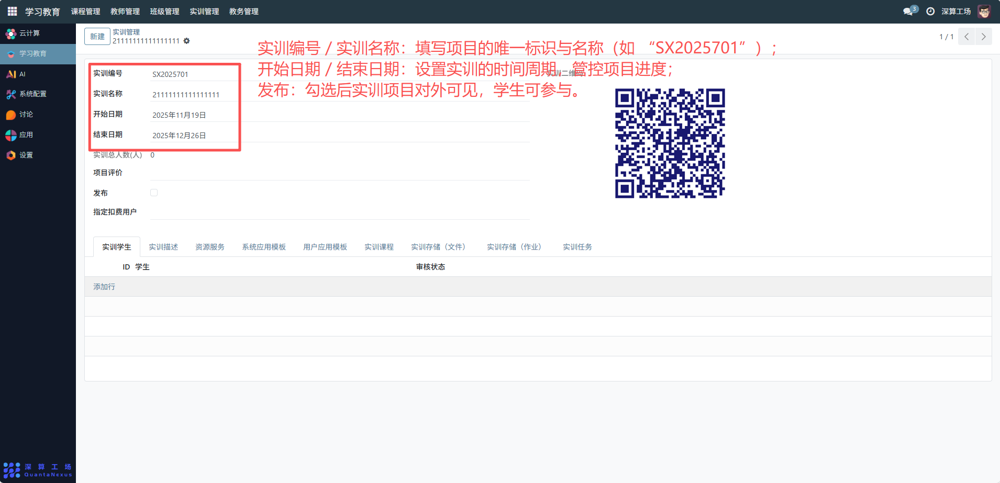
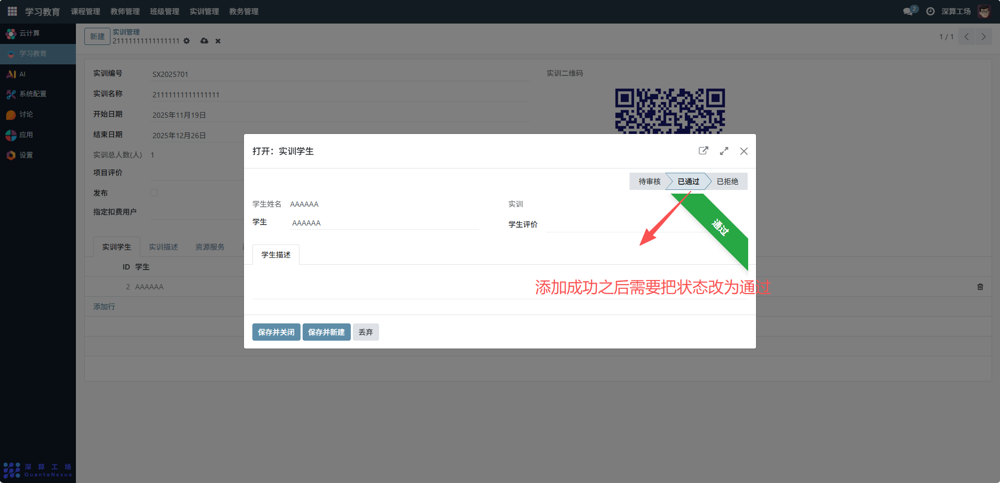
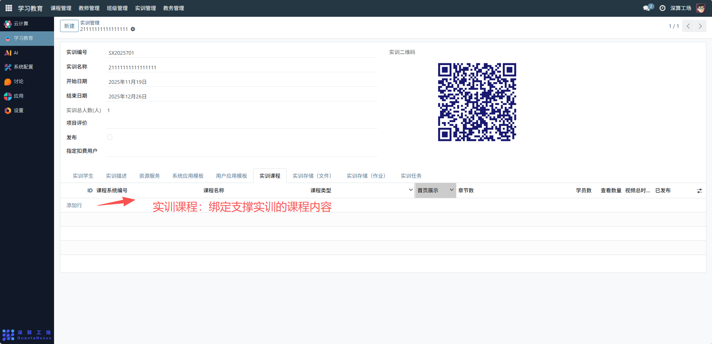
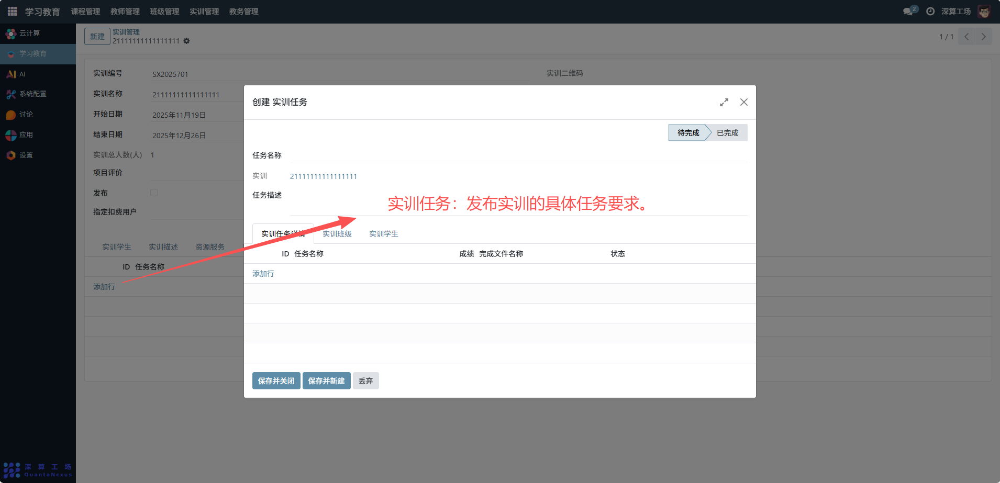
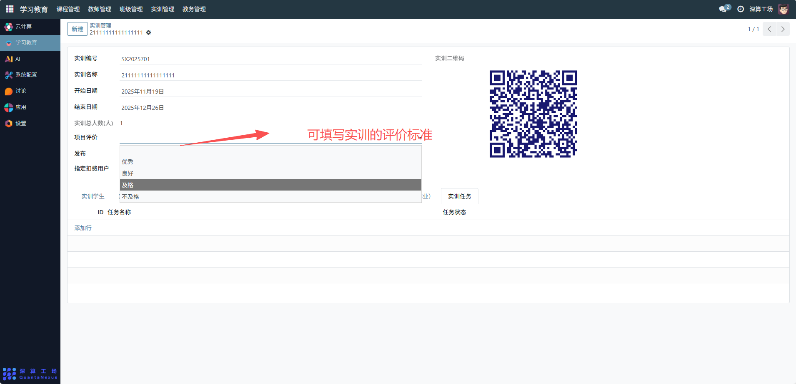

# 实训管理
“实训管理” 是学习教育平台中实训项目的全流程管控工具，核心作用是配置实训项目的基础信息、参与人员、配套资源与任务，实现实训从筹备、发布到执行的全周期管理，是支撑实践教学活动的核心模块。
## 1、实训基础信息配置
实训编号 / 实训名称：填写项目的唯一标识与名称（如 “SX2025701”）；
开始日期 / 结束日期：设置实训的时间周期，管控项目进度；
发布：勾选后实训项目对外可见，学生可参与。

## 2、参与人员管理
实训学生（表格）：点击 “添加行”，填写参与学生信息，设置 “审核状态”（如 “已通过”），管理参与资格；
实训总人数：系统自动统计参与学生数量，直观展示项目规模。

## 3、配套资源与任务配置
资源服务 / 系统应用模板 / 用户应用模板：关联实训所需的工具、模板资源；

实训课程：绑定支撑实训的课程内容；

实训存储（文件 / 作业）：配置实训资料、作业的存储位置；

实训任务：发布实训的具体任务要求。

## 4、项目评价配置
项目评价：填写实训的评价标准，用于后续学生成果的评估。

