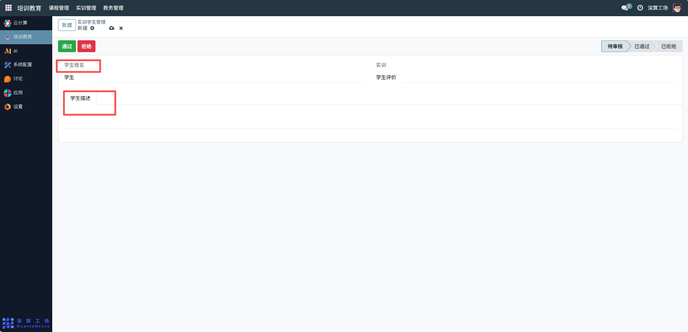
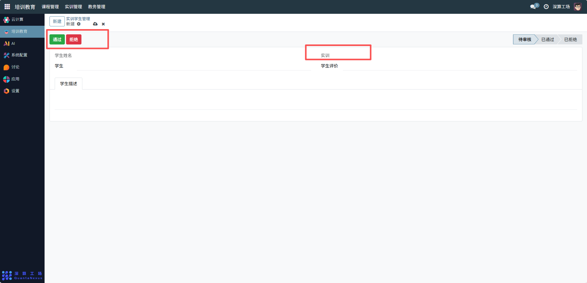
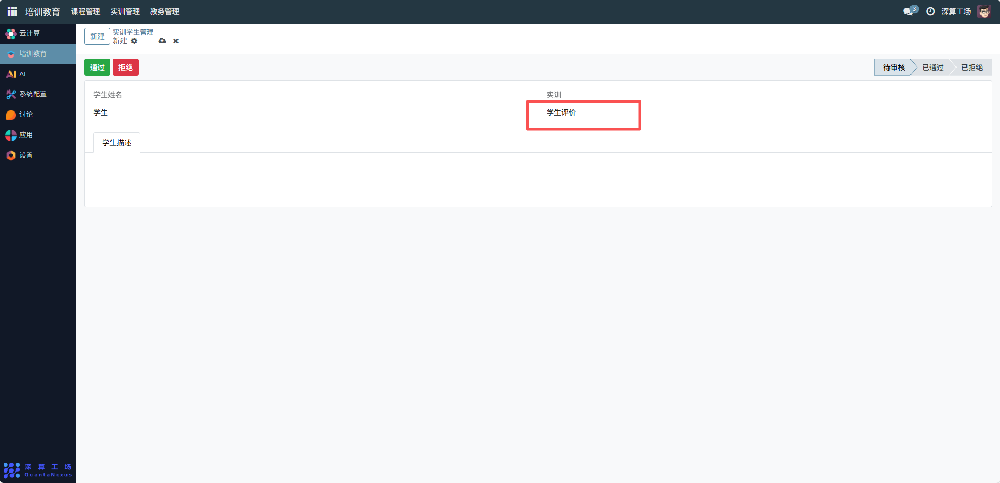

# 实训学生管理
“实训学生管理” 是实训项目中参与学生的审核与信息管理工具，核心作用是筛选符合条件的学生参与实训、记录学生信息并跟踪其实训评价，实现实训学生的准入管控与信息归档，是保障实训项目有序开展的核心人员管理模块。
## 1、学生基础信息配置
学生姓名：可查看关联参与实训的学生姓名；
学生描述：补充学生的相关信息（如专业、技能背景），辅助实训匹配。

## 2、实训关联与审核配置
实训：选择对应的实训项目，明确学生参与的实训活动；
审核操作：对学生的实训申请，点击 “通过”（允许参与）或 “拒绝”（驳回申请），更新审核状态（待审核 / 已通过 / 已拒绝）。

## 3、评价跟踪配置
学生评价：可查看学生在实训中的表现评价，记录实训学习效果。

