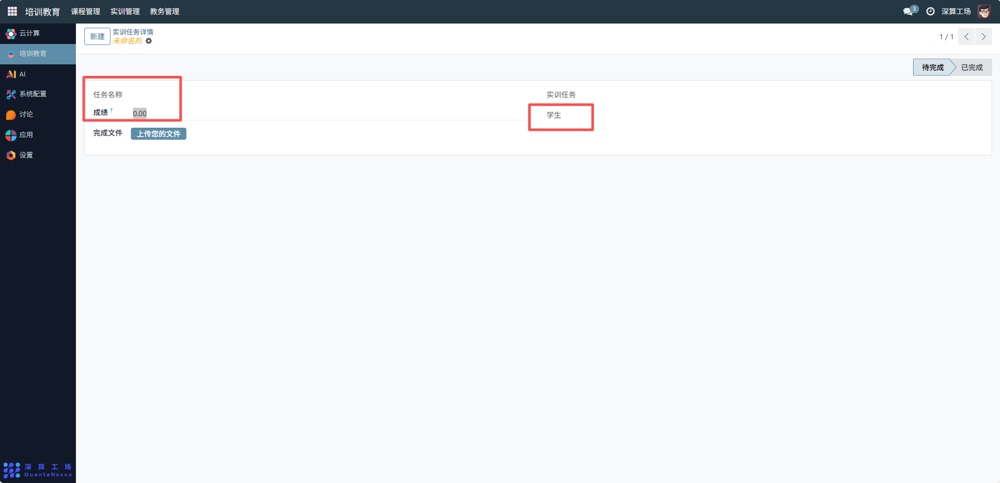
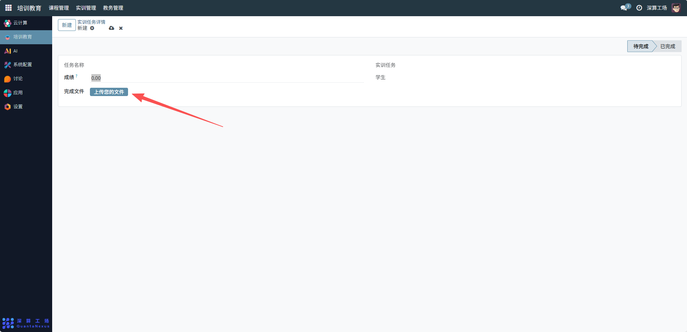
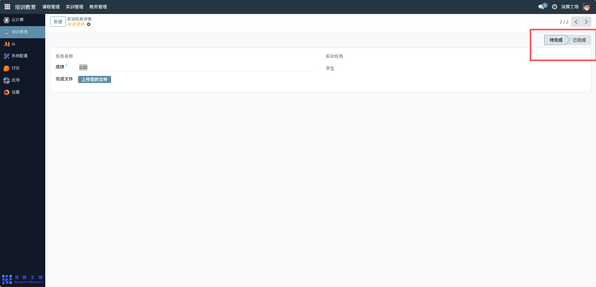

# 实训任务详情
“实训任务详情” 是实训任务的精细化管理工具，核心作用是聚焦单个实训任务的具体信息（成果、成绩、归属），实现任务成果的上传、成绩的记录与任务状态的跟踪，是实训任务从执行到验收的闭环管理模块。
## 1、任务基础关联配置
任务名称：选择对应的实训任务，明确详情所属的任务；
实训任务：关联该详情对应的上级实训任务，定位任务层级；
学生：选择执行该任务的学生，明确任务的执行主体。

## 2、任务成果与成绩配置
完成文件：点击 “上传您的文件” 按钮，上传任务的成果文件（如实训报告）；
成绩：填写任务完成后的评分（如 “85”），记录验收结果。

## 3、任务状态配置
状态标签：根据任务完成情况，切换 “待完成” 或 “已完成” 标签，更新任务进度。

