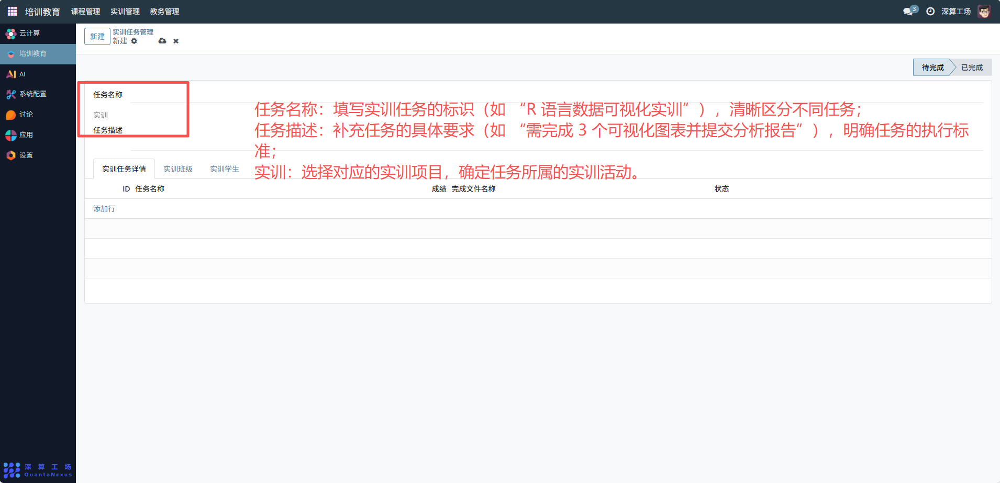
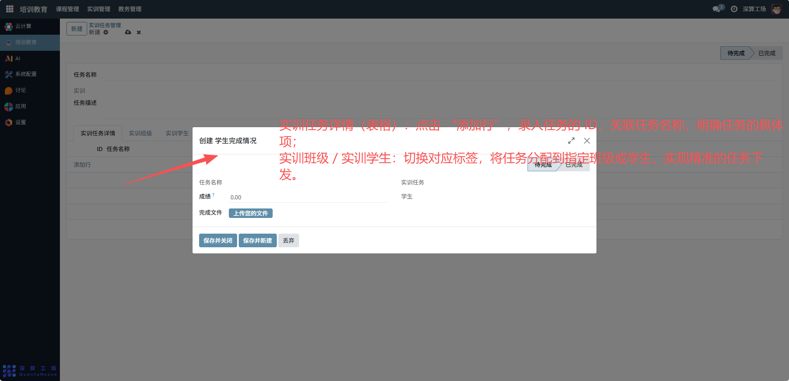
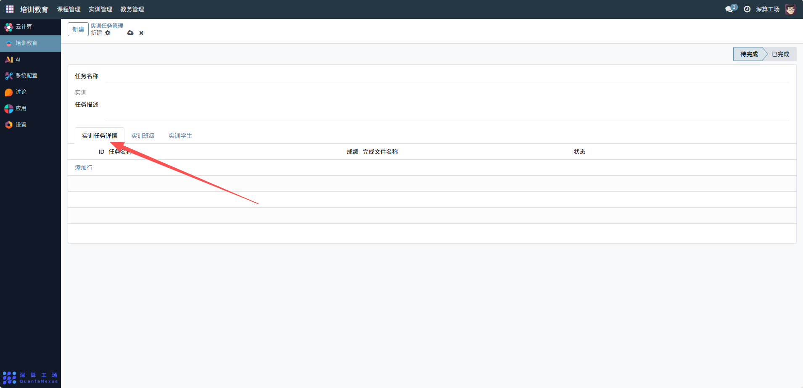

# 实训任务管理
“实训任务管理” 是实训项目中任务分配与进度跟踪的核心工具，核心作用是定义实训任务的内容、关联对应实训项目与学员，并跟踪任务的完成状态、成绩等信息，实现实训任务从发布到验收的全流程管控，是保障实训任务有序推进的核心模块。
## 1、任务基础信息配置
任务名称：填写实训任务的标识（如 “R 语言数据可视化实训”），清晰区分不同任务；
任务描述：补充任务的具体要求（如 “需完成 3 个可视化图表并提交分析报告”），明确任务的执行标准；
实训：选择对应的实训项目，确定任务所属的实训活动。

## 2、任务详情与分配配置
实训任务详情（表格）：点击 “添加行”，录入任务的 ID、关联任务名称，明确任务的具体项；
实训班级 / 实训学生：切换对应标签，将任务分配到指定班级或学生，实现精准的任务下发。

## 3、任务状态与成果配置
状态：选择任务的当前进度（待完成 / 已完成）；
成绩：填写任务完成后的评分；
完成文件名称：记录任务成果的文件标识，便于成果归档与查看。

