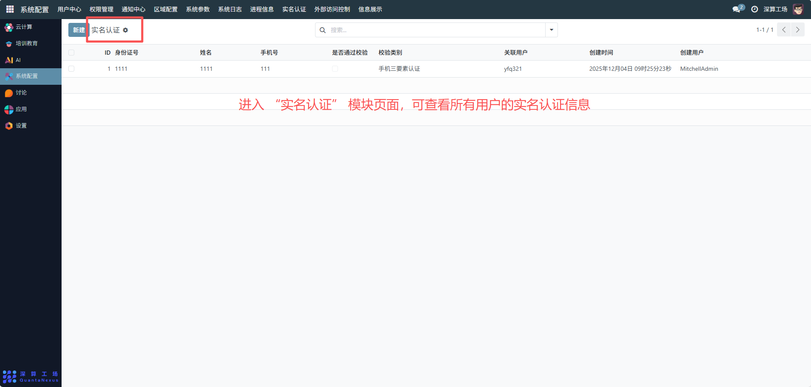
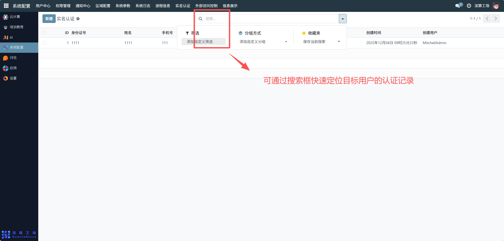
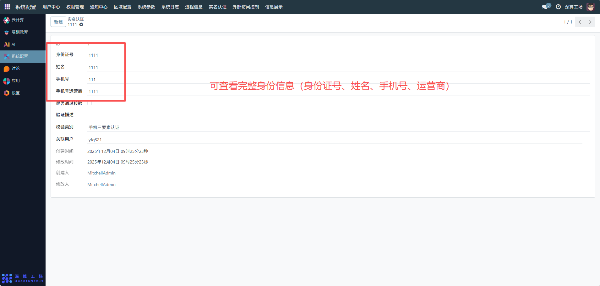
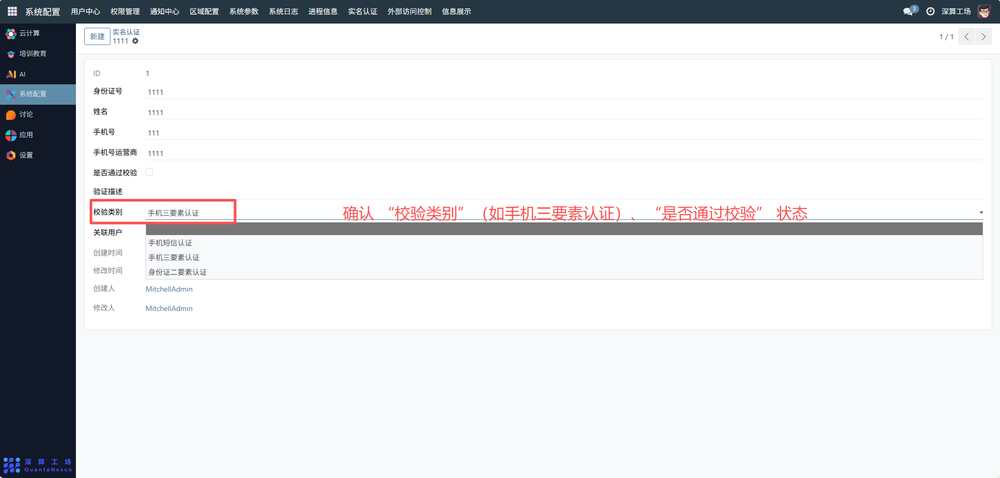
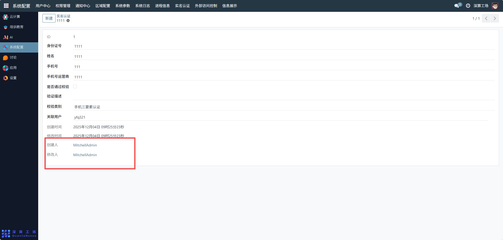

# 实名认证记录
“实名认证记录” 是平台用户身份真实性的管理模块，核心作用是集中记录、管理系统内用户的实名认证信息，验证用户身份的真实性，是平台合规运营、用户安全管理的核心工具。
## 核心用途
- 实名认证信息的集中存档：记录用户的身份证号、姓名、手机号等身份信息，关联对应的平台用户账号，实现身份信息与账号的绑定。
- 认证状态的跟踪管控：通过 “是否通过校验” 字段，监控用户实名认证的审核结果。
- 认证类型的分类管理：通过 “校验类别”（如手机三要素认证），区分不同的实名认证方式。
- 操作轨迹的全链路追溯：记录实名认证的创建 / 修改时间、操作人，保障认证流程的可审计性。
管理配置流程
### 1、查看实名认证列表
进入 “实名认证” 模块页面，可查看所有用户的实名认证信息（身份证号、姓名、关联用户、认证状态等）。

可通过搜索框快速定位目标用户的认证记录。

### 2、查看认证详情
- 点击列表中的任意认证记录（如 ID 为 1 的记录），进入详情页：
- 可查看完整身份信息（身份证号、姓名、手机号、运营商）。

确认 “校验类别”（如手机三要素认证）、“是否通过校验” 状态；

追溯 “创建 / 修改时间”“操作人” 等操作轨迹。

### 3、认证状态管理
- 审核认证：对提交的实名认证信息进行审核，勾选 “是否通过校验”，标记认证结果；
- 信息维护：若用户身份信息变更，更新详情页中的身份证号、姓名等信息（需同步验证真实性）。
## 日常管理与运维
- 认证信息检索：通过搜索框快速查找目标用户的实名认证记录，核验身份信息；
- 认证状态核查：定期梳理 “未通过校验” 的记录，推动用户重新提交认证；
- 操作轨迹审计：通过创建 / 修改时间、操作人，排查认证流程中的异常操作.
- 合规性检查：确保所有实名认证记录的信息完整、真实，符合平台合规要求。