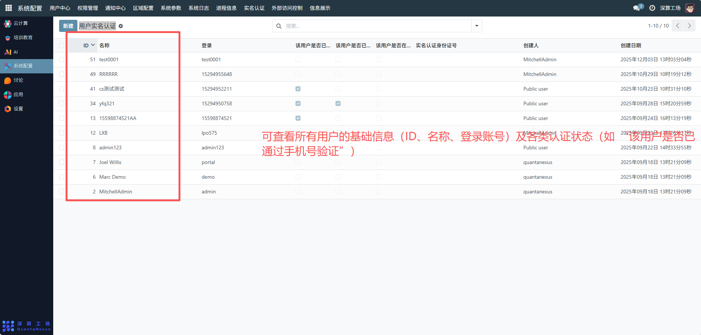
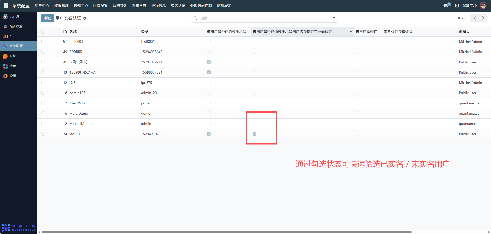
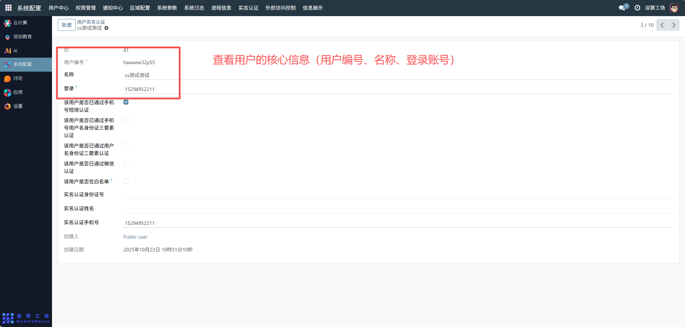
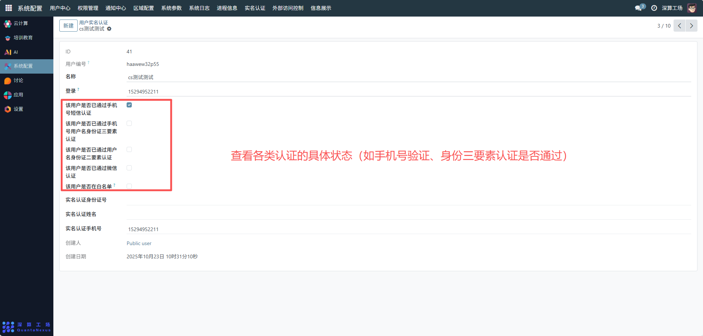

# 用户实名认证
“用户实名认证” 是平台用户多维度身份认证的集中管理模块，核心作用是统一记录、管控所有用户的各类认证状态（如手机号、身份信息、微信等），区分已实名 / 未实名用户，是平台用户身份合规与权限管控的核心工具。
## 核心用途
- 全用户认证状态的统一视图：集中展示所有用户的各类认证状态（如手机号验证、身份三要素认证、微信认证等），清晰区分已实名 / 未实名用户；
- 多维度认证的分类管理：支持跟踪多种认证类型（手机号、身份信息、微信），实现用户身份的多维度核验；
- 认证状态与用户权限的关联：已实名 / 未实名状态可作为用户权限（如资源访问、功能使用）的管控依据；
- 认证操作的轨迹留存：记录认证的创建人、创建日期，保障认证流程的可追溯性。
## 管理配置流程
### 1、查看认证状态列表
进入 “用户实名认证” 模块页面，可查看所有用户的基础信息（ID、名称、登录账号）及各类认证状态（如 “该用户是否已通过手机号验证”）；

通过勾选状态可快速筛选已实名 / 未实名用户。

### 2、查看用户认证详情
- 点击列表中的任意用户，进入详情页：
- 可查看用户的核心信息（用户编号、名称、登录账号）；

可查看各类认证的具体状态（如手机号验证、身份三要素认证是否通过）；

可查看认证的身份信息（实名认证身份证号、姓名、手机号）及操作轨迹（创建人、创建日期）。

### 3、认证状态管理（需对应权限）
- 更新认证状态：对用户的各类认证状态（如 “该用户是否已通过微信认证”）进行勾选 / 取消，标记认证结果；
- 补充认证信息：在详情页填写实名认证的身份证号、姓名等信息，完善用户的身份资料；
- 关联用户权限：根据认证状态，调整用户的资源访问、功能使用权限。

## 日常管理与运维
- 筛选未实名用户：通过列表中的状态勾选，快速定位未完成实名认证的用户，推动其完成认证；
- 核验认证信息：定期核查用户的认证状态与身份信息，确保信息真实有效；
- 权限联动管控：对未实名用户，限制其部分平台功能 / 资源的访问权限；
- 操作轨迹审计：通过创建人、创建日期，追溯认证操作的合规性。