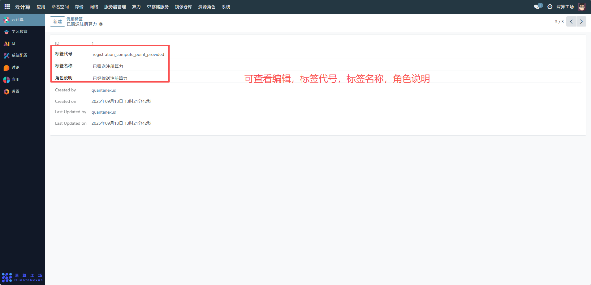
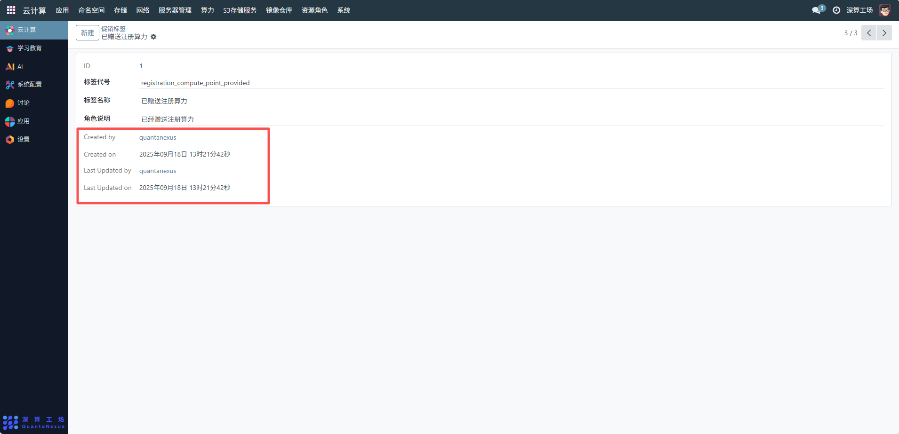

# 促销标签
“促销标签” 是用户权益发放的标识工具，核心作用是通过定义标签（如 “已赠送注册算力”）来标记用户已获得的促销福利，实现权益发放的自动化追踪与管理（比如用户注册后自动打上该标签，触发算力赠送），是平台用户运营中权益管控的关键标识工具。
## 1、标签基础信息配置
- 标签代号：填写标签的唯一系统标识（如registration_compute_point_provided），用于系统自动识别与触发；
- 标签名称 / 角色说明：填写标签的展示名称（如 “已赠送注册算力”）与说明，明确该标签对应的促销权益。

## 2、审计信息
Created by/Created on/Last Updated by/Last Updated on：记录标签的创建、修改信息，实现促销策略的可追溯。

