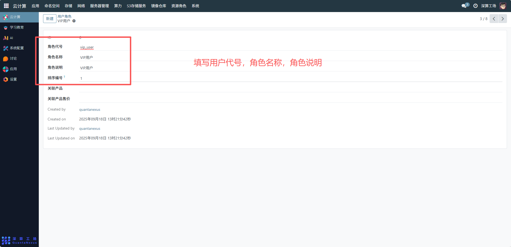
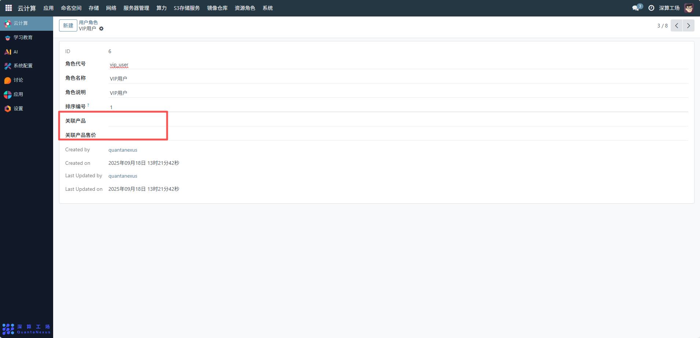
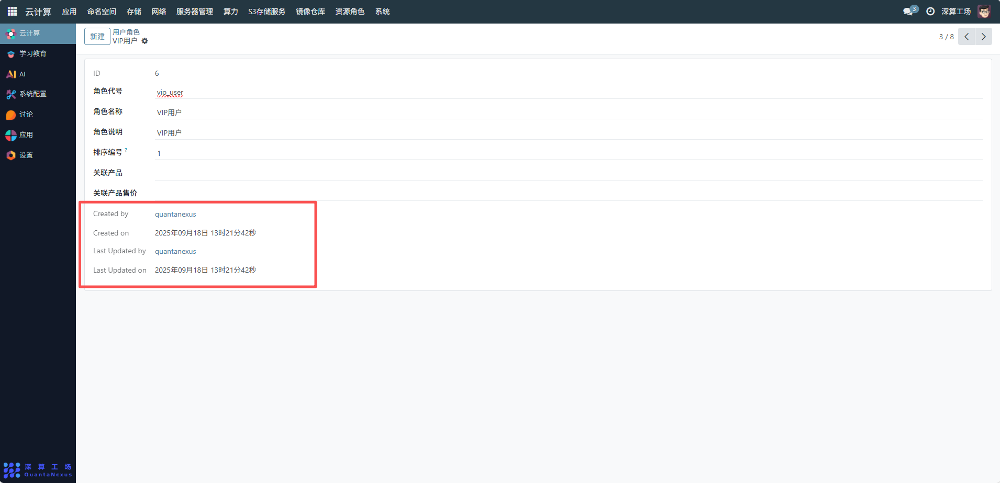

# 用户角色
“用户角色” 是平台用户的权限与身份分类工具，核心作用是定义不同用户群体的身份标识（如 “VIP 用户”），并关联对应的权限、权益（如资源配额、功能访问权），实现用户的批量权限管理，避免逐个用户配置权限，提升平台的权限管控效率。
## 1、角色基础信息配置
- 角色代号：可查看角色的唯一标识（如vip_user），用于系统识别。
- 角色名称 / 角色说明：可查看角色的展示名称（如 “VIP 用户”）与说明，明确角色的定位。
- 排序编号：设置角色的排序，用于权限或资源分配的顺序判定。

## 2、角色权益关联配置
- 关联产品：选择该角色对应的平台服务 / 产品（如 VIP 专属资源包）。
- 关联产品售价：填写该角色对应的产品定价（若为付费角色）。

## 3、审计信息
Created by/Created on/Last Updated by/Last Updated on：记录角色的创建、修改信息，实现角色策略的可追溯。

