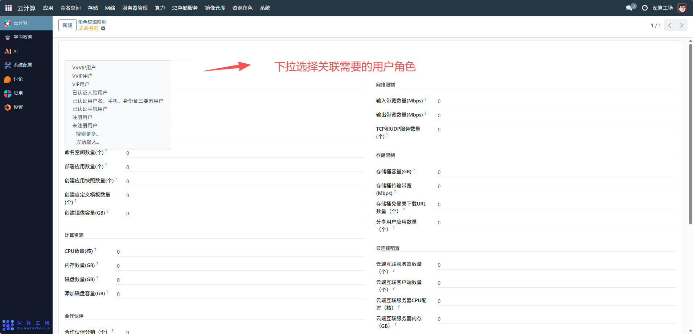
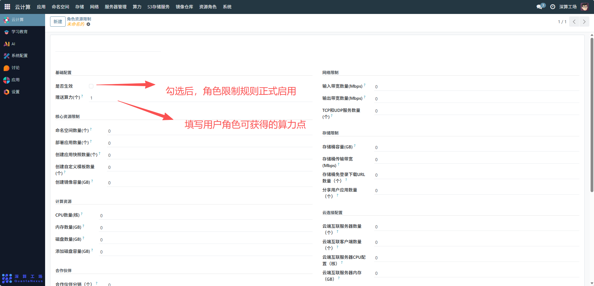
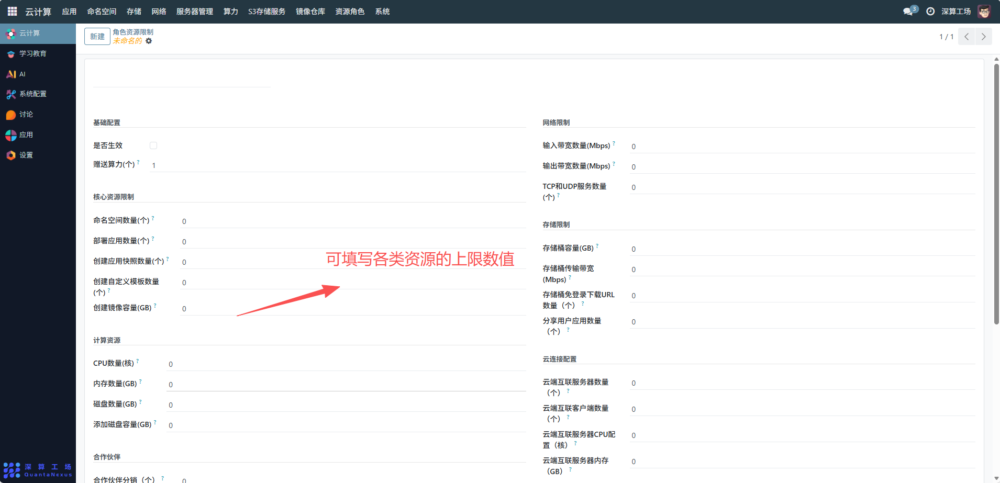

# 角色资源限制
“角色资源限制” 是按用户角色批量配置资源配额的工具，核心作用是为不同角色（如 VVIP 用户、注册用户）统一设置资源使用上限（包括命名空间、算力、存储、网络等），实现角色级的资源管控，避免逐个用户配置资源，提升平台资源分配的效率与公平性。
## 1、角色与基础配置
- 选择目标角色：从下拉列表中选择需配置的角色（如 VVIP 用户、注册用户）。
- 是否生效：勾选后该角色的资源限制规则正式启用。
- 赠送算力 (个)：配置该角色用户可获得的算力权益，关联角色福利。

## 2、资源配额配置
填写各类资源的上限数值：
- 核心资源限制：如 “命名空间数量”“部署应用数量”，限制角色可使用的功能次数。
- 计算资源：如 “CPU 数量”“内存数量”“磁盘数量”，限制角色可占用的硬件算力。
- 存储限制：如 “存储桶容量”“存储传输带宽”，限制角色的存储资源消耗。
- 网络限制：如 “输入 / 输出带宽数量”“TCP 和 UDP 服务数量”，限制角色的网络资源使用。
- 云端互联配置：如 “云端互联服务器数量”，限制角色使用云端服务的规模。

