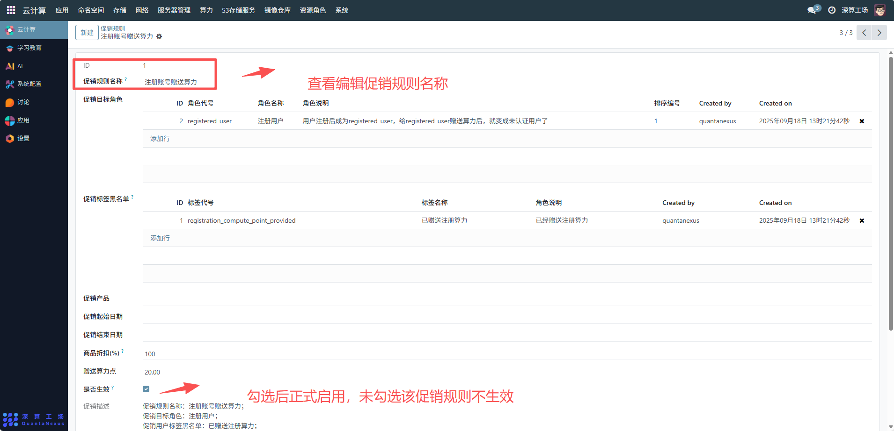
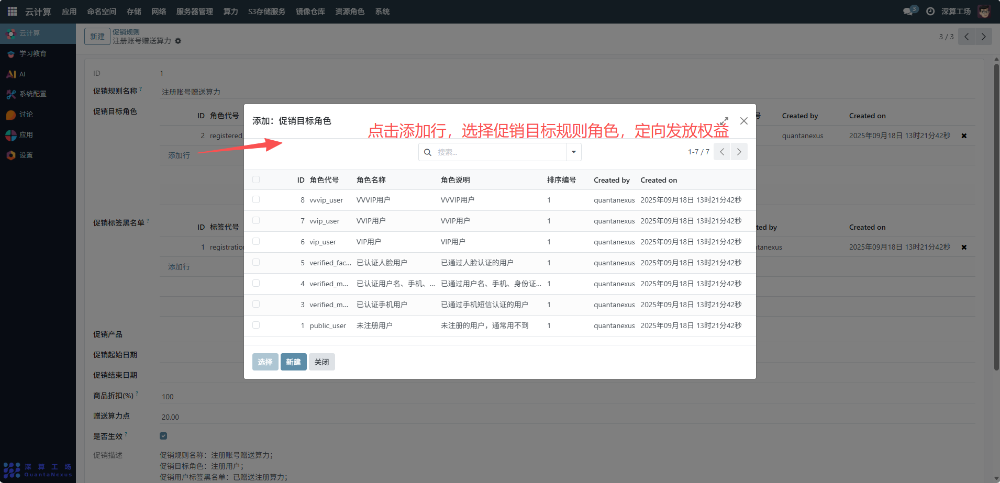
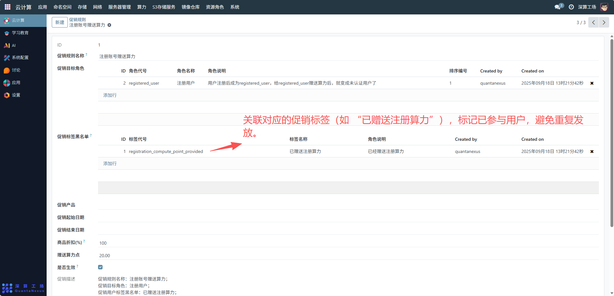
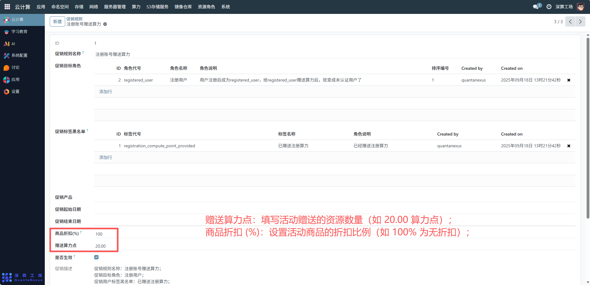
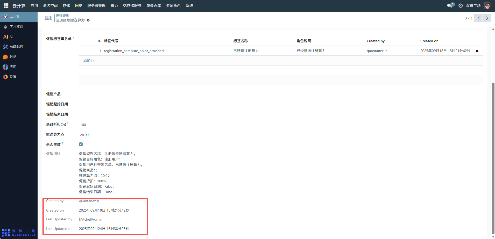

# 促销规则
“促销规则” 是平台促销活动的全流程配置工具，核心作用是定义促销活动的目标用户、权益内容、生效范围与时间，实现促销活动的自动化执行（比如用户注册后自动赠送算力），是用户运营中权益发放、活动管控的核心规则中枢。
## 1、促销基础信息配置
- 促销规则名称：填写活动标识（如 “注册账号赠送算力”），明确活动主题。
- 促销起止日期：设置活动的生效时间范围，控制活动的时间窗口。
- 是否生效：勾选后活动正式启用，未勾选则活动暂不执行。

## 2、目标用户与标签配置
- 促销目标角色：点击 “添加行”，选择活动覆盖的用户角色（如 “注册用户”），定向发放权益。
- 促销标签黑名单：关联对应的促销标签（如 “已赠送注册算力”），标记已参与用户，避免重复发放。

## 3、权益内容配置
- 赠送算力点：填写活动赠送的资源数量（如 20.00 算力点）。
- 商品折扣 (%)：设置活动商品的折扣比例（如 100% 为无折扣）。
- 促销产品：关联活动对应的平台产品（若有）。

## 4、审计信息与更新记录
Created by/Created on/Last Updated by/Last Updated on：记录规则的创建、修改信息，实现活动策略的可追溯。

