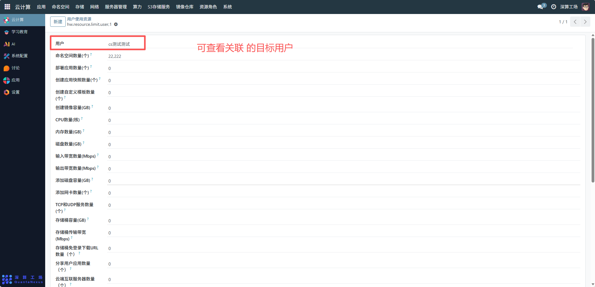
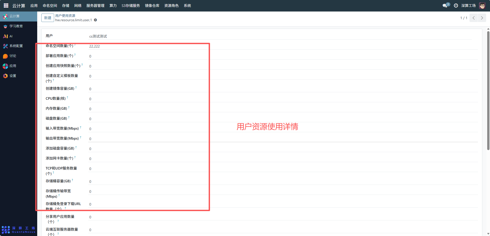
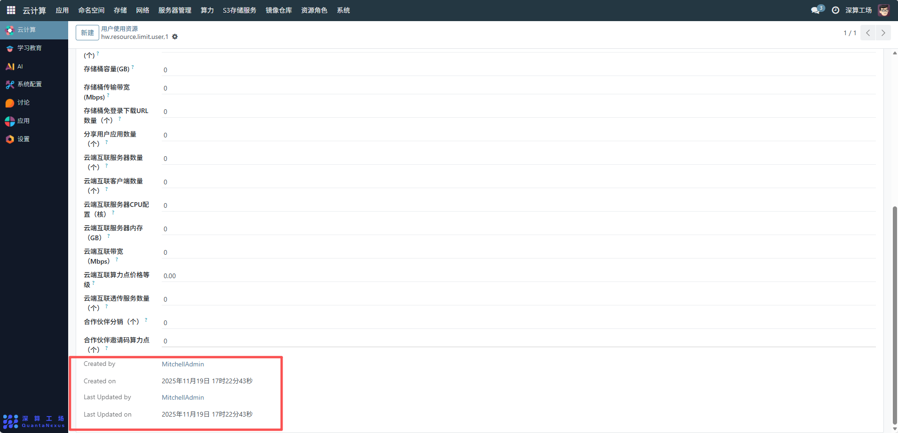

# 用户使用资源
“用户使用资源” 是用户资源配额的精细化管理工具，核心作用是为特定用户，可查看各类资源的使用详情（包括命名空间、应用部署、算力、存储、网络等资源），实现用户级的资源消耗管控，避免单用户过度占用集群资源，保障平台资源的公平分配与稳定运行。
## 1、关联目标用户
用户：选择需配置资源配额的目标用户（如 “cs 测试测试”），明确配额的适用对象。

## 2、资源配额配置
可查看用户资源类型对应的数值：
- 功能类配额：如 “命名空间数量”“部署应用数量”“创建自定义模板数量” 等，用户已使用的次数。
- 算力存储类配额：如 “CPU 数量”“内存数量”“磁盘数量”“存储桶容量” 等，用户已占用的硬件资源。
- 网络类配额：如 “输入 / 输出带宽数量”“TCP 和 UDP 服务数量” 等，用户已使用的网络资源消耗。
- 云服务类配额：如 “云端互联服务数量”“云端互联服务 CPU 配置” 等，用户已使用的云端服务的资源规模。

## 3、审计信息
Created by/Created on/Last Updated by/Last Updated on：记录配额配置的创建、修改信息，实现资源策略的可追溯。

