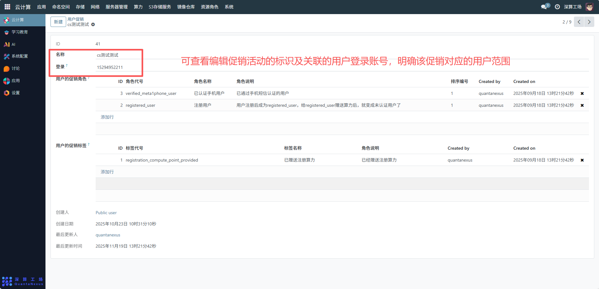
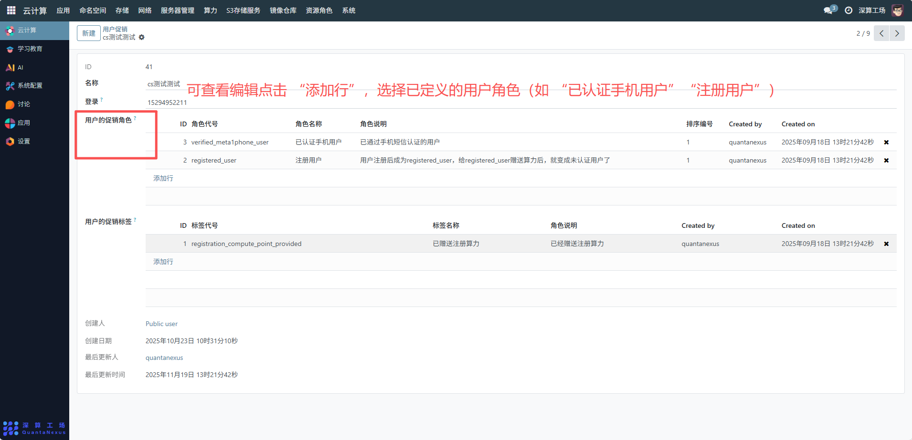
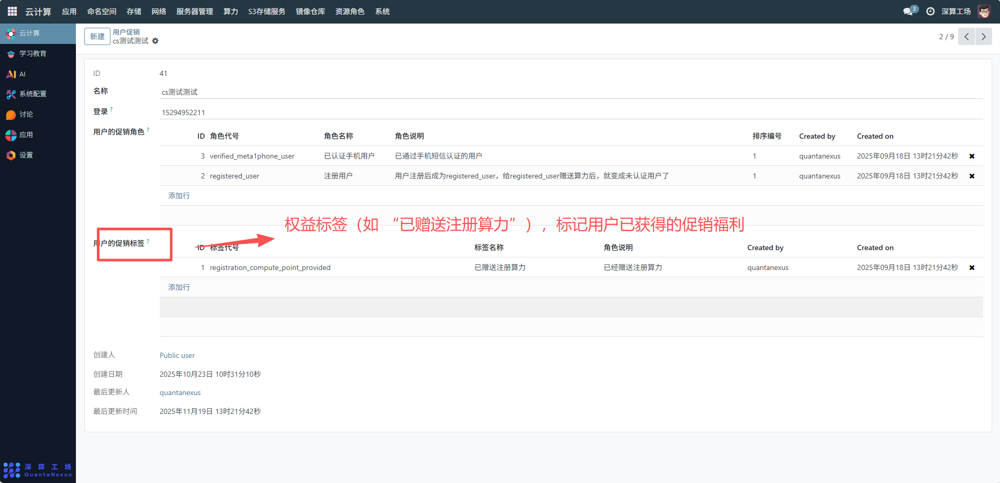
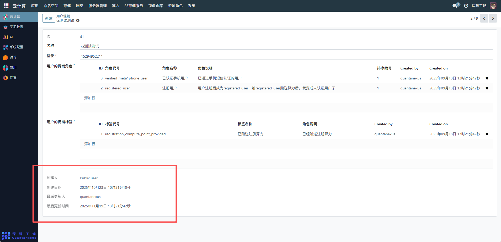

# 用户促销
“用户促销” 是用于配置用户权益与身份标签的管理工具，核心作用是通过绑定 “促销角色” 和 “促销标签”，为用户分配对应的权限、算力等权益（比如新用户注册后自动获得算力赠送），实现用户身份与权益的自动化关联，支撑平台的用户运营与权益管控。
## 1、促销基础信息配置
名称 / 登录：填写促销活动的标识（如 “cs 测试测试”）及关联的用户登录账号，明确该促销对应的用户范围。

## 2、促销角色配置
- 用户的促销角色（表格）：点击 “添加行”，选择已定义的用户角色（如 “已认证手机用户”“注册用户”），为用户绑定对应的身份等级与权限。
- 角色会关联对应的权益说明（如 “注册用户赠送算力后成为未认证用户”）。

## 3、促销标签配置
用户的促销标签（表格）：点击 “添加行”，选择权益标签（如 “已赠送注册算力”），标记用户已获得的促销福利。

## 4、审计信息
创建人 / 创建日期 / 最后更新人 / 最后更新时间：记录促销配置的创建、修改信息，实现运营策略的可追溯。

