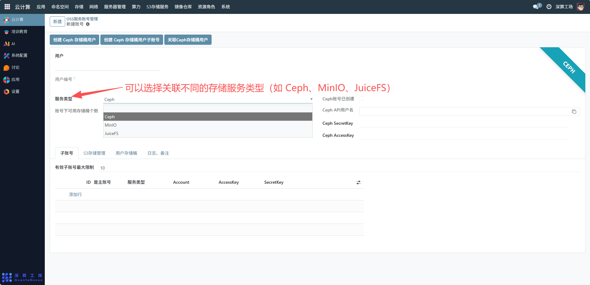

# OSS服务账号管理
“OSS 服务账号管理” 是云存储服务（如 Ceph、JuiceFS）的账号权限管理工具，核心作用是创建、配置、关联存储服务的用户 / 子账号，分配存储资源的访问权限，是云存储资源安全管控与权限分配的核心模块。。下面是oss服务账号管理的一个流程。
## 核心用途
- 存储服务账号的全生命周期管理：支持创建 Ceph 等存储服务的用户 / 子账号、关联已有用户，实现账号从创建到关联的全流程管控。
- 存储权限的精细化分配：通过 “账号下可用存储桶个数”“有效子账号最大限制” 等字段，控制用户 / 子账号可使用的存储资源额度。
- 多存储服务的统一管理：支持 Ceph、MinIO、JuiceFS 等多种存储服务类型，实现不同存储资源的账号统一配置。
- 访问凭证的安全管理：生成并管理 Ceph 的 API 用户名、AccessKey、SecretKey 等访问凭证，保障存储资源的安全访问。

## 1、 Ceph 存储桶用户
点击创建 Ceph 存储桶用户按钮，系统会自动生成 Ceph API 用户名、SecretKey 和 AccessKey，并在界面中展示，创建后，“Ceph 账号已创建” 会显示勾选状态。

## 2、Ceph 存储桶用户子账号
- 点击创建 Ceph 存储桶用户子账号按钮，系统会为当前用户生成子账号的 AccessKey 和 SecretKey子账号会显示在 “子账号” 列表中，可查看其 ID、Servers Type（默认 Ceph）、Account 等信息。需注意有效子账号最大限制（示例中为 10），不可超过该限制创建。

## 3、关联 Ceph 存储桶用户
- 若需将现有 Ceph 存储桶用户与系统账号关联，点击关联 Ceph 存储桶用户按钮，按照提示输入 Ceph 用户的 API 用户名、SecretKey 和 AccessKey，完成关联操作。

## 4、管理子账号
- 查看子账号信息：在 “子账号” 列表中，可查看每个子账号的 AccessKey、SecretKey 等详情。
- 删除子账号：点击子账号对应的删除账号按钮，可删除不需要的子账号（删除前需确认该子账号无正在使用的存储桶关联）。

## 5、日志与备注
- 切换至 “日志、备注” 标签页，可查看账号操作的日志记录，或填写备注信息（如子账号的用途说明）。

## 6、关联服务类型

- 服务类型：可以选择关联不同的存储服务类型（如 Ceph、MinIO、JuiceFS）。

