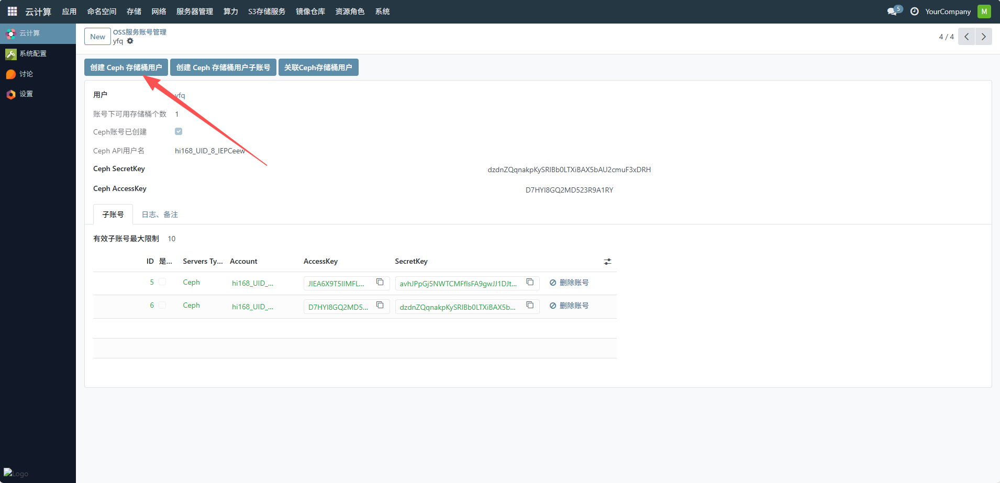
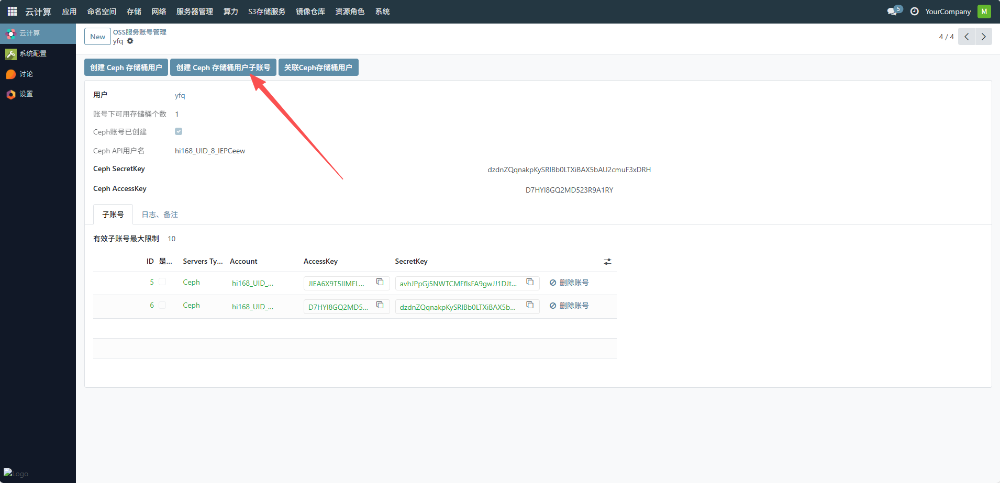
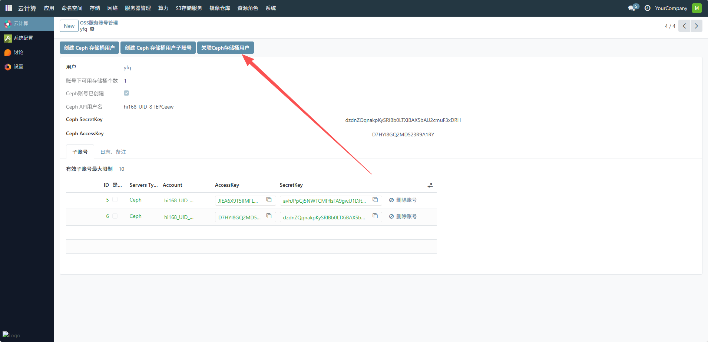
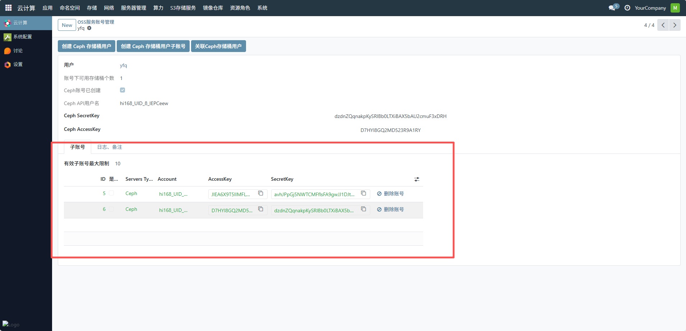
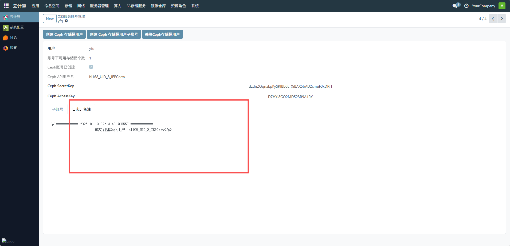

# OSS服务账号管理
OSS 服务账号管理界面，用于集中管理对象存储服务（OSS）的账号资源，为平台管理员提供了对象存储服务的账号入口，助力管理员在云计算环境中高效管理非结构化数据（如文件、图片、视频等）的存储与访问。下面是oss服务账号管理的一个流程。
## 1、 Ceph 存储桶用户
点击创建 Ceph 存储桶用户按钮，系统会自动生成 Ceph API 用户名、SecretKey 和 AccessKey，并在界面中展示，创建后，“Ceph 账号已创建” 会显示勾选状态。

## 2、Ceph 存储桶用户子账号
点击创建 Ceph 存储桶用户子账号按钮，系统会为当前用户生成子账号的 AccessKey 和 SecretKey子账号会显示在 “子账号” 列表中，可查看其 ID、Servers Type（默认 Ceph）、Account 等信息。需注意有效子账号最大限制（示例中为 10），不可超过该限制创建。

## 3、关联 Ceph 存储桶用户
若需将现有 Ceph 存储桶用户与系统账号关联，点击关联 Ceph 存储桶用户按钮，按照提示输入 Ceph 用户的 API 用户名、SecretKey 和 AccessKey，完成关联操作。

## 4、管理子账号
查看子账号信息：在 “子账号” 列表中，可查看每个子账号的 AccessKey、SecretKey 等详情。
删除子账号：点击子账号对应的删除账号按钮，可删除不需要的子账号（删除前需确认该子账号无正在使用的存储桶关联）。

## 5、日志与备注
切换至 “日志、备注” 标签页，可查看账号操作的日志记录，或填写备注信息（如子账号的用途说明）。

