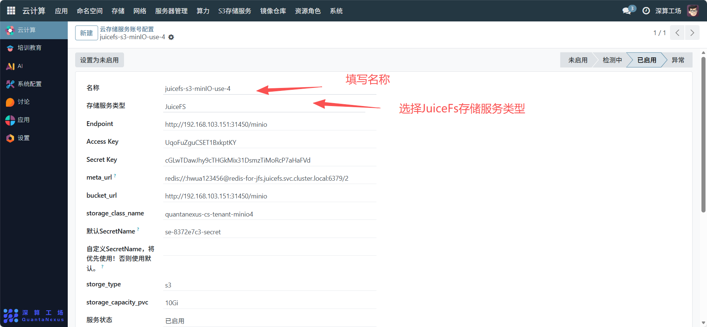
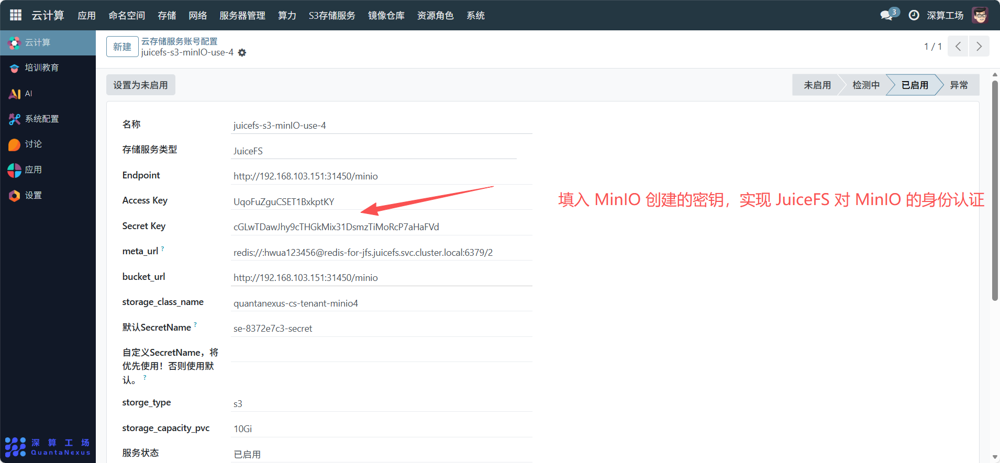
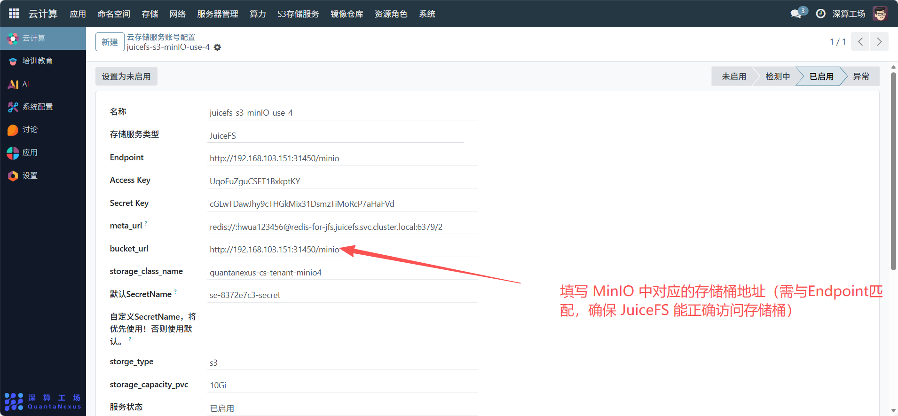
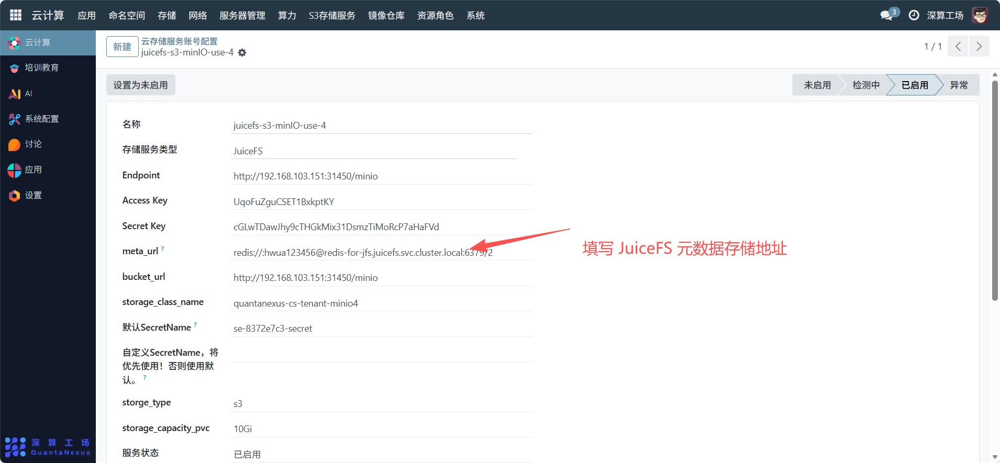
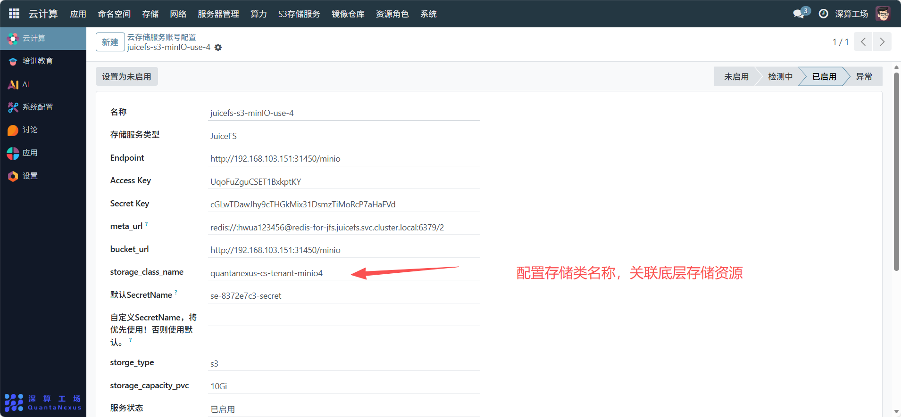
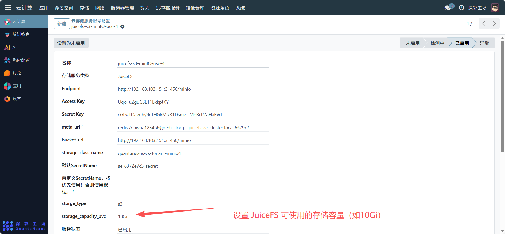
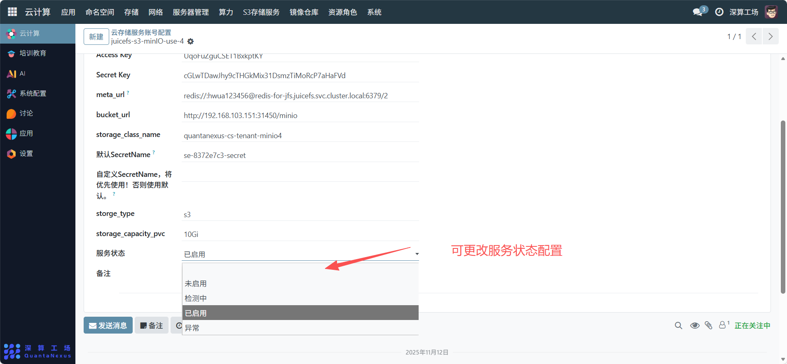

# 云存储账号配置
“云存储服务账号配置” 是云存储服务（如 JuiceFS 对接 MinIO）的访问凭证与资源参数管理工具，核心作用是集中配置存储服务的连接信息、认证密钥、资源配额等，实现对云存储服务的安全访问与资源管控，是保障云存储服务正常运行的核心配置模块。
## 核心用途
- **1、存储服务的身份认证**：通过Access Key和Secret Key配置访问密钥，确保只有授权主体能访问存储服务。
- **2、连接信息的集中管理**:记录Endpoint（服务地址）、bucket_url（存储桶地址）等，明确存储服务的访问路径。
- **3、资源参数的精准配置**：设置storage_capacity_pvc（存储容量）、storage_type（存储类型）等，定义存储资源的使用边界。
- **4、服务状态的灵活管控**：通过 “已启用 / 未启用” 状态切换，控制该账号配置对应的存储服务是否可用。
- **5、密钥优先级管理**：支持 “自定义 SecretName” 优先于默认密钥，提升密钥管理的灵活性。

## 与 JuiceFS+MinIO 的协同管理配置流程
JuiceFS 作为分布式文件系统，通常需要对接 MinIO（对象存储）作为底层存储，因此 “云存储服务账号配置” 需与两者形成联动，步骤如下：
### 1、前提：完成 MinIO 基础配置
确保 MinIO 服务已部署，且已创建存储桶（bucket），记录其Endpoint（如http://192.168.103.151:31450/minio）；
在 MinIO 中创建访问密钥（Access Key和Secret Key），用于后续 JuiceFS 的认证。

[MinIO 基础配置步骤](oss-storage.md)

### 2、配置 “云存储服务账号”，关联 JuiceFS 与 MinIO
* 基础信息：
  - 名称：填写有辨识度的标识（如juicefs-s3-minIO-use-4）。
  - 存储服务类型：选择 “JuiceFS”，明确该账号用于 JuiceFS 服务。

* 连接与认证信息：
  - Endpoint：填写 MinIO 的服务地址（需与 MinIO 配置一致）。

  - Access Key/Secret Key：填入 MinIO 创建的密钥，实现 JuiceFS 对 MinIO 的身份认证。

  - bucket_url：填写 MinIO 中对应的存储桶地址（需与Endpoint匹配，确保 JuiceFS 能正确访问存储桶）。

* 资源与元数据配置：
  - meta_url：填写 JuiceFS 元数据存储地址（通常为 Redis，如redis://hwwua123456@redis-for-jfs.juicefs.svc.cluster.local）。

  - storage_class_name：配置存储类名称，关联底层存储资源。

  - storage_capacity_pvc：设置 JuiceFS 可使用的存储容量（如10Gi），避免资源滥用。

* 状态与密钥管理：
  - 服务状态：设为 “已启用”，使配置生效。

  - 密钥优先级：如需自定义密钥，填写 “自定义 SecretName”，否则使用 “默认 SecretName”。

## 协同运维与校验
- 状态同步：若 MinIO 服务停用，需同步将该账号配置设为 “未启用”，避免连接错误。
- 密钥更新：当 MinIO 的Access Key/Secret Key变更时，需立即更新该配置中的对应字段，否则会导致 JuiceFS 访问失败。
- 资源调整：若业务需要更大存储容量，修改storage_capacity_pvc并确保 MinIO 侧有足够空间。
