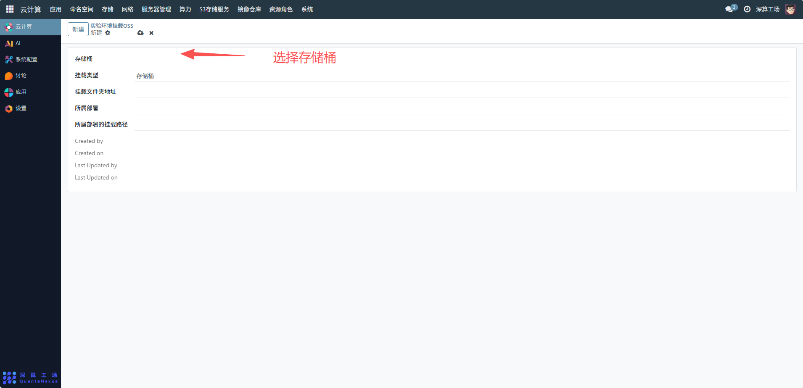
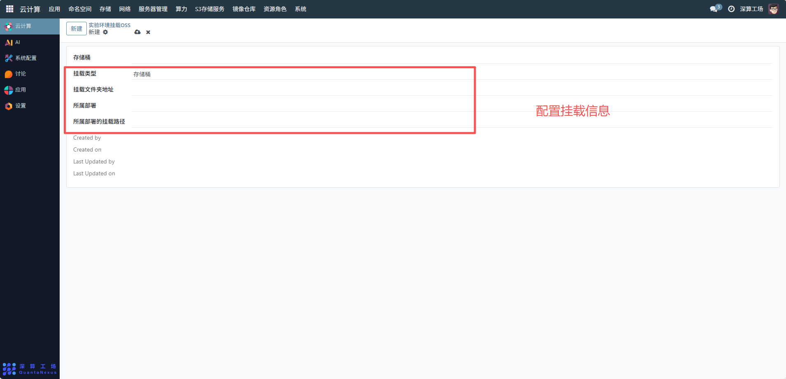
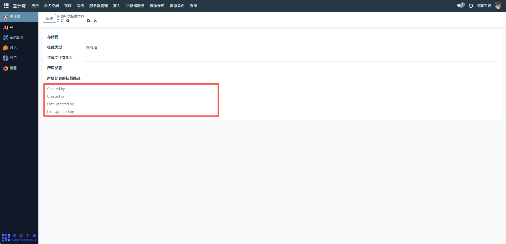

# 实验环境挂载OSS
实验环境挂载 OSS 管理界面，管理员可通过该界面管理系统中实验环境与 OSS 存储的挂载关系。
## 1、选择存储桶
在 “存储桶” 字段中，选择需要挂载的 OSS 存储桶，确保存储桶的归属和权限符合实验环境需求。

## 2、配置挂载信息
- 挂载类型：确认挂载类型为 “存储桶”（默认已选择，若有其他类型可按需切换）。
- 挂载文件夹地址：输入实验环境中用于挂载 OSS 存储桶的本地文件夹地址，例如/data/experiment_oss，需确保该路径在实验环境中可访问且有足够权限。
- 所属部署：选择该挂载配置所属的部署环境。
- 所属部署的挂载路径：输入部署环境中对应的挂载路径，与 “挂载文件夹地址” 保持一致或根据部署规则填写，确保路径映射正确。

## 3、确认创建与更新信息
界面下方的 “Created by”“Created on”“Last Updated by”“Last Updated on” 为系统自动记录的创建和更新信息，无需手动配置，可用于追溯挂载配置的操作历史。

