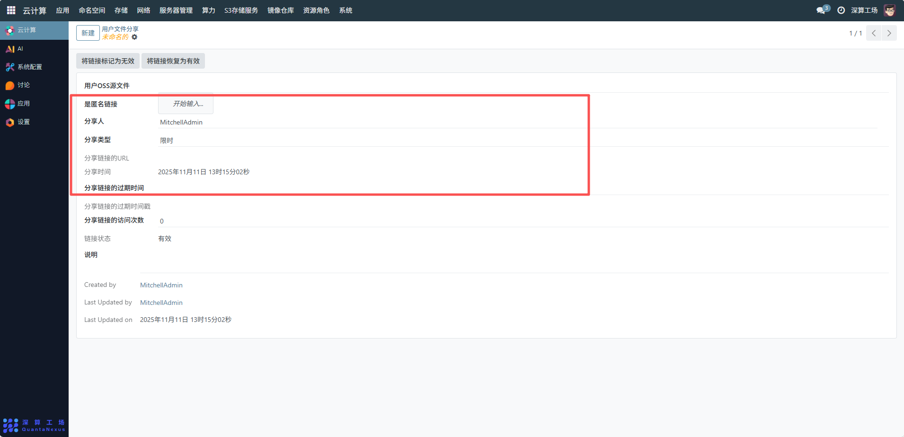
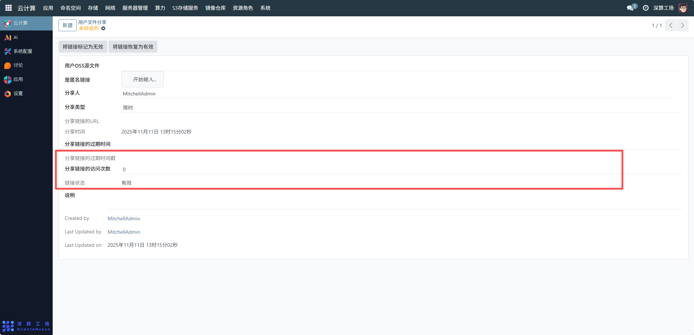
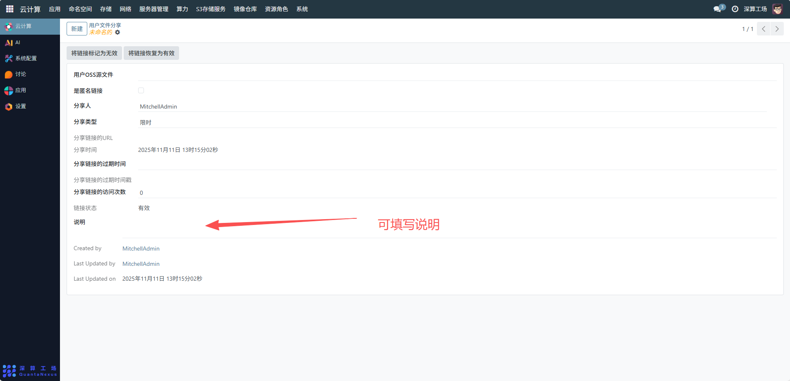

# 文件分享
主要用于管理员对系统内所有用户的文件分享行为进行集中管控
## 1、可查看用户 OSS 源文件
在 “用户 OSS 源文件” 字段中，选择需要查看的源文件，确保文件归属和路径正确。

## 2、配置分享类型与权限
- 是否匿名链接：若允许匿名访问分享链接，勾选该选项；若需限制访问（如仅授权用户可访问），则不勾选。
- 分享类型：选择分享类型，如 “限时”（需设置过期时间）或 “永久”（无过期限制）。
- 分享链接的过期时间：若选择 “限时” 分享类型，需在此处设置具体的过期时间，确保链接在指定时间后失效。

## 3、管理分享链接状态
- 若需停止分享，点击将链接标记为无效，使链接无法再被访问；
- 若需恢复已失效的链接，点击将链接恢复为有效，重新启用分享功能。

## 4、填写说明
在 “说明” 字段中，填写该文件分享的用途、备注等信息（如 “项目资料临时分享，有效期 7 天”），便于后续追溯管理。

