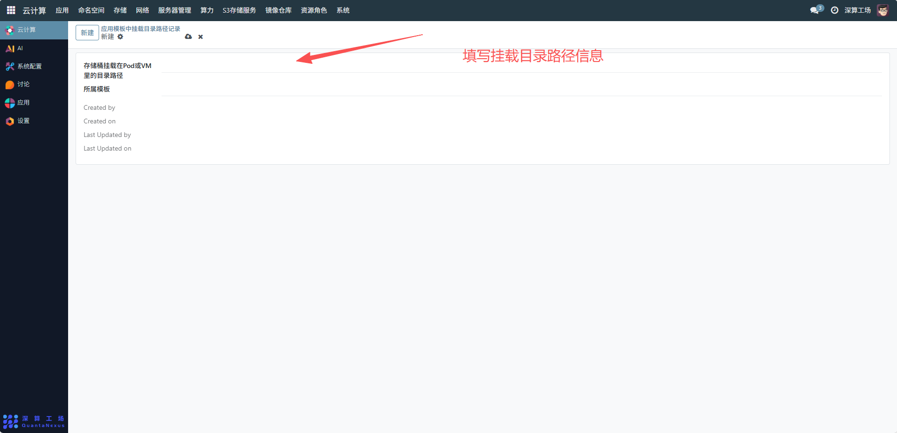
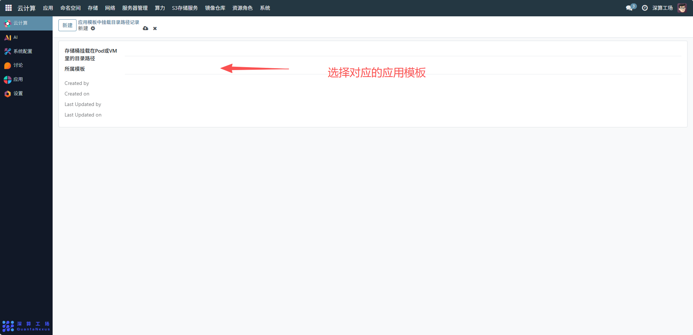
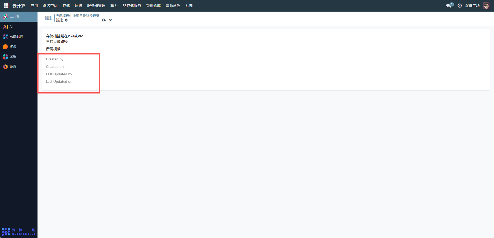

# 挂载目录路径记录
应用模板中挂载目录路径记录管理界面，管理员可通过该界面查看和管理所有应用模板中存储桶挂载到 VM 的目录路径配置，管理员统一管理应用模板存储挂载配置的关键工具，通过标准化记录挂载路径，保障应用部署时存储资源访问的一致性与可靠性。
## 1、挂载目录路径信息
存储桶挂载在 Pod 或 VM 里的目录路径：可查看存储桶在应用模板对应的 Pod（容器）或 VM（虚拟机）中的具体挂载路径，该路径需符合 Pod/VM 的文件系统规范，确保应用能通过此路径访问挂载的存储资源。

## 2、关联所属模板
所属模板：从下拉选项中选择该挂载路径对应的应用模板（需提前创建应用模板），建立挂载路径与应用模板的关联关系，确保配置仅对目标模板生效。

## 3、记录
- 配置完成后，系统会自动记录以下信息，无需手动填写，用于后续追溯管理：
- Created by：创建该配置的用户。
- Created on：配置的创建时间。
- Last Updated by：最后修改该配置的用户。
- Last Updated on：最后修改时间。

