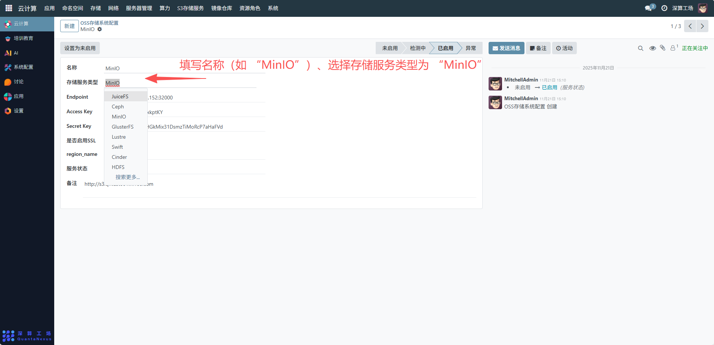
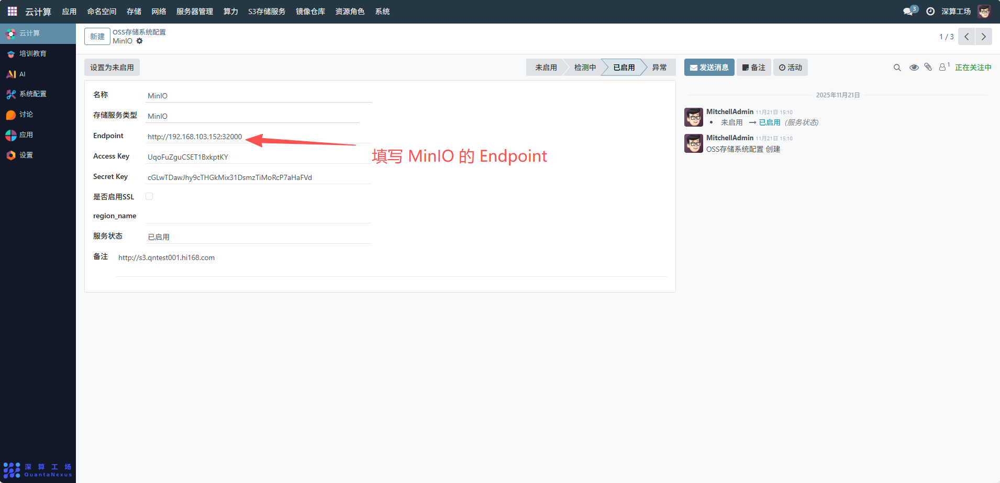
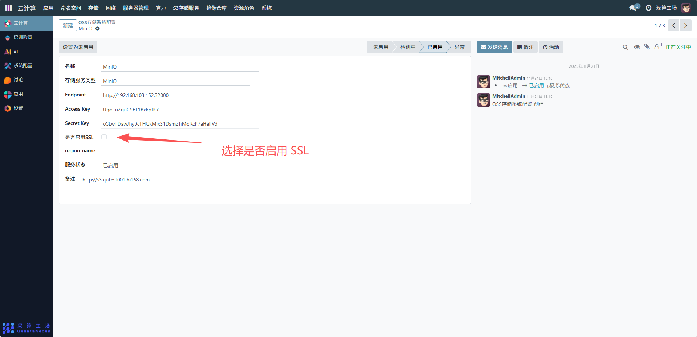

# OSS存储系统配置
“OSS 存储系统配置” 是 OSS 存储服务的访问与参数管理工具，核心作用是配置 MinIO 服务的连接地址、认证凭证、安全选项等信息，实现 MinIO 存储服务的安全访问与状态管控，是支撑基于 MinIO 的存储资源调度的核心模块。
## 核心用途
**1、MinIO 服务的访问配置**：通过 Endpoint、Access Key、Secret Key 配置 MinIO 的访问地址与认证凭证，保障服务的安全访问。
**2、安全与区域管理**：通过 “是否启用 SSL” 控制访问的加密方式，“region_name” 定义存储区域。
**3、服务状态的实时管控**：通过 “服务状态”（已启用 / 未启用）切换 MinIO 服务的可用状态。
**4、存储资源的基础标识**：关联 “存储服务类型”（MinIO），明确该 OSS 配置对应的存储服务类型。

## 与 JuiceFS+MinIO 的协同管理配置流程
JuiceFS 通常会对接 MinIO 作为底层存储，因此需要将OSS 存储系统配置（MinIO）与JuiceFS 云存储账号配置联动，步骤如下：
### 1、先配置 OSS 存储系统（MinIO）
基础信息：填写名称（如 “MinIO”）、选择存储服务类型为 “MinIO”。

访问凭证：填写 MinIO 的 Endpoint（如http://192.168.103.152:32000）、Access Key、Secret Key。

安全与状态：选择是否启用 SSL，将服务状态设为 “已启用”。

### 2、再配置 JuiceFS 云存储账号，关联 MinIO
- 存储服务类型：选择 “JuiceFS”；
- 关联 MinIO：在 JuiceFS 配置的bucket_url中填写 MinIO 的存储桶地址（需与 OSS 配置的 MinIO Endpoint 对应）。
- 访问凭证：若 JuiceFS 通过 MinIO 认证，可复用 MinIO 的 Access Key/Secret Key，或配置 JuiceFS 专属密钥。
- 元数据与资源：配置 JuiceFS 的 meta_url（如 Redis 地址）、存储容量等参数。

[配置 JuiceFS 云存储账号步骤](cloud-storage.md)

## 协同运维
- 状态同步：若 MinIO 的服务状态变更（如停用），需同步调整 JuiceFS 配置的服务状态。
- 凭证更新：若 MinIO 的 Access Key/Secret Key 变更，需同步更新 JuiceFS 配置中对应的认证信息。
- 资源适配：根据 MinIO 的存储容量，调整 JuiceFS 的存储配额，避免资源超限。