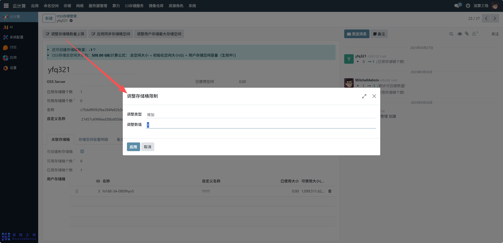
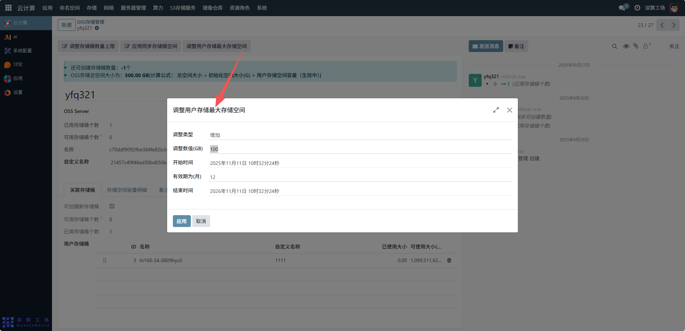
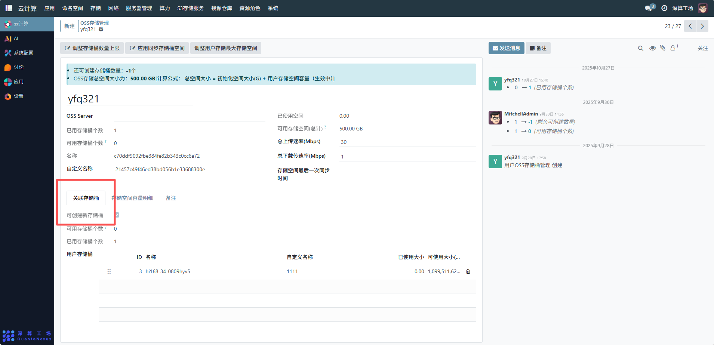
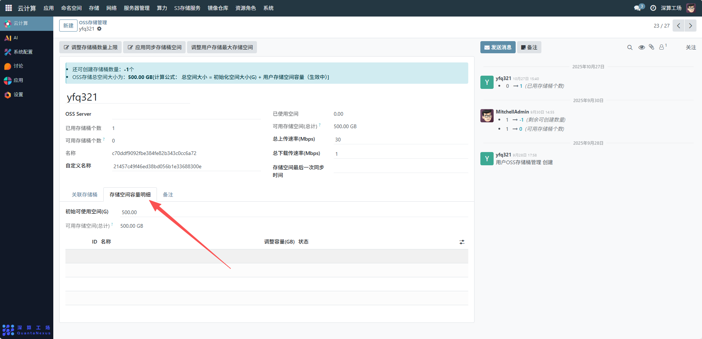
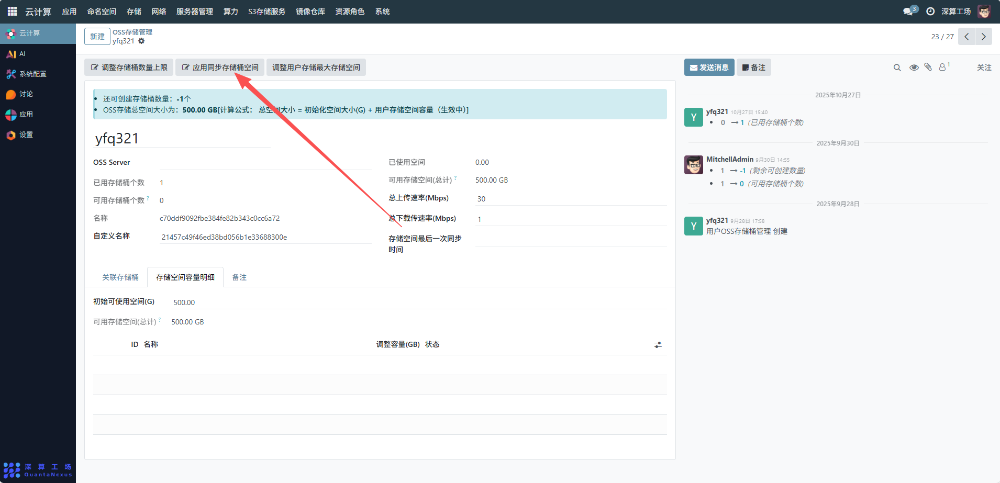
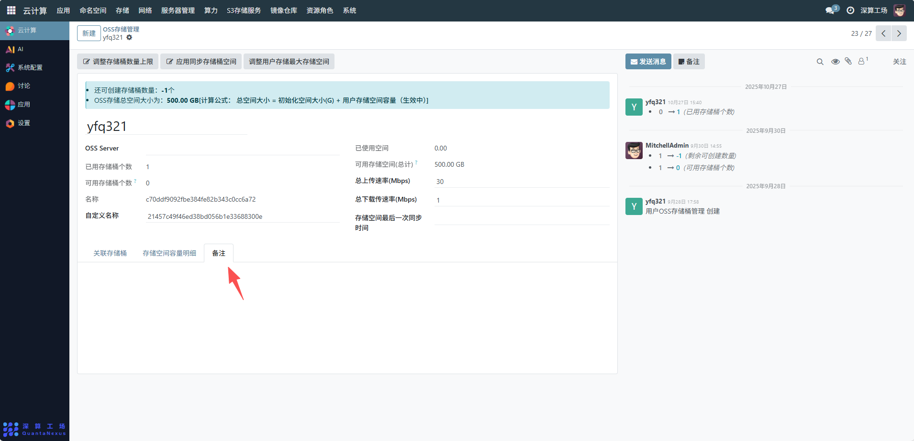

# S3存储管理
OSS 存储管理界面，用于全局管控所有用户的对象存储资源，其支撑了非结构化数据（如文件、多媒体、）的持久化存储与高效访问，是平台数据生态中 “数据底座” 的关键组成部分，为上层应用提供可靠的存储资源支撑。
要管理配置 OSS 存储，可按照以下流程操作：
## 1、存储桶数量与空间调整
调整存储桶数量上限：点击 “调整存储桶数量上限” 按钮，可修改用户可创建的存储桶数量限制，根据业务需求设置合理的数量（如增加或减少存储桶配额）。
调整用户存储最大存储空间：点击 “调整用户存储最大存储空间” 按钮，设置用户可使用的总存储空间上限（如示例中总空间为 500.00 GB），确保满足业务数据存储需求。

## 2、存储桶管理
关联存储桶：切换至 “关联存储桶” 标签页，可将已有存储桶与当前用户关联，实现存储桶的归属管理。
管理用户存储桶：在 “用户存储桶” 列表中，可查看每个存储桶的 ID、名称、自定义名称、已使用大小和可使用大小等信息；若需删除存储桶，点击对应存储桶的删除按钮（垃圾桶图标）即可。

## 3、存储空间容量明细查看
切换至 “存储空间容量明细” 标签页，可查看存储空间的详细使用情况，包括各存储桶的容量占用明细，便于掌握存储资源的使用分布。

## 4、应用同步存储桶空间
点击 “应用同步存储桶空间” 按钮，可将存储桶空间配置同步到关联的应用中，确保应用侧的存储配置与 OSS 存储管理侧保持一致。

## 5、备注与消息
切换至 “备注” 标签页，可填写 OSS 存储管理的相关说明信息，如配置变更原因、存储用途等。

