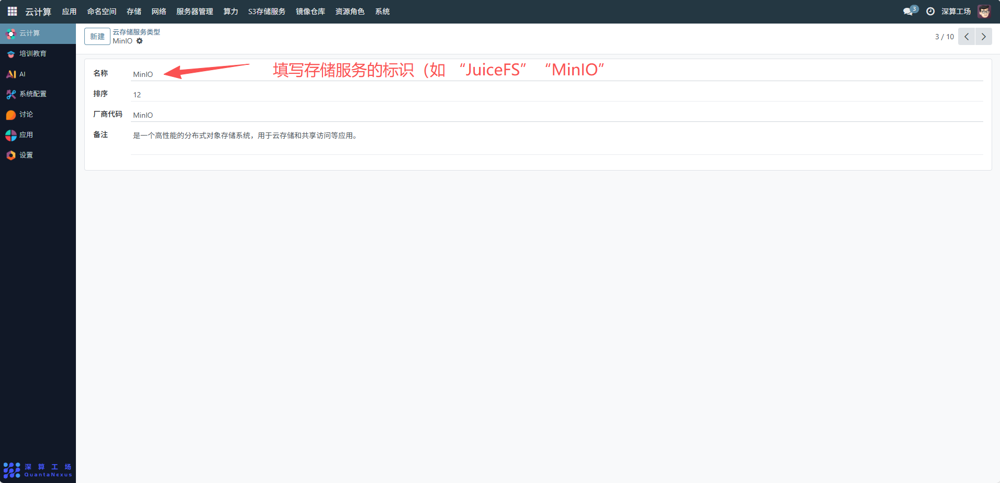
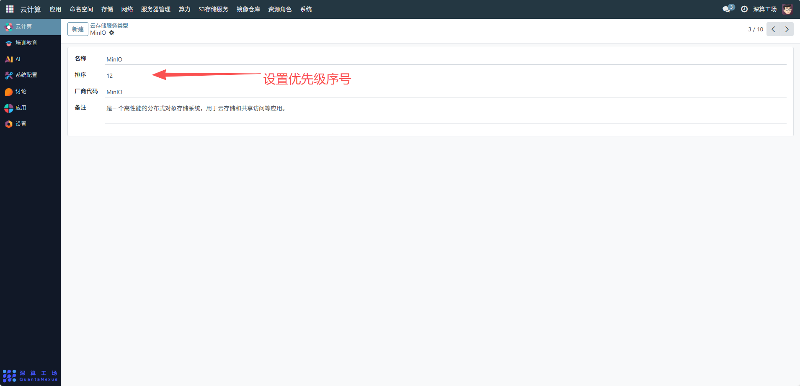
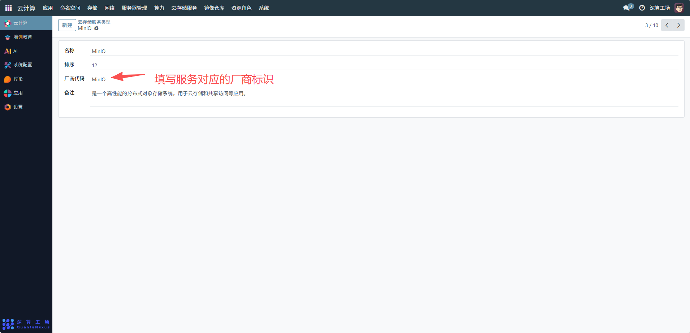
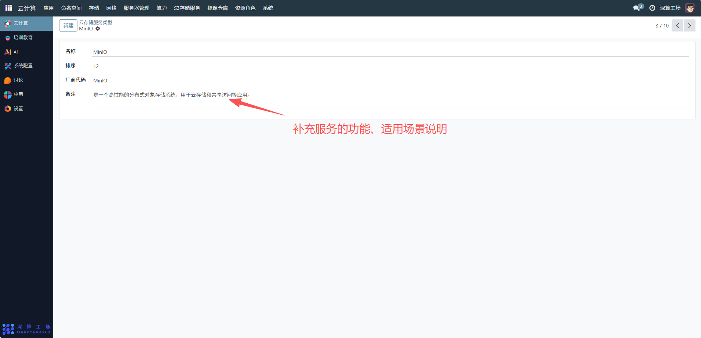
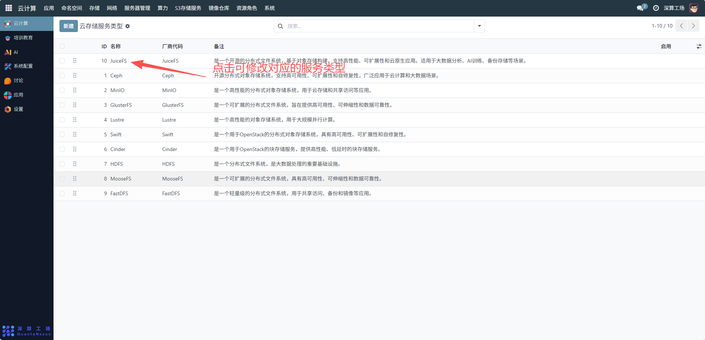
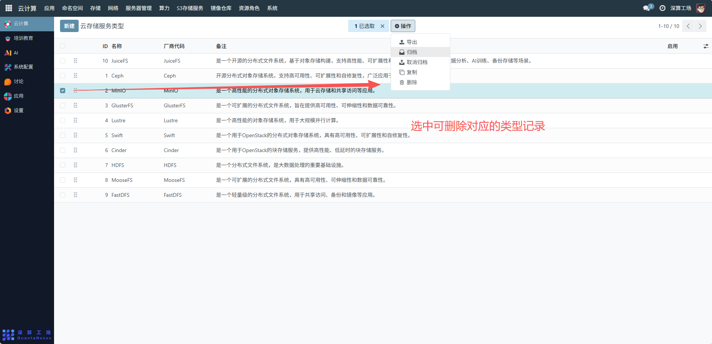

# 云存储服务类型
“云存储服务类型” 是云存储服务的分类与信息管理工具，核心作用是对不同类型的云存储服务（如 JuiceFS、MinIO）进行标准化定义、分类梳理，为后续云存储账号配置、资源调度提供统一的类型依据，是云存储资源管理的基础分类模块。
## 核心用途
**1、云存储服务的标准化分类**：通过 “名称”“厂商代码” 明确不同存储服务的类型（如 JuiceFS 是分布式文件系统、MinIO 是对象存储），统一存储服务的分类规则。
**2、服务信息的集中说明**：通过 “备注” 补充服务的功能、适用场景（如 JuiceFS 适配大数据分析），辅助后续资源选型。
**3、服务展示 / 调度的优先级管理**：通过 “排序” 字段定义不同存储服务的展示或调度优先级（数字越小优先级越高）。
**4、服务可用性的管控**：通过 “启用” 开关控制某类存储服务是否可被后续配置使用。

## 管理配置流程
### 1、新增云存储服务类型
名称：填写存储服务的标识（如 “JuiceFS”“MinIO”）。

排序：设置优先级序号（如 JuiceFS 填 “10”、MinIO 填 “12”，代表 JuiceFS 优先级更高）。

厂商代码：填写服务对应的厂商标识（与名称一致即可，如 “JuiceFS” 对应厂商代码 “JuiceFS”）。

备注：补充服务的功能、适用场景说明（如 “MinIO 是高性能分布式对象存储系统”）。

### 2、管理已存在的服务类型
修改信息：点击可修改对应的服务类型，调整 “排序”“备注” 等字段（如业务需求变化时，调整服务优先级）。

删除类型：若某类存储服务不再使用，可删除对应的类型记录（需确保无关联的账号配置）。

## 与 JuiceFS+MinIO 的协同管理
在配置 JuiceFS+MinIO 的云存储账号前，需先确保已在 “云存储服务类型” 中完成两者的定义：
- 新增 “JuiceFS” 类型，明确其是分布式文件系统。
- 新增 “MinIO” 类型，明确其是对象存储。
