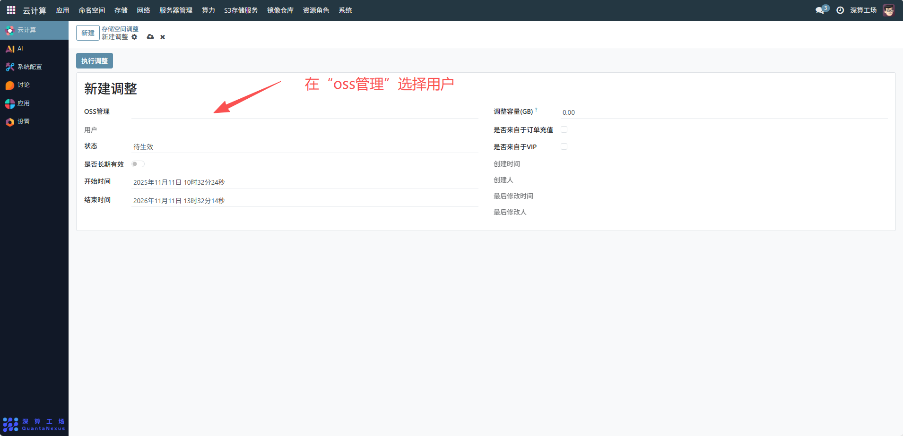
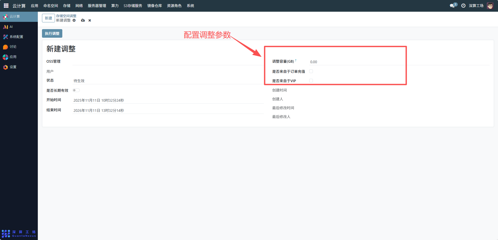
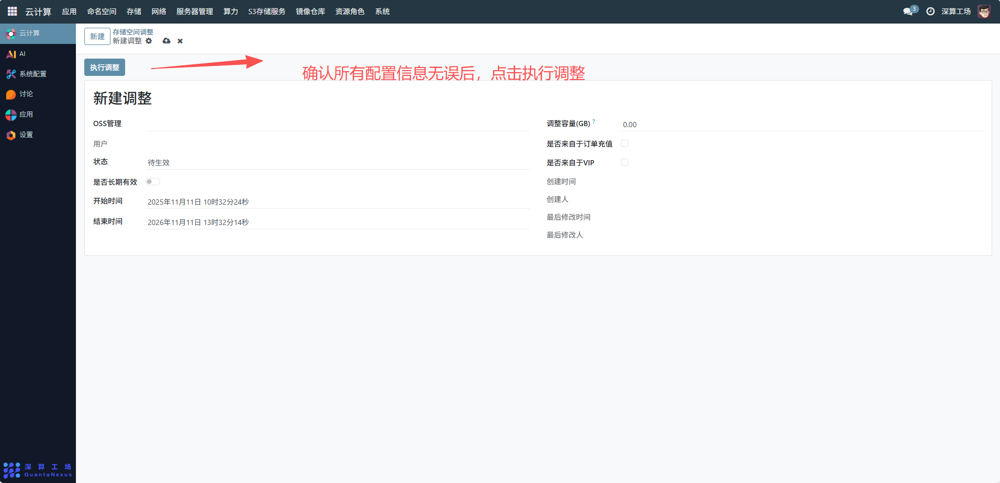

# 存储空间调整
存储空间调整管理界面，管理员可通过该界面查看和管理所有用户的 OSS 存储空间调整记录
## 1、选择 OSS 管理用户
在 “OSS 管理 - 用户” 下拉框中，选择需要调整存储空间的目标用户。

## 2、配置调整参数
调整容量 (GB)：输入需要调整的存储空间大小（以 GB 为单位），例如增加 50GB 则输入 “50.00”，减少 20GB 则输入 “-20.00”。
是否来自于订单充值：若存储空间调整源于用户的订单支付（如购买存储扩容套餐），勾选此选项；否则不勾选。
是否来自于 VIP：若调整是 VIP 用户的专属权益（如 VIP 免费扩容），勾选此选项；否则不勾选。

## 3、设置生效时间
是否长期有效：若调整的存储空间长期有效，勾选此选项；若为临时调整（如活动期间扩容），则不勾选并设置以下时间参数。
开始时间：选择存储空间调整的生效开始时间。
结束时间：选择存储空间调整的失效结束时间（仅当 “是否长期有效” 未勾选时需设置）。

## 4、执行调整
确认所有配置信息无误后，点击执行调整按钮，系统会根据配置自动更新用户的存储空间配额。

