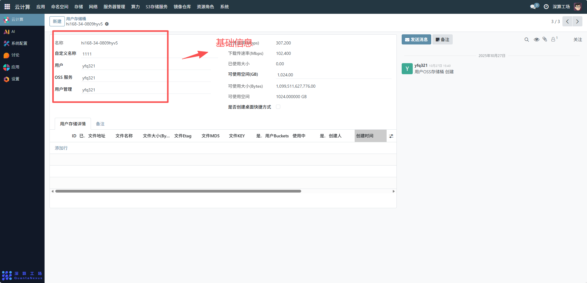
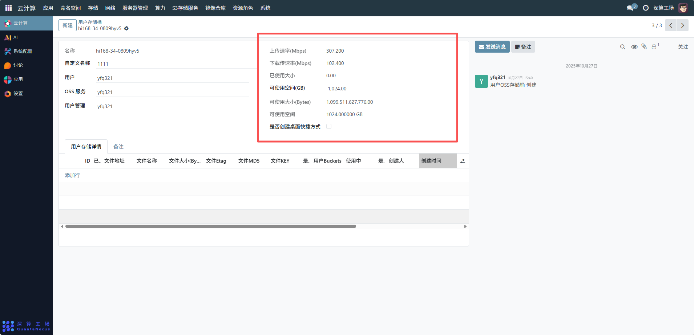
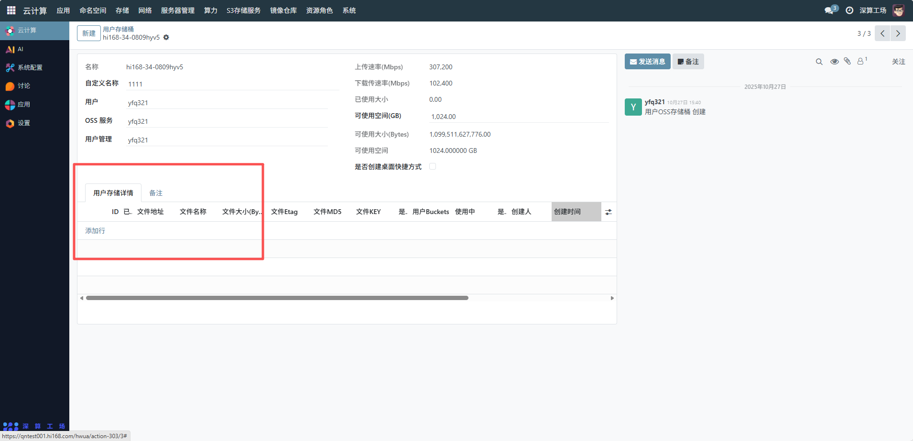

# 存储桶
主要用于管理员对系统中所有用户的存储桶进行集中化管理，包括查看存储桶的资源分布、使用状态、性能参数等，便于开展资源调配、状态监控和合规性管理，确保存储资源的高效利用与安全可控。
## 1、基础信息配置
- 名称与自定义名称：确认存储桶的系统名称（如hi168-34-0809hyv5）和自定义名称（如1111），自定义名称可根据业务需求修改，便于识别存储桶用途。
- 用户与服务关联：确认存储桶关联的用户（如yfq321）和 OSS 服务（如yfq321），确保归属关系正确。

## 2、性能与空间配置
- 上传 / 下载速率：查看或调整存储桶的上传速率（如307.200 Mbps）和下载速率（如102.400 Mbps），根据业务对传输速度的需求进行配置。
- 存储空间：确认可使用空间（如1,024.00 GB），若需调整，可通过上层 OSS 存储管理界面修改存储桶的空间配额。
- 桌面快捷方式：如需为存储桶创建桌面快捷方式以方便访问，勾选 “是否创建桌面快捷方式” 选项。

## 3、用户存储详情管理
- 文件管理：点击 “添加行” 可已上传文件，文件地址、名称、大小等信息；也可查看已有文件的 Etag、MD5、KEY 等元数据，实现文件的增删改查管理。
- Bucket 状态：在 “用户 Buckets 使用中” 列，可标记存储桶是否处于使用状态，便于资源调度和管理。

