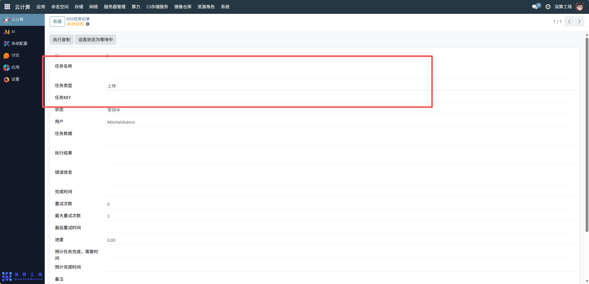
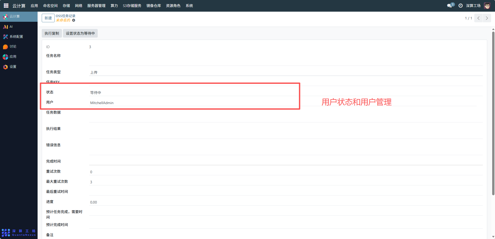
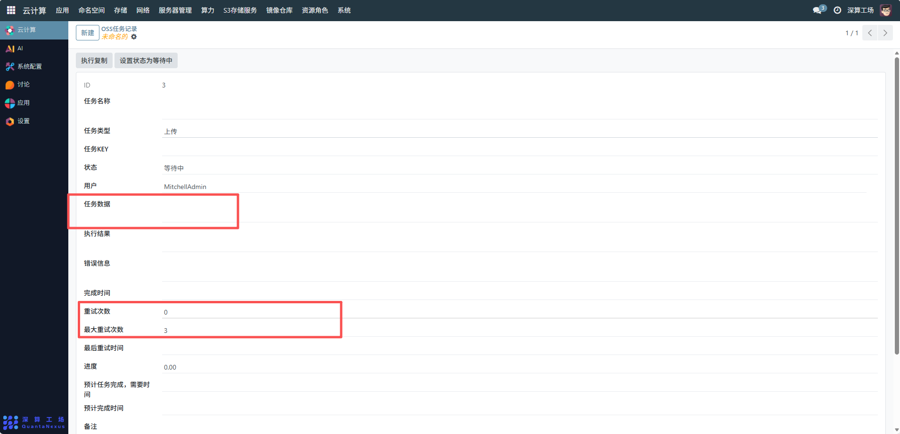
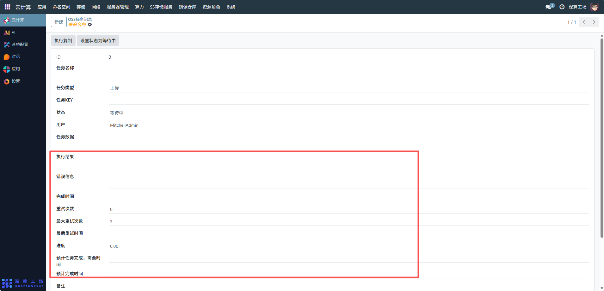
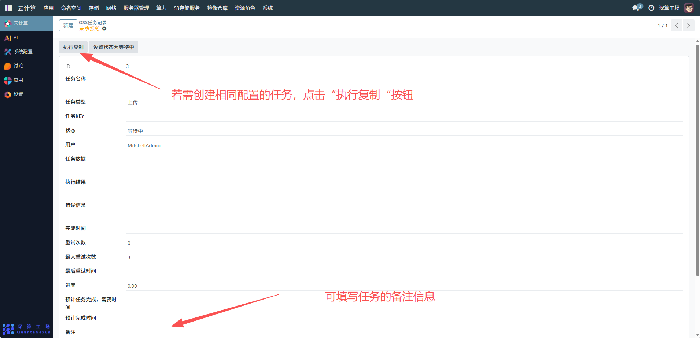

# 任务记录
后台管理中的 任务记录，主要用于 追踪、监控和审计系统中各类操作任务的执行情况。
## 1、基本信息配置
任务名称：可查看任务的标识名称，如 “OSS 上传任务_20251111”，便于识别任务用途。
任务类型：选择任务类型（如示例中的 “上传”，也可根据需求选择 “下载”“删除” 等类型）。
任务 KEY：可查看任务的唯一标识 KEY，用于系统内任务的区分和关联。

## 2、任务状态与用户管理
状态：可通过 “设置状态为等待中” 按钮将任务状态设置为 “等待中”，也可根据任务执行进度手动调整为 “执行中”“已完成”“失败” 等状态。
用户：确认任务所属用户（如示例中的 “MitchellAdmin”），确保任务归属正确。

## 3、任务数据与执行配置
任务数据：填写任务的具体数据信息，以上传任务为例，可填写待上传文件的路径、存储桶信息等。
重试次数与最大重试次数：设置任务的重试机制，示例中 “最大重试次数” 为 3，可根据需求调整；“重试次数” 会随任务自动重试次数更新。

## 4、任务监控与追溯
执行结果与错误信息：任务执行后，系统会自动记录 “执行结果”（成功 / 失败）和 “错误信息”（若失败），便于问题排查。
完成时间、最后重试时间、进度、预计完成时间：这些字段会随任务执行自动更新，用于监控任务进度和耗时。

## 5、任务操作
执行复制：若需创建相同配置的任务，点击 “执行复制” 按钮，快速生成新任务并修改差异化配置。
备注：填写任务的备注信息，如 “重要业务数据上传任务，需优先执行”，便于后续追溯管理。

