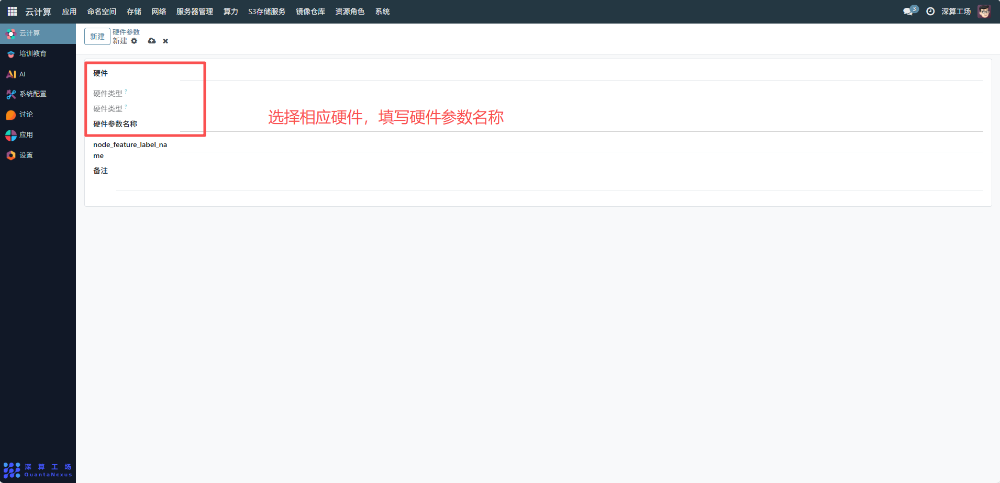
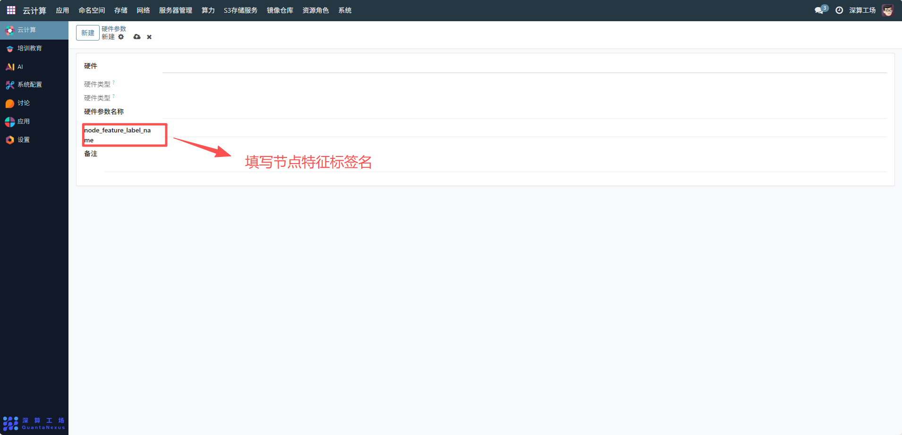
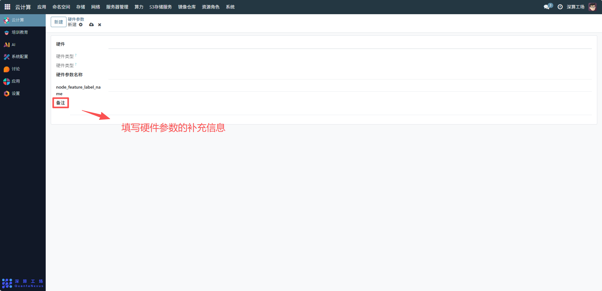

# 硬件参数
硬件参数是用于定义集群中硬件设备的基础属性与分类标准的模板，核心作用是标准化硬件指标的名称、类型及特征标签，为 “硬件参数值”（具体节点的硬件数据）提供统一的记录框架，确保不同节点的硬件配置可被规范采集、对比和调度。
## 1、硬件基础分类配置
- 硬件：填写硬件设备的大类（如 “计算硬件”“存储硬件”），从宏观上区分硬件类型；
- 硬件类型：填写具体硬件类别（如 “CPU”“NVIDIA GPU”“DDR4 内存”），进一步细化硬件分类，便于针对性管理；
- 硬件参数名称：填写具体的硬件指标名称（如 “基础频率”“核心数”“显存容量”），需精准描述该参数的含义（如 “显存容量” 明确指向 GPU 的内存大小）。

## 2、特征标签键配置
node_feature_label_name：填写该硬件参数对应的节点标签键（如硬件参数名称为 “GPU 型号” 时，标签键可设为 “gpu-model”），后续节点的硬件参数值（如 “V100”）会作为标签值与该键关联，形成 “键 - 值” 对（如 “gpu-model: V100”），供调度系统筛选使用。

## 3、补充说明配置
备注：填写该硬件参数的补充信息（如 “‘基础频率’单位为 GHz，用于衡量 CPU/GPU 的基础运算速度”），明确参数的定义、单位或适用场景，避免理解歧义。

