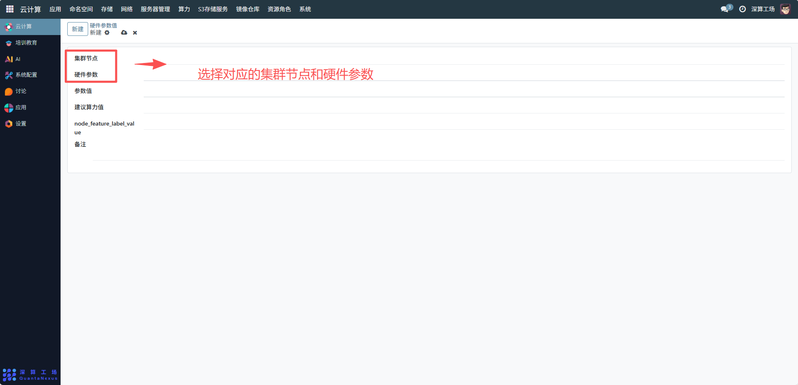
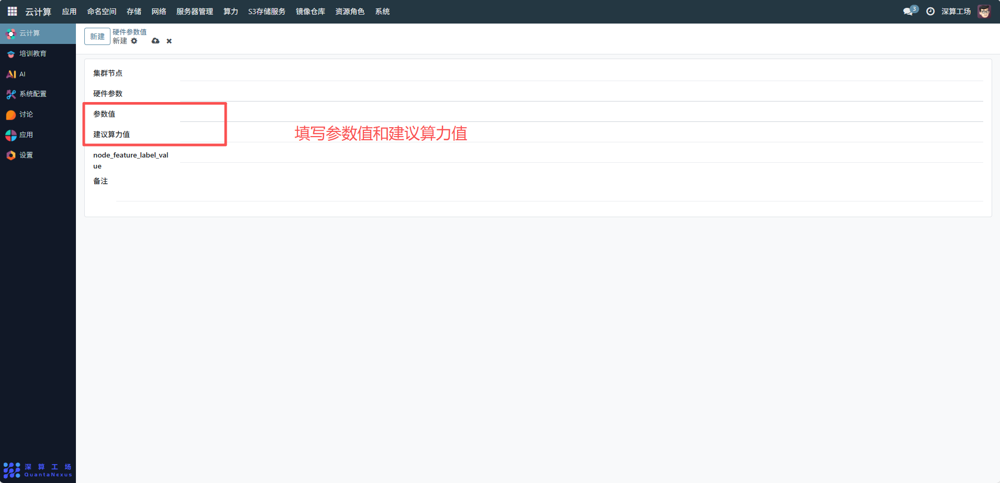
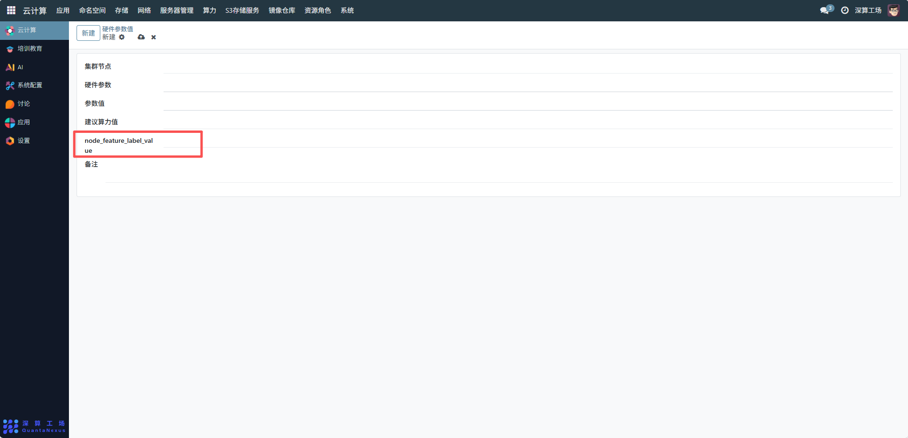
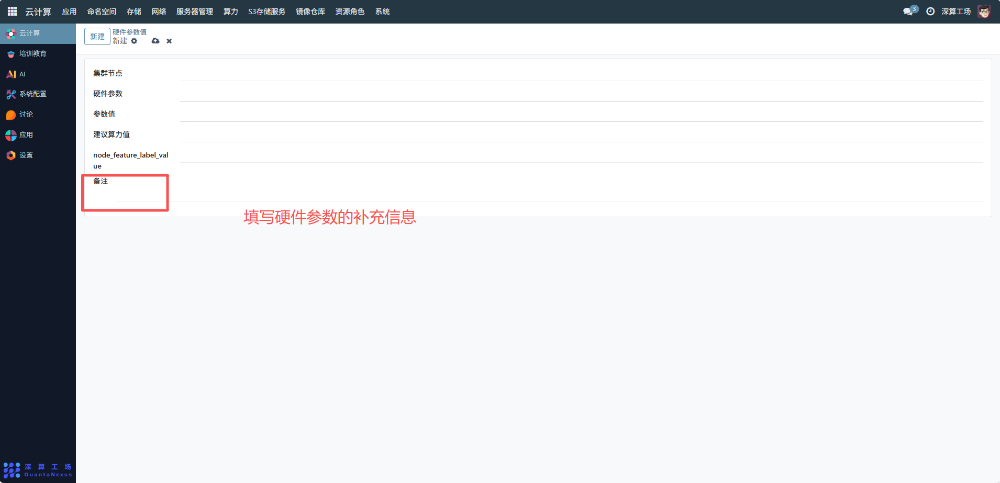

# 硬件参数值
硬件参数值是用于记录和标准化集群节点硬件配置的关键指标数据，核心作用是为集群资源调度、性能评估和硬件管理提供量化依据，确保应用部署能匹配节点的硬件能力（如 CPU、内存、GPU 型号等）。
## 1、基础关联配置
- 集群节点：选择对应的集群节点（如 “node-01”），明确该硬件参数值所属的物理 / 虚拟节点；
- 硬件参数：填写具体的硬件指标名称（如 “CPU 型号”“内存容量”“GPU 核心数”“显存大小” 等），需覆盖节点的关键硬件属性。

## 2、数值与算力配置
- 参数值：填写硬件参数的具体数值（如 “CPU 型号 = Intel Xeon E5-2680”“内存容量 = 128GB”“GPU 核心数 = 16”），确保数据准确可量化；
- 建议算力值：根据硬件参数计算的综合算力评分（如基于 CPU、GPU 性能得出的 “100 算力单位”），用于调度系统快速判断节点的算力水平。

## 3、节点特征标签配置
node_feature_label_value：填写节点的硬件特征标签（如 “gpu=true”“high-memory=true”），用于调度时通过标签快速筛选符合条件的节点（如 “仅调度到带 GPU 的节点”）。

## 4、补充说明配置
备注：填写硬件参数的补充信息（如 “该节点 GPU 为 NVIDIA Tesla V100，支持 FP16 精度计算”），辅助管理员理解节点的硬件特性。

