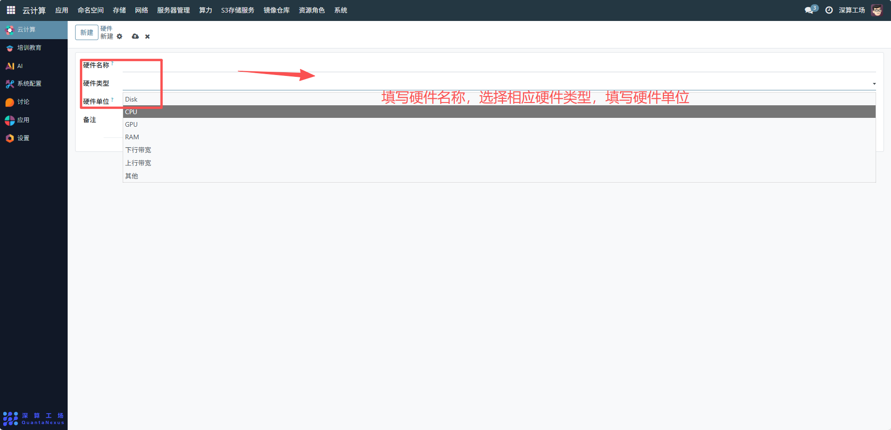

# 硬件
这里的 “硬件” 是核心作用是统一记录硬件的名称、类型、单位等基础属性，为后续 “硬件参数”“硬件参数值” 提供最顶层的设备分类框架，是集群硬件资源管理的 “根目录”。
## 1、硬件基础信息配置
- 硬件名称：填写具体硬件的标识名称（如 “Intel Xeon E5-2680 CPU”“NVIDIA Tesla V100 GPU”“DDR4 128GB 内存”），需精准区分不同硬件型号。
- 硬件类型：填写硬件的大类（如 “计算硬件”“存储硬件”“网络硬件”），从宏观上对硬件进行分类管理。
- 硬件单位：填写该硬件对应的计量单位（如 CPU 填 “核”、内存填 “GB”、硬盘填 “TB”、带宽填 “Gbps”），确保后续参数值的单位统一。

## 2、补充说明配置
备注：填写硬件的补充信息（如 “‘Intel Xeon E5-2680 CPU’为 12 核 24 线程，基础频率 2.5GHz”），辅助管理员快速了解硬件的核心特性。

