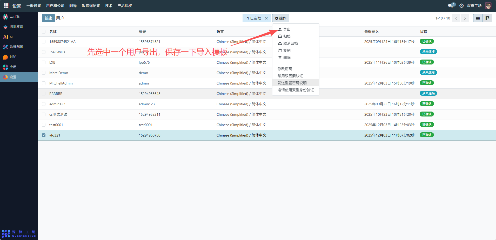
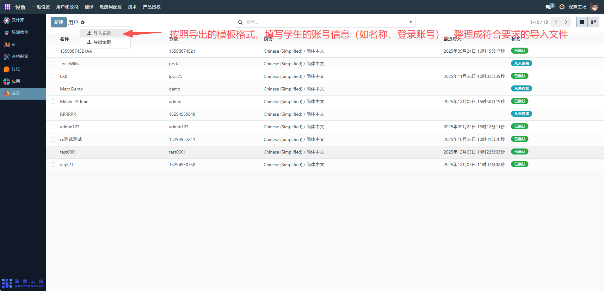
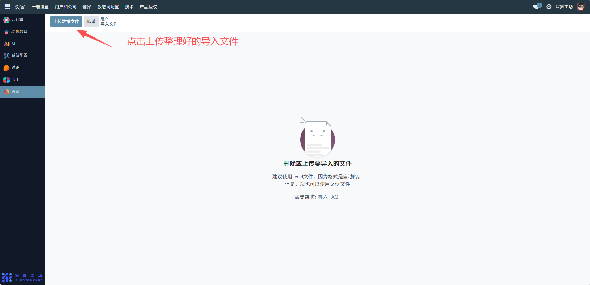
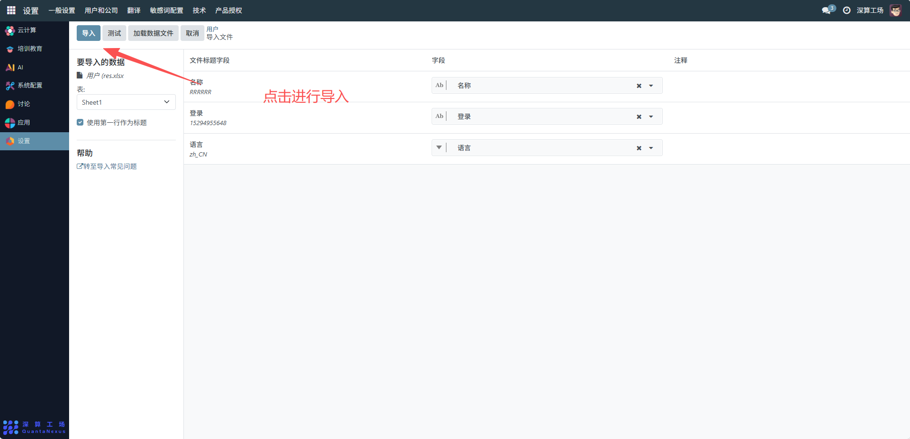
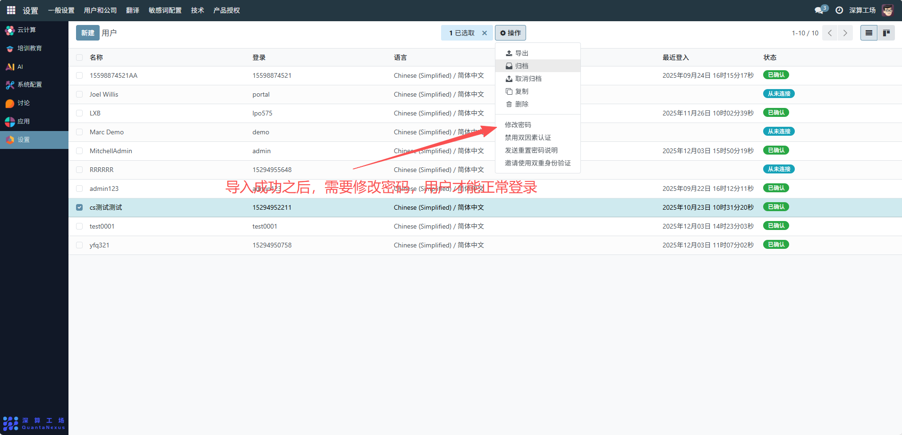

# 批量开通学生账号
## 1、导出用户模板，查看导入模板
- 在用户列表中选中一个用户，点击 “操作” 按钮，选择 “导出”，获取包含用户信息格式的模板文件。

## 2、准备导入文件
- 按照导出的模板格式，填写学生的账号信息（如名称、登录账号），整理成符合要求的导入文件。

## 3、执行导入操作
- 点击 “用户” 旁的设置按钮，点击 “导入记录”后，先上传整理好的数据文件。

- 进入导入界面后，设置文件映射关系（确保导入文件的字段与系统字段匹配），然后点击 “导入” 完成账号导入。

## 4、修改密码以确保正常登录
- 导入成功后，在用户列表中选中导入的用户账号，点击 “操作” 按钮，选择 “修改密码”，设置新密码之后，用户即可正常登录账号。

