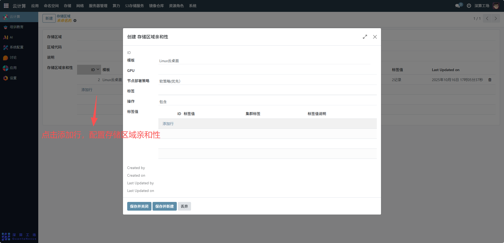
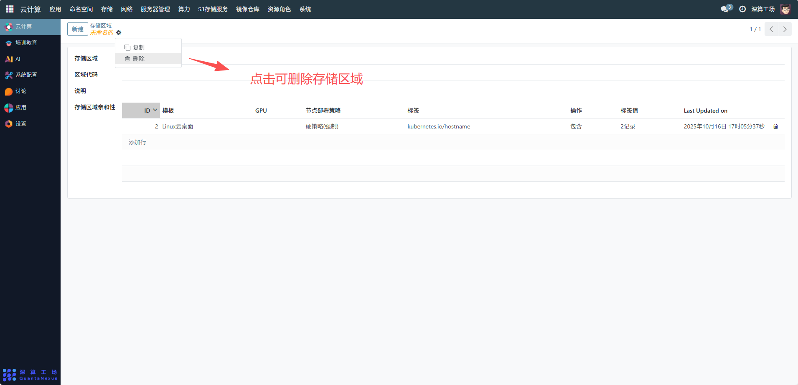

# 存储区域
存储区域是对集群存储资源进行物理 / 逻辑分区管理的单元，核心作用是将存储资源按地理位置、性能等级等维度分组，结合 “存储区域亲和性” 策略，让应用优先使用指定区域的存储资源，实现存储的区域化调度与隔离。
## 1、基础信息配置
- 存储区域：填写区域名称（如 “上海一区存储”），明确区域标识；
- 区域代码：填写区域的唯一编码（如 “SH-01”），用于系统识别；
- 说明：补充区域的用途描述（如 “上海一区高性能 NFS 存储”），便于理解区域定位。

## 2、存储区域亲和性配置
点击 “添加行”，配置存储与节点的亲和策略：
- 模板 / 标签 / 标签值：关联节点的标签（如region: shanghai），定义该存储区域对应的节点范围；
- 节点部署策略：选择 “软策略（优先）” 或 “硬策略（必须）”，控制应用是否优先 / 强制使用该区域的存储；
- GPU（可选）：若存储关联 GPU 节点，配置对应的 GPU 信息。

## 3、编辑及删除存储区域
- 调整区域范围：修改 “存储区域亲和性” 的标签配置，扩展 / 缩小该区域对应的节点范围；
- 删除区域：需先迁移该区域的所有存储资源（PV、PVC），再删除存储区域配置。

