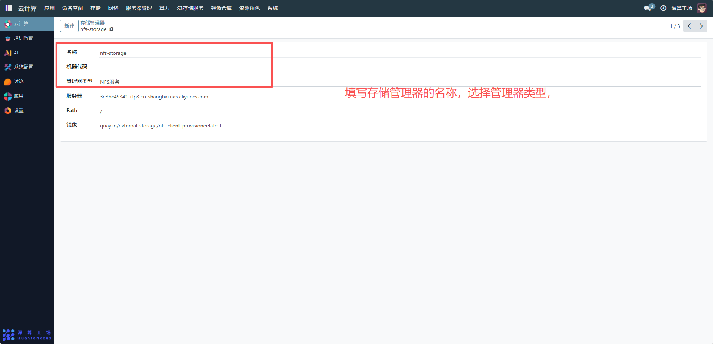
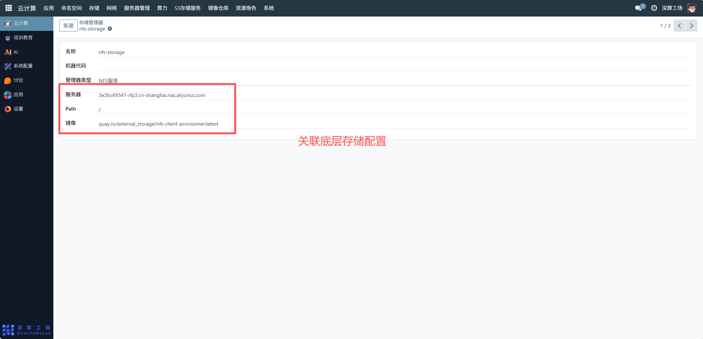
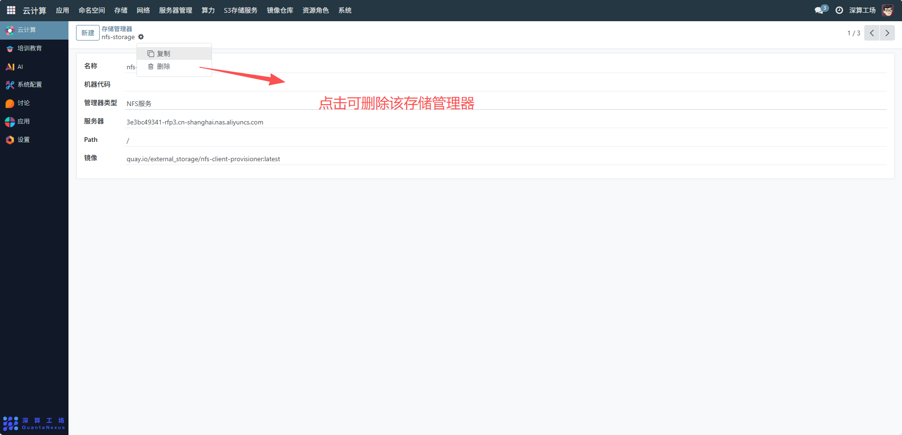

# 存储管理器
存储管理器是集群中存储资源的 “驱动与管理组件”，核心作用是对接底层存储服务（如示例中的 NFS 服务器），并为集群提供存储资源的自动化管理能力（如动态创建 PV、绑定 PVC），是存储类型（StorageClass）与底层存储之间的 “桥梁”
## 1、基础信息配置
- 名称：填写存储管理器的标识名称（如示例中的nfs-storage），便于后续关联存储类型；
- 管理器类型：选择对应的存储服务类型（如示例中的 “NFS 服务”），匹配底层存储的类型；
- 机器代码：（可选）填写关联的服务器标识，明确存储服务部署的节点。

## 2、关联底层存储配置
- 服务器：填写底层存储服务的地址（如示例中的 NFS 服务器域名），让管理器能连接到存储后端；
- Path：填写存储服务的共享路径（如示例中的/），指定集群可访问的存储目录；
- 镜像：选择对应的存储管理组件镜像（如示例中的nfs-client-provisioner），该镜像提供存储资源的自动化管理逻辑。

## 3、编辑及删除存储管理器
- 更新存储服务地址：若底层存储服务迁移，修改 “服务器” 字段，更新管理器的存储后端连接信息。
- 删除存储管理器：需先清理所有关联的存储类型、PVC、PV，再删除管理器，避免存储资源管理失效。

