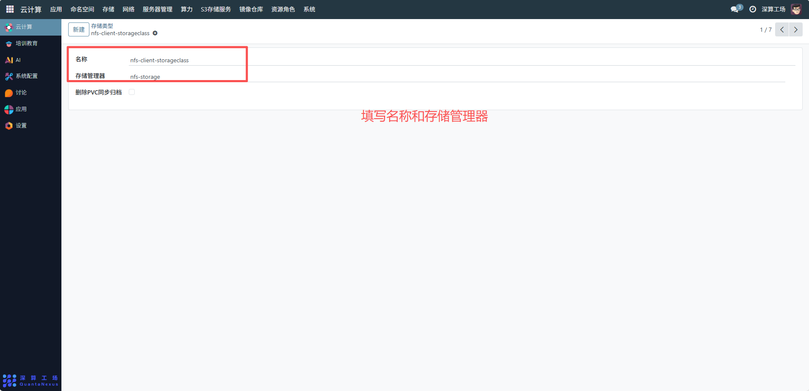
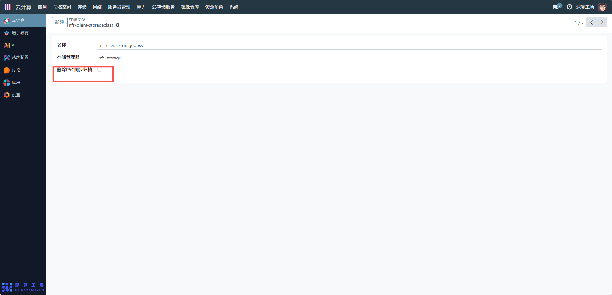
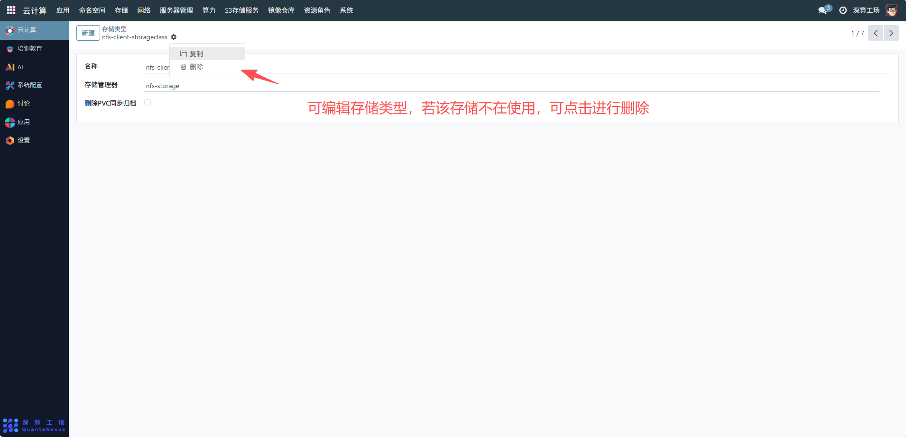

# 存储类型
存储类型是 Kubernetes 集群中用于定义存储资源的模板，核心作用是标准化存储的配置（如存储后端类型、性能等级、备份策略等），让应用可以快速申请符合需求的存储资源，无需手动配置底层存储细节。
## 1、基础信息配置
名称：填写存储类型的标识名称（如示例中的nfs-client-storageclass），需符合 Kubernetes 资源命名规范；
存储管理器：选择对应的存储后端管理组件（如示例中的nfs-storage），关联底层存储的驱动 / 服务（比如 NFS 服务器、云存储服务等）。

## 2、存储策略配置
删除 PVC 同步归档：勾选该选项后，当应用删除 PVC 时，对应的存储数据会自动归档（避免误删数据）；若不勾选，删除 PVC 会直接清理存储数据。

## 3、编辑及删除存储类型
编辑存储类型：若底层存储后端变更（如更换 NFS 服务器），可修改 “存储管理器” 关联的组件，更新存储类型的配置；
删除存储类型：若该存储类型不再使用，需先确保所有关联的 PVC/PV 已清理，再删除存储类型，避免存储资源泄漏。

