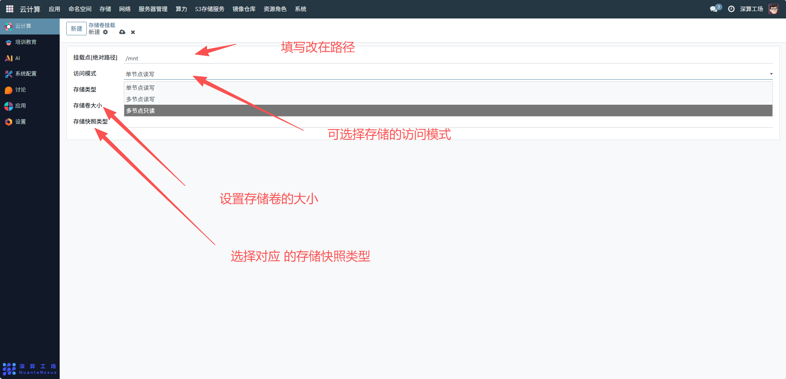
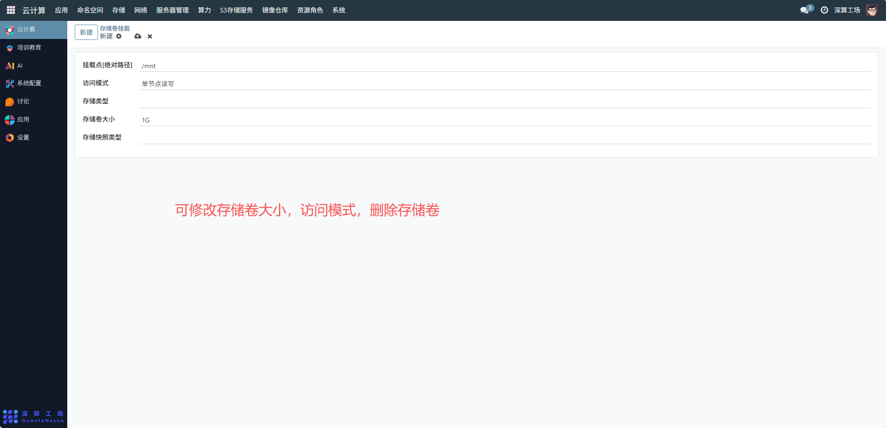

# 存储卷挂载
存储卷挂载是将集群中的存储资源（如持久卷 PV）关联到应用容器的指定路径，核心作用是让应用可以访问外部存储数据（实现数据持久化、共享），避免容器重启后数据丢失。
## 1、核心参数配置
- 挂载点 (绝对路径)：填写容器内的挂载路径（如示例中的/mnt），应用通过该路径访问存储卷中的数据；
- 访问模式：选择存储卷的访问权限：
- 单节点读写：仅允许一个节点的容器读写该存储卷；
- 多节点只读：多个节点的容器可同时读取（不可写）；
- 多节点读写：多个节点的容器可同时读写）；
- 存储类型：选择对应的存储类型（StorageClass，需提前配置），指定存储卷的后端类型（如 NFS、云盘）；
- 存储卷大小：设置存储卷的容量（如示例中的1G），满足应用的存储需求；
- 存储快照类型：（可选）选择对应的存储快照类型，为该存储卷配置快照规则（用于数据备份）。

## 2、编辑及删除存储卷挂载
- 调整存储卷大小：若应用存储需求增加，可修改 “存储卷大小” 参数，扩展存储容量（需存储后端支持动态扩容）；
- 修改访问模式：根据业务需求，调整存储卷的访问权限（比如从 “单节点读写” 改为 “多节点只读”）；
- 删除存储卷：若应用不再需要该存储卷，先停止应用，再删除存储卷挂载配置，释放存储资源。

