# 系统参数
## 1、leanTemplateClickRecordsDays
- 定义系统保留模板点击记录的最长期限（单位：天）。超过该期限的历史记录将在自动清理任务中被删除。

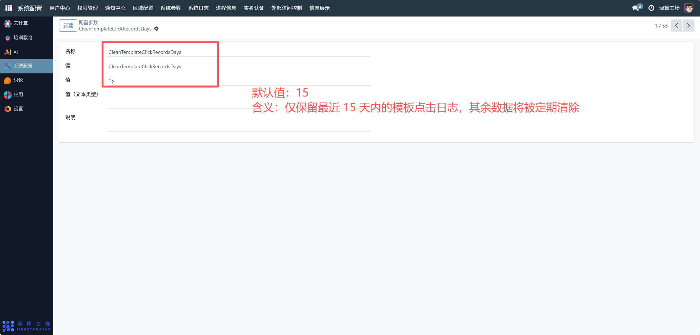

## 2、AppDeploymentCleanDays
- AppDeploymentCleanDays 的作用是设置应用部署相关数据的自动清理周期（当前配置值为 14 天）。

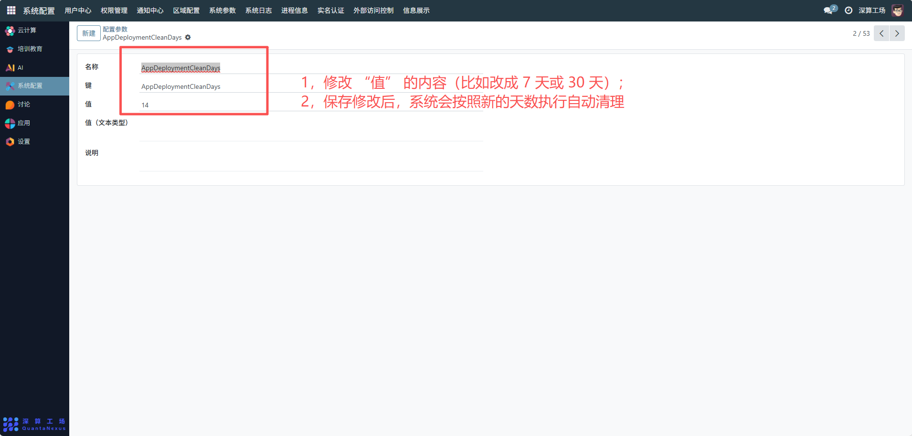

## 3、PassCleanNamespaceComputePointThreshold
- 这个参数是命名空间计算资源的闲置清理阈值：当某个命名空间的计算资源占用量低于这个值时，系统会自动清理它的闲置资源。当前设为 0。

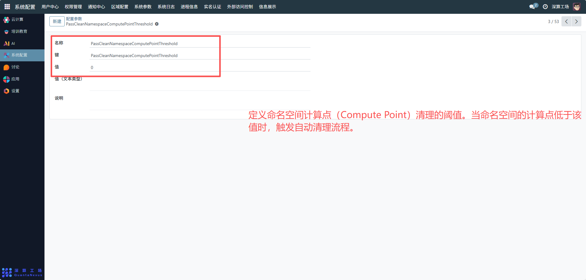

## 4、SendEmailForCleanNamespace

- 控制是否在清理命名空间前向相关用户发送通知邮件。

- **默认值**：no  
- **作用**：启用或禁用清理命名空间前的邮件提醒功能，用于保障用户知情权与操作透明性。  
- **配置方式**：通过系统管理后台的“系统参数”模块进行配置，支持设置为 `yes` 或 `no`，修改后立即生效。

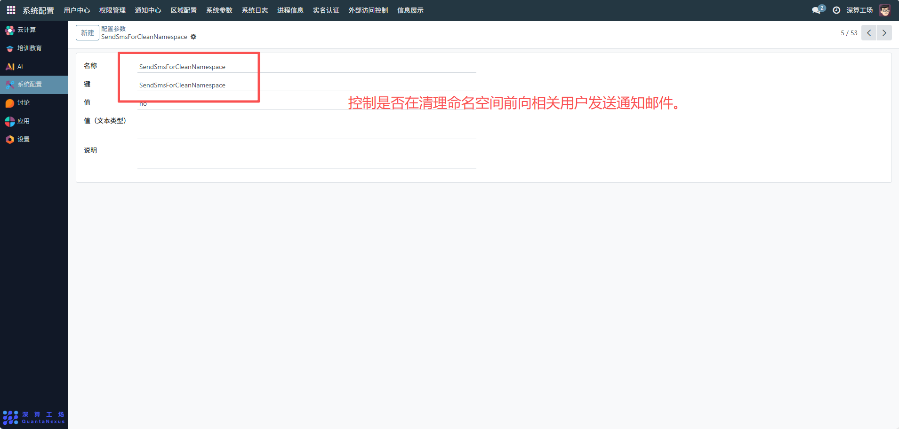

## 5、SendSmsForCleanNamespace

控制是否在清理命名空间前向相关用户发送短信通知。

- **默认值**：no  
- **作用**：启用或禁用清理操作前的短信提醒机制，用于及时告知用户资源即将被释放。  
- **配置方式**：通过系统管理后台的“系统参数”模块进行配置，支持设置为 `yes` 或 `no`，修改后立即生效。 

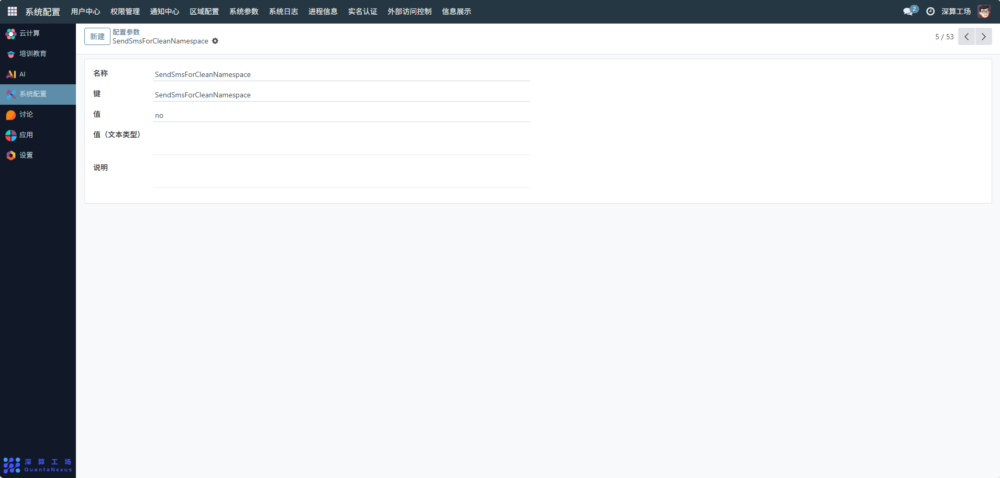

## 6、EnableCleanMeta3PhoneVerifiedNamespace

- 控制是否启用对已绑定手机号的 Meta3 命名空间的自动清理功能。

- **默认值**：yes  
- **作用**：当设置为 `yes` 时，系统将对满足清理条件的、且已通过手机号验证的 Meta3 命名空间执行资源回收操作；设为 `no` 则跳过此类命名空间的清理。  
- **配置方式**：通过系统管理后台的“系统参数”模块进行配置，支持 `yes` 或 `no`，修改后在下一次清理任务中生效。  

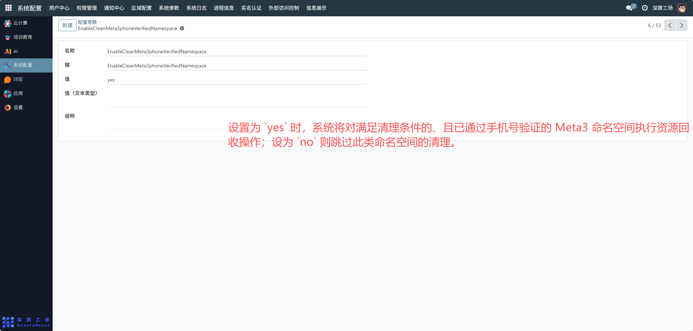

## 7、EnableAppPublishNotification

- 控制是否启用应用发布时的通知功能。

- **默认值**：no  
- **作用**：当设置为 `yes` 时，系统在应用发布成功后向相关人员发送通知（如邮件、站内信等）；设为 `no` 则关闭该通知机制。  
- **配置方式**：通过系统管理后台的“系统参数”模块进行配置，支持 `yes` 或 `no`，修改后立即生效。

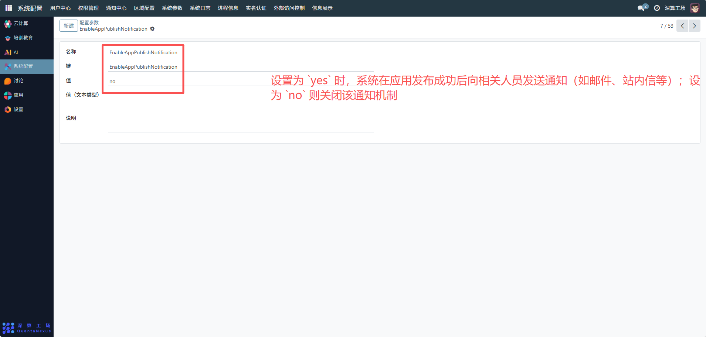

## 8、total_points_lack_prompt？

- 定义当用户可用积分不足时，系统提示信息的文本内容。

- **默认值**：空（需配置）  
- **作用**：用于在用户执行需要消耗积分的操作时，若积分不足，则显示该自定义提示语，引导用户充值或调整行为。  
- **配置方式**：通过系统管理后台的“系统参数”模块进行配置，支持输入任意文本内容，修改后立即生效。  

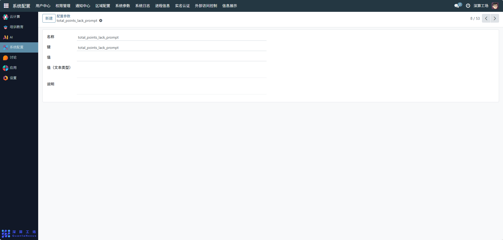

## 9、UseHi168WireGuardClient

- 控制是否启用 Hi168 设备的 WireGuard 客户端功能。

- **默认值**：no  
- **作用**：当设置为 `yes` 时，系统将为 Hi168 设备自动配置并启用 WireGuard 客户端，用于建立安全的网络隧道；设为 `no` 则禁用该功能。  
- **配置方式**：通过系统管理后台的“系统参数”模块进行配置，支持 `yes` 或 `no`。

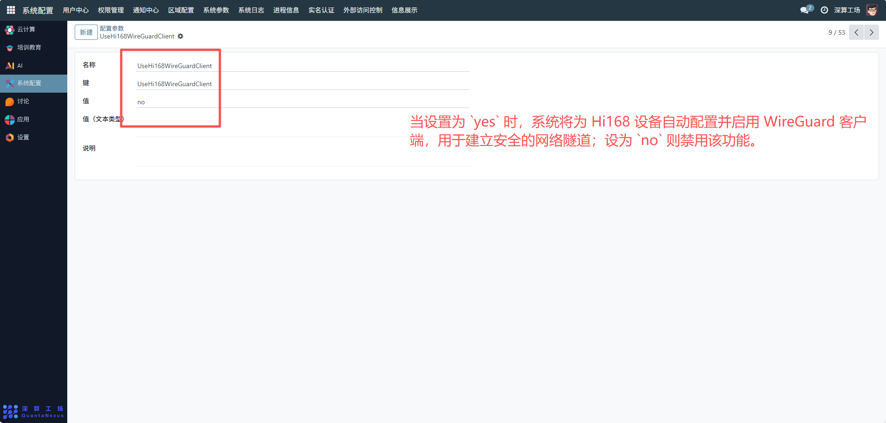

## 10、UseHi168WireGuardClient

- 控制是否启用 Hi168 设备的 WireGuard 客户端功能。

- **默认值**：no  
- **作用**：决定是否为 Hi168 设备自动配置 WireGuard 客户端，用于建立安全的远程访问隧道。开启后可实现设备与内网之间的加密通信。  
- **配置方式**：在系统管理后台的“系统参数”模块中设置为 `yes` 或 `no`。

## 11、AppStoppedDeploymentCleanDays

定义已停止部署的应用在系统中保留的最长期限（单位：天）。

- **默认值**：15  
- **作用**：控制停止运行的应用部署实例的生命周期。超过该天数的停用部署将被自动清理，以释放资源并优化系统管理效率。  
- **配置方式**：通过系统管理后台的“系统参数”模块进行配置。

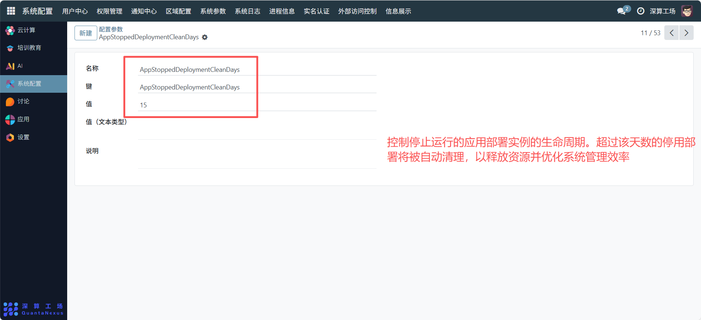

## 12、AppStoppedDeploymentCleanDays

- 设置已停止的应用部署在系统中保留的天数。

- **默认值**：15  
- **作用**：用于控制停用部署实例的自动清理周期。超过该时间未重启的部署将被系统自动清除，以释放资源、减少冗余配置。  
- **配置方式**：在“系统配置” → “系统参数”中修改数值，支持整数输入。

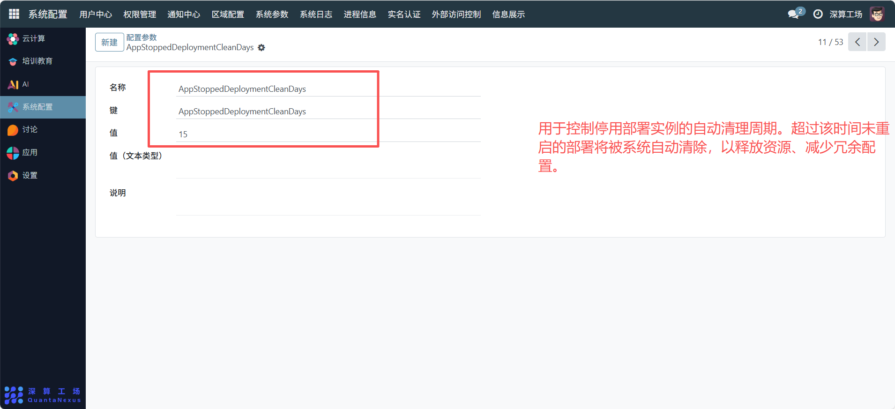

## 13、SendEmailForStopAppDeployment

- 控制是否在应用部署停止时向相关用户发送邮件通知。

- **默认值**：no  
- **作用**：当设置为 `yes` 时，系统在应用部署被停止后自动发送通知邮件，提醒负责人关注状态变更；设为 `no` 则不发送。  
- **配置方式**：通过“系统配置” → “系统参数”模块进行设置，支持 `yes` 或 `no`。

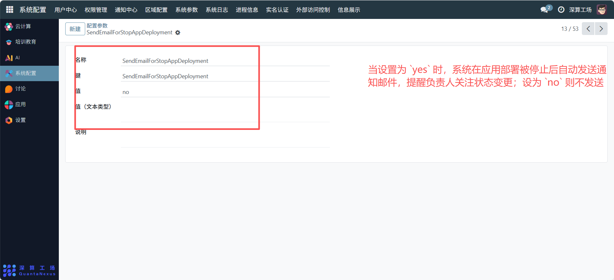