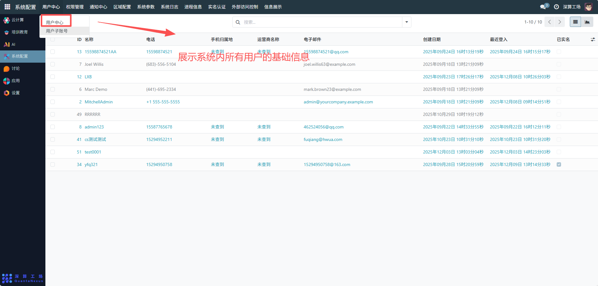
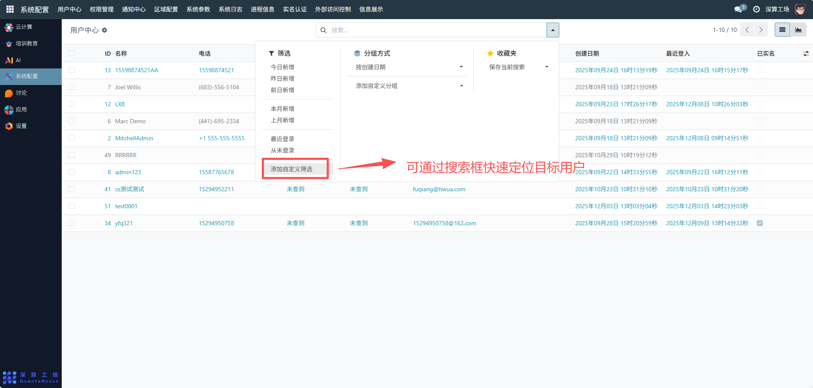
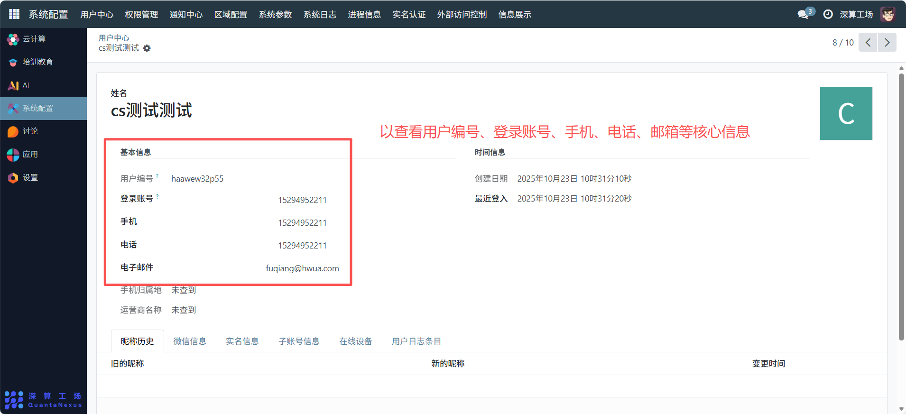
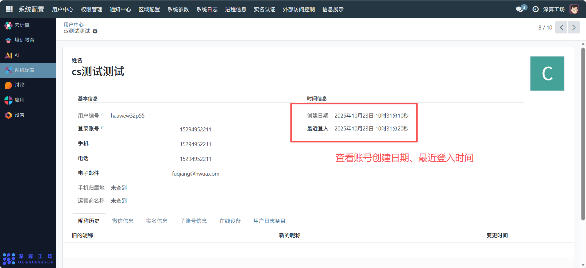
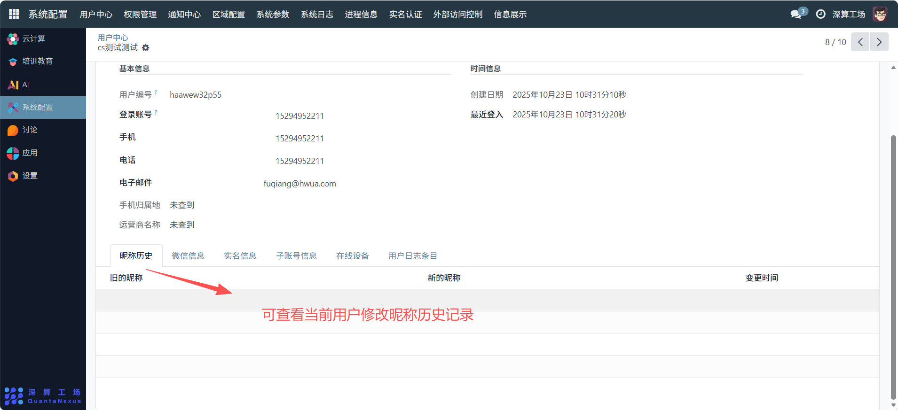
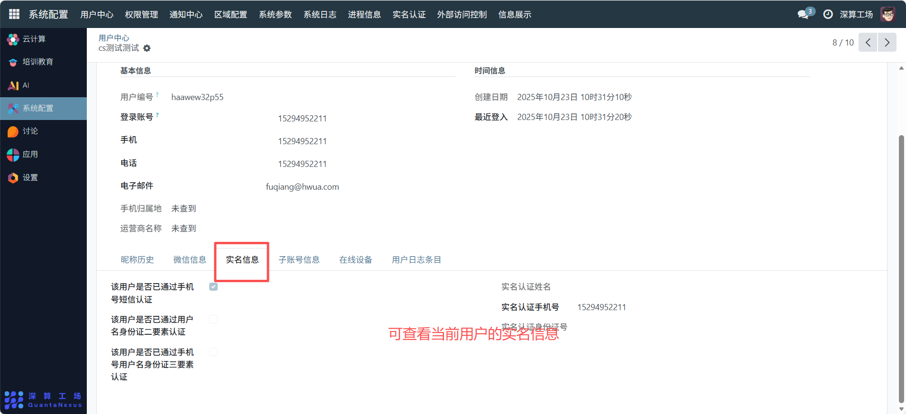
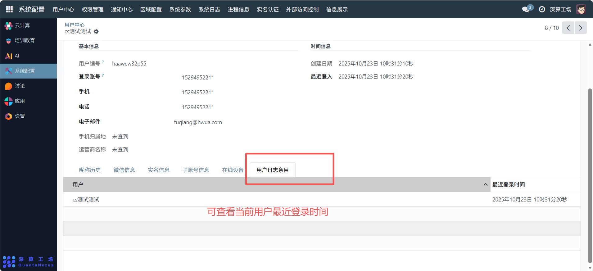

# 用户中心
“用户中心”是系统管理模块中的核心功能之一，主要用于集中查看、管理和维护系统中所有注册用户的账户信息与行为数据。它为管理员提供了全面的用户视图和精细化的操作能力，保障系统的安全性和可管理性。

## 核心用途
- 用户信息的集中管理：查看系统内所有用户的基础信息（名称、电话、邮箱等）、账号状态（已实名），实现用户信息的统一视图；
- 用户详情的精准查看：点击单个用户（如 “yfq321”），可查看其详细信息（用户编号、登录账号、时间信息）及操作记录（昵称历史）；
- 用户状态的跟踪管控：监控用户的 “创建日期”“最近登入” 时间，跟踪账号活跃度；
- 用户信息的全维度维护：支持查看 / 管理用户的微信信息、实名信息、账号信息等多维度数据。
## 管理配置流程
### 1、查看用户列表
进入 “用户中心” 页面，直接查看系统内所有用户的基础信息（ID、名称、电话、创建 / 登录时间、实名状态）。

可通过搜索框快速定位目标用户。

### 2、查看用户详情
- 点击列表中的任意用户，进入详情页：
- 基本信息：可以查看用户编号、登录账号、手机、电话、邮箱等核心信息。

- 时间信息：查看账号创建日期、最近登入时间；

- 多维度信息：切换 “昵称历史”“微信信息”“实名信息” 等标签页，查看用户的各类关联信息。

### 3、用户信息维护
- 信息更新：对用户的基础信息（如电话、邮箱）进行编辑更新。
- 状态管控：标记用户的 “已实名” 状态，管理账号的实名认证情况。
- 操作记录跟踪：通过 “昵称历史” 等标签页，追溯用户信息的变更轨迹。

## 日常管理与运维
- 用户检索：通过搜索框快速查找目标用户，提升管理效率。
- 活跃度监控：通过 “最近登入” 时间，识别长期未活跃的账号。
- 信息核验：核对用户的实名信息、联系方式，保障账号的真实性。
- 问题排查：通过用户详情的时间信息、操作记录，排查账号相关的异常问题。