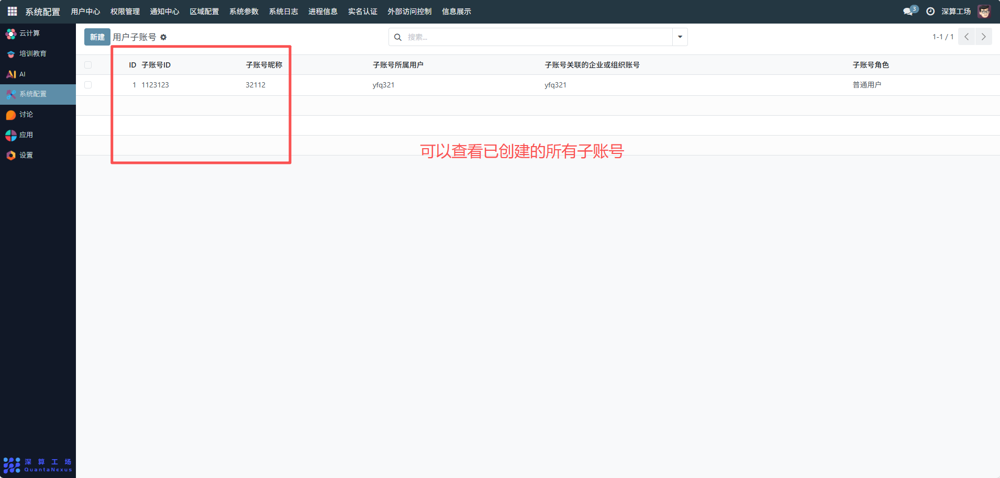
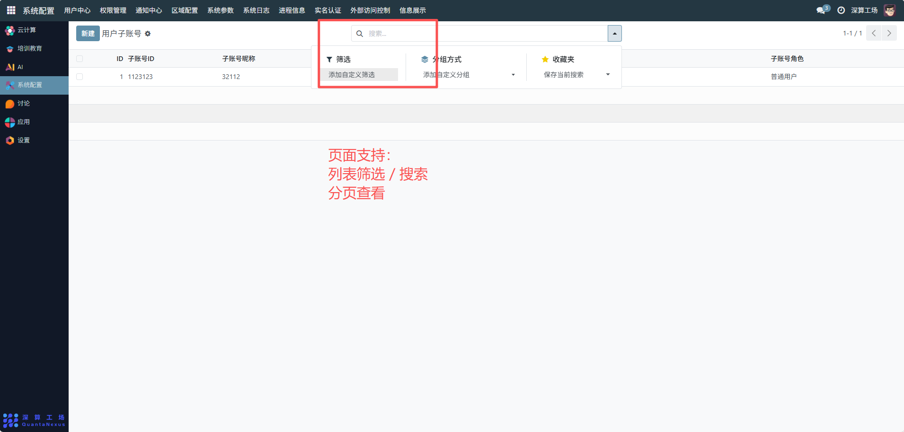
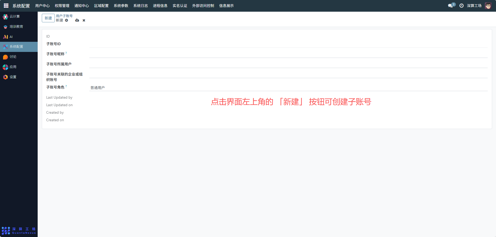
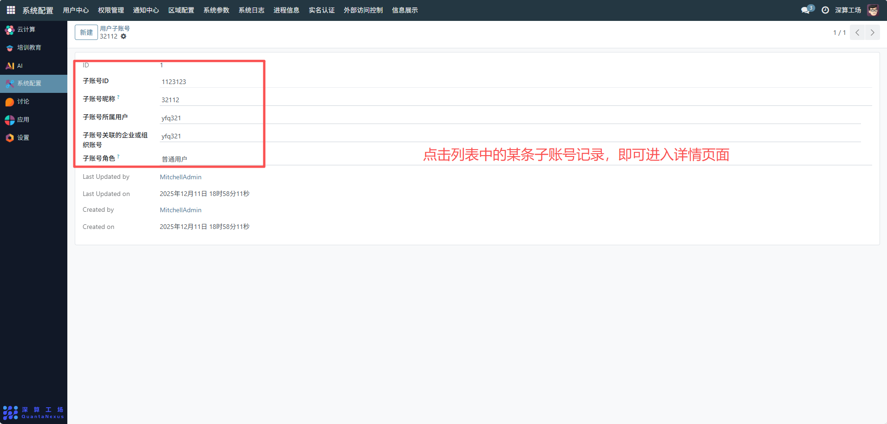
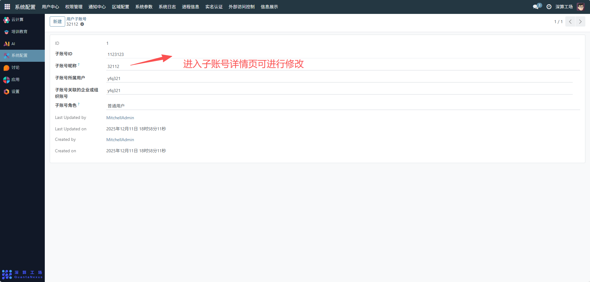
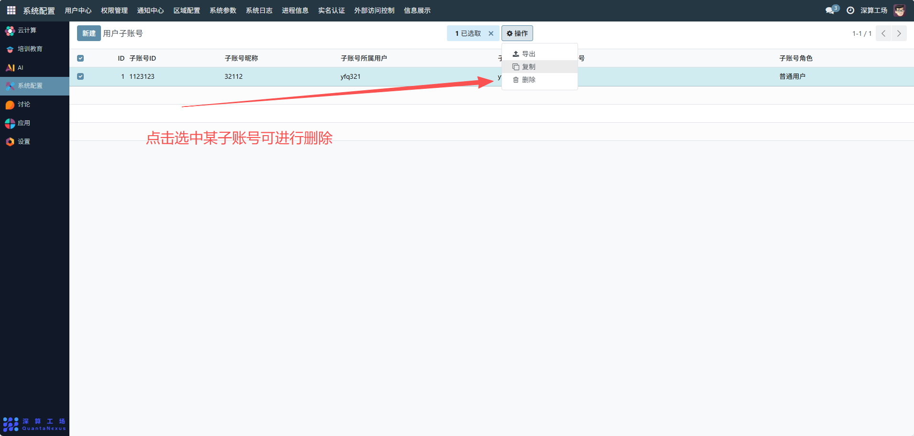

# 用户子账号
- 用户子账号模块用于为主账号（例如企业账号、组织账号或个人主账号）创建多个子账号，以实现：
- 权限分离与协作：主账号可为团队成员、不同岗位分配独立账号，执行受控范围内的操作。
- 安全管理：通过子账号角色、所属用户、关联组织信息，实现更细粒度的权限控制。
- 审计与责任追踪：每个子账号的操作均可独立追踪，提高系统安全性和可审计性。
## 子账号管理操作指南

### 1、查看子账号列表
进入“用户子账号”页面后，你可以查看已创建的所有子账号，包括：
- 子账号ID
- 子账号昵称
- 所属用户
- 角色
- 关联组织账号

页面支持：
- 列表筛选 / 搜索
- 分页查看

### 2、创建子账号
点击界面左上角的 「新建」 按钮，进入创建子账号表单：
- 创建时通常需要填写：
- 子账号昵称
- 选择所属用户
- 选择子账号角色
- （可选）关联企业或组织账号
- 创建完成后系统会自动生成子账号ID，并记录创建时间与创建者。

### 3、查看子账号详情
点击列表中的某条子账号记录，即可进入详情页面：
- 详情页展示内容包括：
- 基础信息（昵称、角色、所属用户、组织关联等）
- 修改人 / 修改时间
- 此页面用于审计和管理查看。

### 4、编辑子账号
进入子账号详情页可编辑子账号：
可修改：
- 昵称
- 角色（提升/降低权限）
- 关联企业/组织
- 所属用户
- 密码（若系统支持重置）
- 所有更新操作都会记录“Last Updated By / Last Updated On”。

### 5、删除子账号
在列表界面会提供：
- 删除 按钮。

