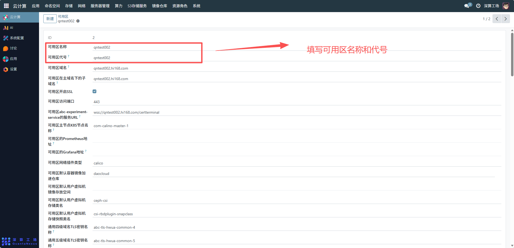
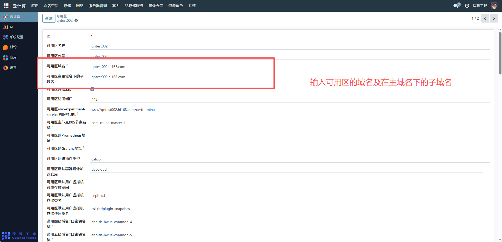
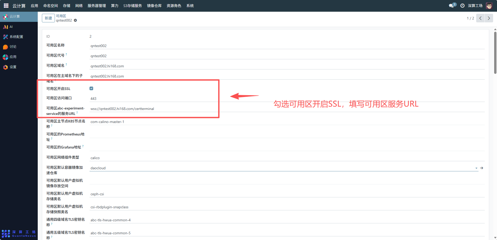
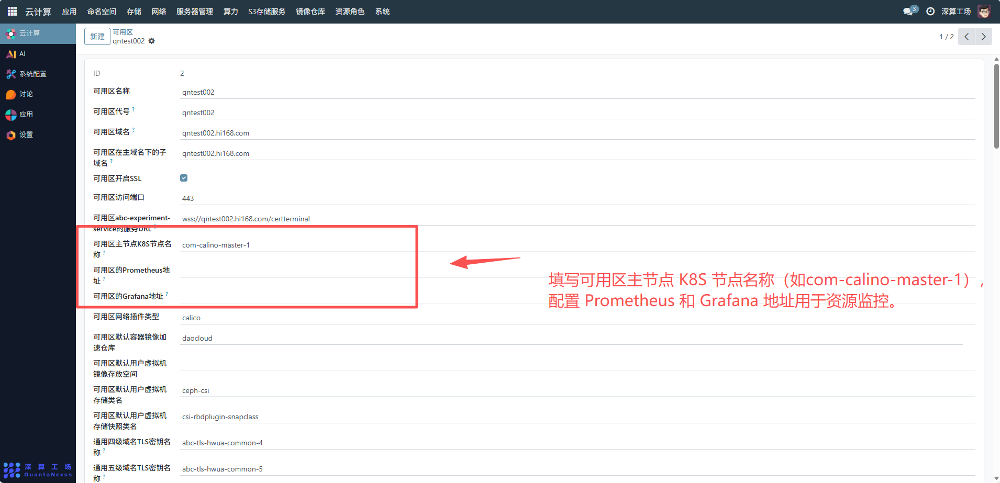
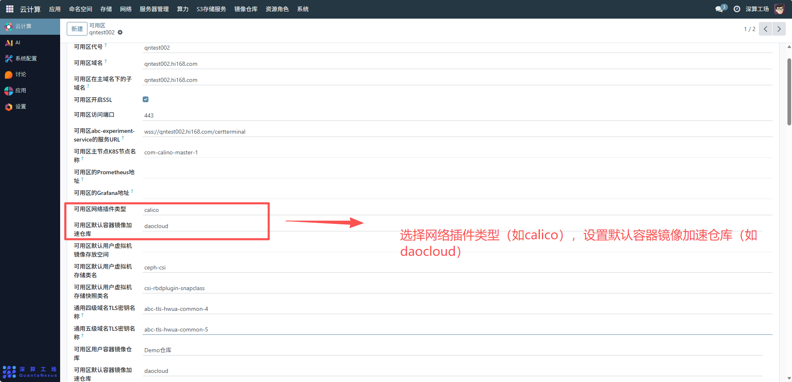
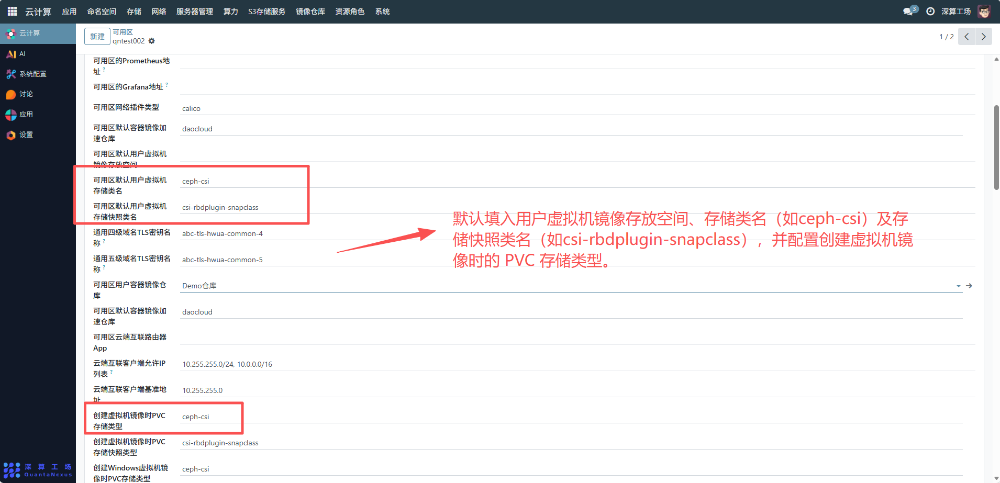
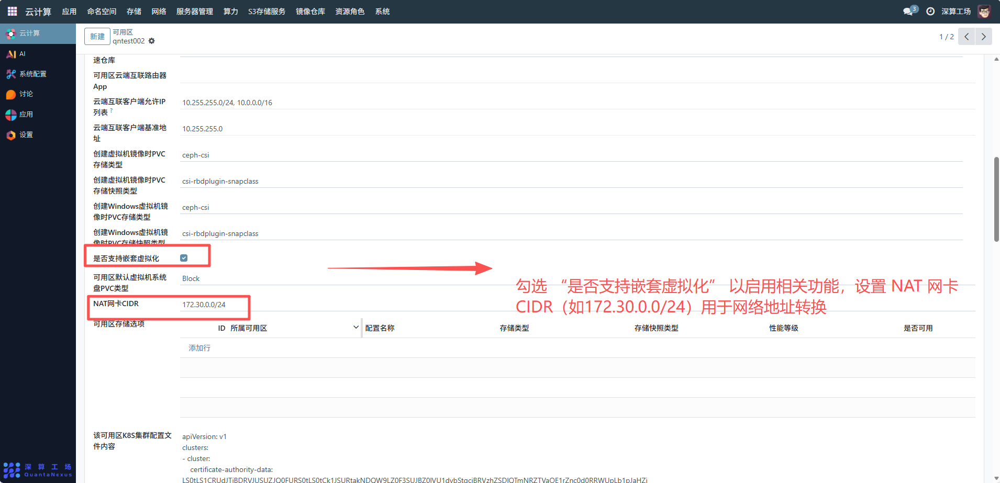
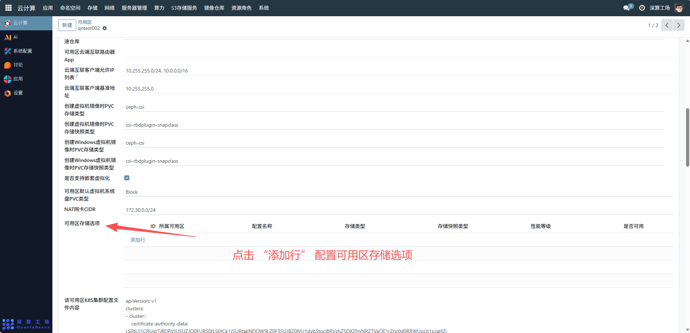

# 可用区
该可用区是云计算中实现高可用与资源管理的核心单元，通过物理故障隔离保障业务连续性，聚合计算、存储、网络资源并调度分配，借助 SSL、多级 TLS 密钥保障服务访问安全，还支持监控运维集成，是支撑业务可靠运行、资源高效交付的关键基础设施。
## 1、基本信息配置
- 可用区名称 / 代号：输入可用区的标识名称（如qntest002）和代号，确保名称与代号具有唯一性，便于识别和管理。
- 可用区域名 / 子域名：填写可用区的域名及在主域名下的子域名，用于网络访问和服务寻址。

## 2、网络与安全配置
- 开启 SSL 与访问端口：勾选 “可用区开启 SSL” 以启用安全传输，设置访问端口（如443），确保数据传输的安全性。
- 服务 URL 配置：填写可用区特定服务的 URL（如wss://qntest002.hi168.com/certterminal），用于服务的接入和调用。
- 云端互联与 IP 限制：配置云端互联路由器 App、客户端允许 IP 列表（如10.255.255.0/24, 10.0.0.0/16）及基准地址，实现网络互通与访问控制。

## 3、计算与存储配置
- K8S 与监控组件：填写可用区主节点 K8S 节点名称（如com-calino-master-1），配置 Prometheus 和 Grafana 地址用于资源监控。
- 网络插件与镜像仓库：选择网络插件类型（如calico），设置默认容器镜像加速仓库（如daocloud）和用户容器镜像仓库（如Demo仓库）。
- 虚拟机存储配置：指定默认用户虚拟机镜像存放空间、存储类名（如ceph-csi）及存储快照类名（如csi-rbdplugin-snapclass），并配置创建虚拟机镜像时的 PVC 存储类型。

## 4、高级配置
- 嵌套虚拟化与 NAT 网卡：勾选 “是否支持嵌套虚拟化” 以启用相关功能，设置 NAT 网卡 CIDR（如172.30.0.0/24）用于网络地址转换。
- 存储选项：点击 “添加行” 配置可用区存储选项，包括所属可用区、配置名称、存储类型、存储快照类型、性能等级及是否可用等信息，满足不同存储需求。

