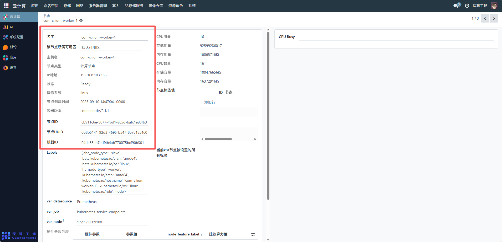
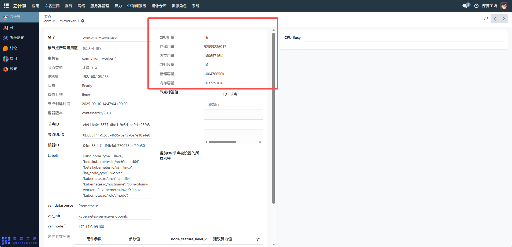
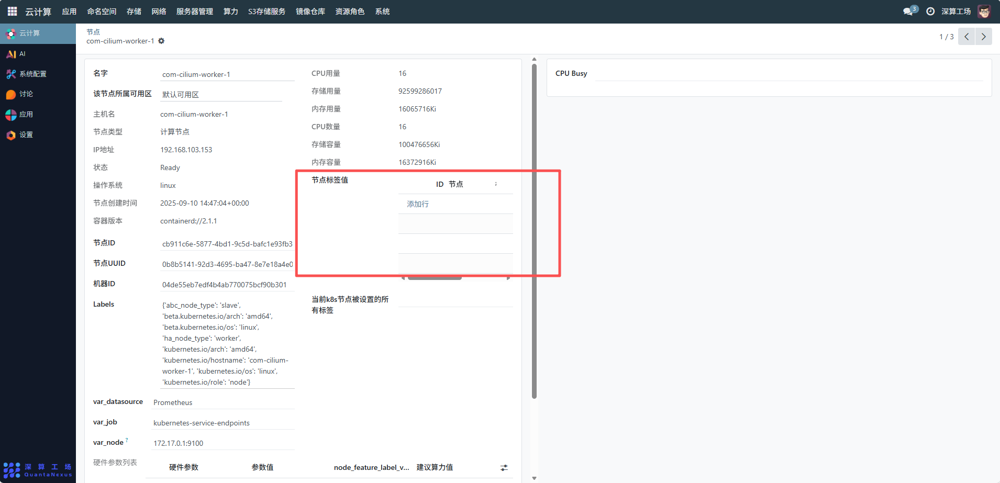
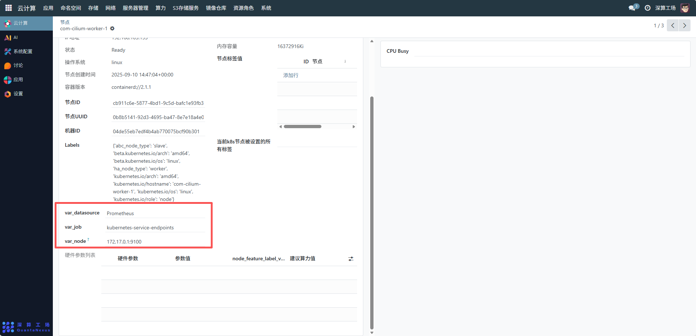
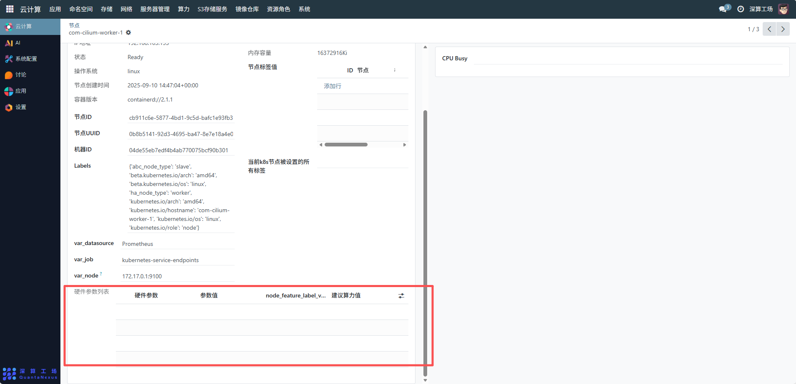

# 集群节点
集群节点是云计算环境中承载应用和服务的基础计算单元，主要作用是提供 CPU、内存、存储等硬件资源，运行容器或虚拟机，支撑业务应用的部署与运行，同时通过集群化管理实现资源的弹性调度、高可用性和负载均衡。
## 1、节点基础信息管理
- 查看节点属性：可查看节点的名称（如com-cilium-worker-1）、所属可用区（如 “默认可用区”）、主机名、节点类型（如 “计算节点”）、IP 地址、状态（如 “Ready” 表示节点就绪）、操作系统、创建时间、容器版本等信息，用于识别和判断节点的基本情况。
- 标识与唯一 ID 管理：记录节点的节点 ID、节点 UUID、机器 ID，这些标识用于节点的唯一化管理和资源关联。

## 2、资源用量与容量监控
CPU / 内存 / 存储管理：查看节点的CPU 用量 / 数量、内存用量 / 容量、存储用量 / 容量，实时掌握节点资源的使用情况，为资源调度和扩容缩容提供依据。若资源不足，可考虑添加新节点或对现有节点进行硬件升级。

## 3、节点标签与调度配置
- 节点标签配置：通过 “节点标签值” 区域的 “添加行” 功能，为节点添加自定义标签（如node-role=worker、gpu-enabled=true），用于 Kubernetes 等编排系统的资源调度，实现应用与特定节点的亲和性部署。
- 查看系统标签：界面中的Labels字段展示了节点的系统默认标签（如架构、操作系统、节点角色等），这些标签是系统调度和资源管理的基础。

## 4、监控与数据源配置
监控集成：配置var_datasource（如Prometheus）、var_job、var_node等参数，实现节点与监控系统的集成，通过右侧的 “CPU Busy” 等监控面板实时查看节点的性能指标，及时发现资源瓶颈或故障。

## 5、硬件参数与算力配置
硬件参数列表管理：在 “硬件参数列表” 中，可查看或配置节点的硬件参数及建议算力值，用于算力模型的构建和资源的量化管理，确保算力分配与硬件能力匹配。

