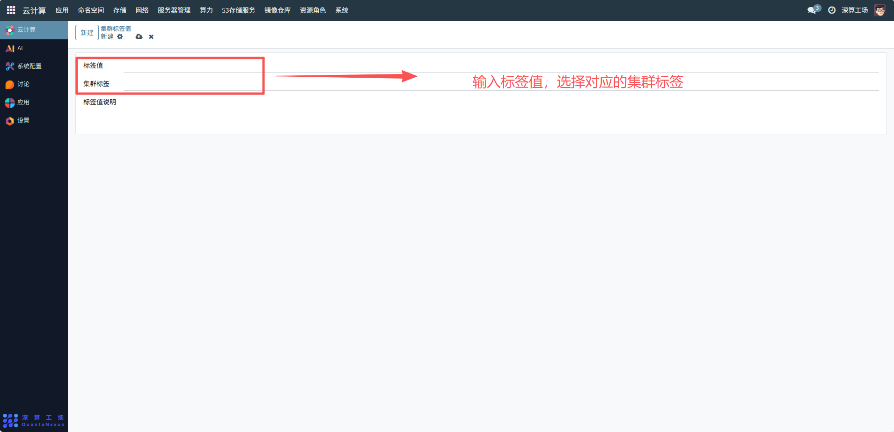

# 集群标签值
集群标签值主要用于为 Kubernetes 集群中的标签定义具体的取值，通过 “标签键 - 标签值” 的组合，实现对集群资源（如节点、Pod）的精细化分类、调度和管理，便于资源调度策略的制定。
## 1、标签值与集群标签关联
标签值：输入具体的标签取值，如com-calino-master-3（需与集群标签的业务含义匹配）。
集群标签：选择对应的集群标签，建立 “标签键 - 标签值” 的关联关系。

## 2、标签值说明补充
在 “标签值说明” 字段中，填写该标签值的用途说明，如 “标识集群中的 com-calino-master-3 主节点”，便于后续理解和维护。

