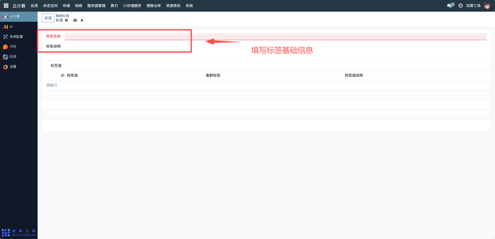
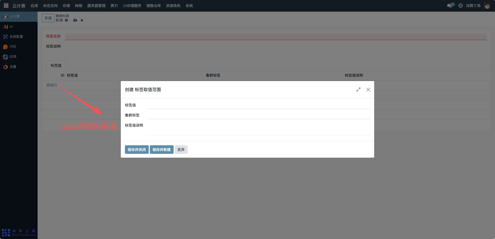

# 集群标签
集群标签主要用于对 Kubernetes 集群中的资源（如节点、Pod 等）进行分类和标识，通过键值对的形式为资源添加自定义属性，便于资源的分组管理、调度策略制定（如节点亲和性）和权限控制，提升集群资源管理的灵活性与可操作性。
## 1、标签基础信息配置
标签名称：定义标签的键名，例如 kubernetes.io/hostname（用于标识主机名），需遵循 Kubernetes 标签命名规范。
标签说明：填写标签的用途说明，如 “主机名标签，用于节点主机名的标识与调度”，便于理解标签的业务含义。

## 2、标签值管理
添加标签值：点击 “添加行”，输入标签值（如 com-cilium-master-2、com-calino-master-1），并关联对应的集群标签（即标签名称），同时可填写标签值说明（如 “主节点 com-cilium-master-2 的主机名标识”）。
删除标签值：若某标签值不再需要，点击其右侧的删除图标（垃圾桶），即可移除该标签值的配置。

