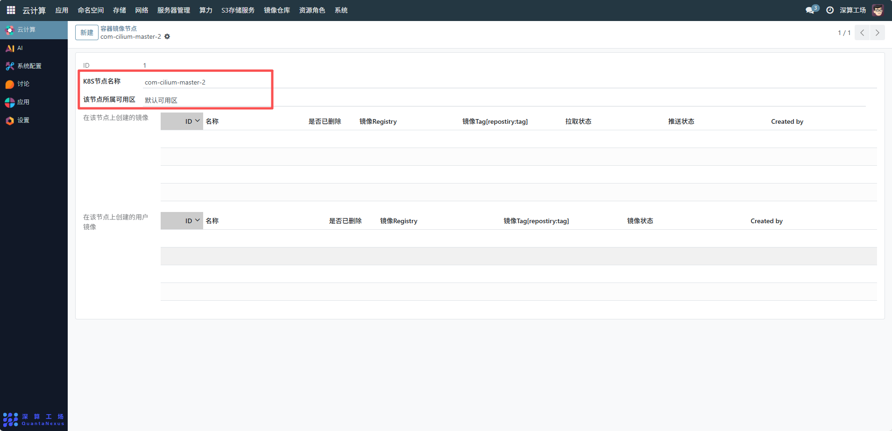
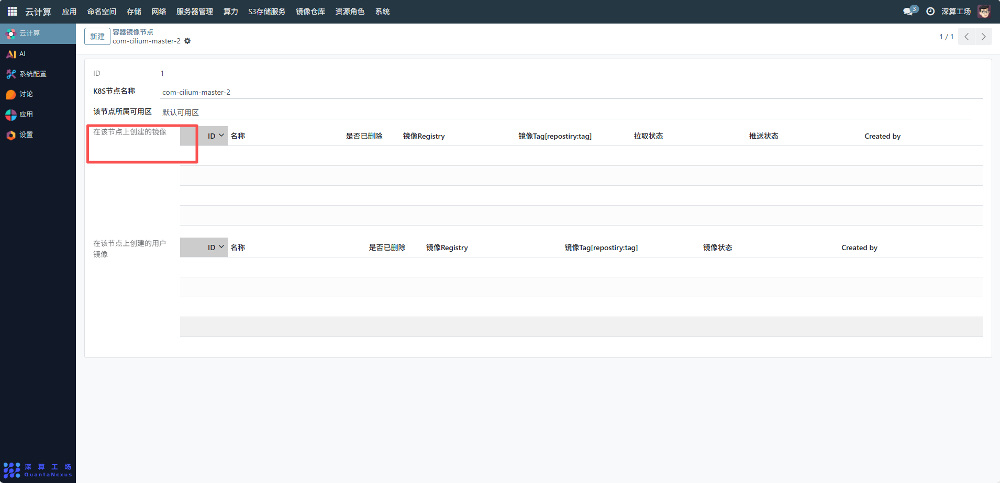
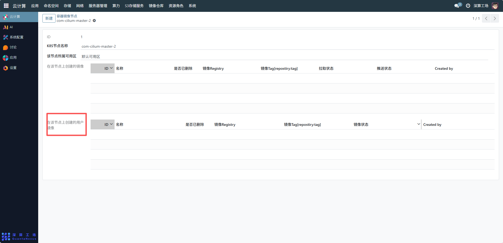

# 容器镜像节点
容器镜像节点主要用于管理 Kubernetes 集群中节点与容器镜像的关联关系，实现对节点上创建的系统镜像和用户镜像的集中管控，包括镜像的拉取、推送状态追踪，以及镜像的生命周期管理（如是否删除），从而保障容器化应用在节点上的可靠部署与运行。
## 1、基础信息确认
K8S 节点名称：确认节点的 K8S 标识（如com-cilium-master-2），确保与集群中的节点一一对应。
所属可用区：确认节点所属的可用区（如 “默认可用区”），用于资源的区域化管理和调度。

## 2、系统镜像管理
在 “在该节点上创建的镜像” 区域，可对系统级镜像进行如下操作：
- 添加镜像：点击 “ID” 下拉或添加行，关联节点上的系统镜像，填写名称、镜像 Registry、镜像 Tag（如nginx:latest）等信息。
- 状态追踪：查看镜像的拉取状态和推送状态，确保镜像在节点上成功拉取或推送；通过 “是否已删除” 标识，管理镜像的删除状态。

## 3、用户镜像管理
在 “在该节点上创建的用户镜像” 区域，对用户自定义镜像进行管理：
- 添加用户镜像：点击 “ID” 下拉或添加行，关联用户创建的镜像，填写名称、镜像 Registry、镜像 Tag等信息。
- 状态监控：查看镜像状态（如 “已就绪”“拉取中”），并通过 “是否已删除” 标识管理用户镜像的生命周期。

