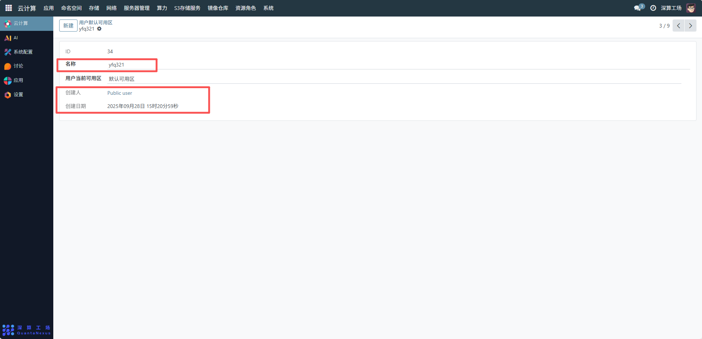
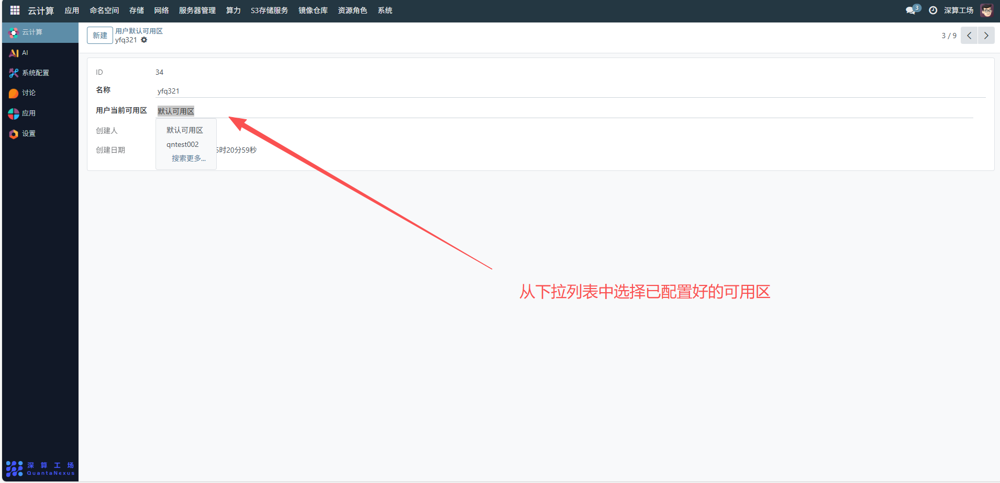

# 用户默认可用区
用户默认可用区主要用于为用户预设默认的资源部署区域，确保用户在创建或使用云资源（如虚拟机、存储、应用等）时，默认在该可用区进行资源分配，提升资源管理的便捷性和一致性。
## 1、查看用户默认可用区信息
在界面中可查看用户的ID、名称、当前默认可用区（如示例中的 “默认可用区”）、创建人和创建日期，这些信息用于识别和追溯用户的可用区配置。

## 2、配置用户默认可用区
若需修改用户的默认可用区，点击 “用户当前可用区” 字段，从下拉列表中选择已配置好的可用区（需提前在 “可用区” 模块完成可用区的创建与配置），例如选择 “qntest002” 作为新的默认可用区。
配置完成后，系统会自动保存，用户后续创建资源时将默认在该可用区部署。

