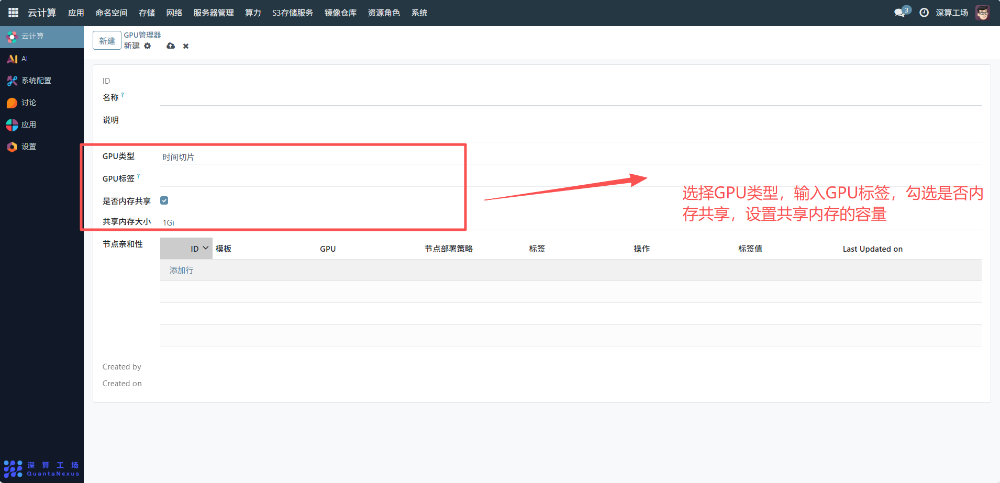
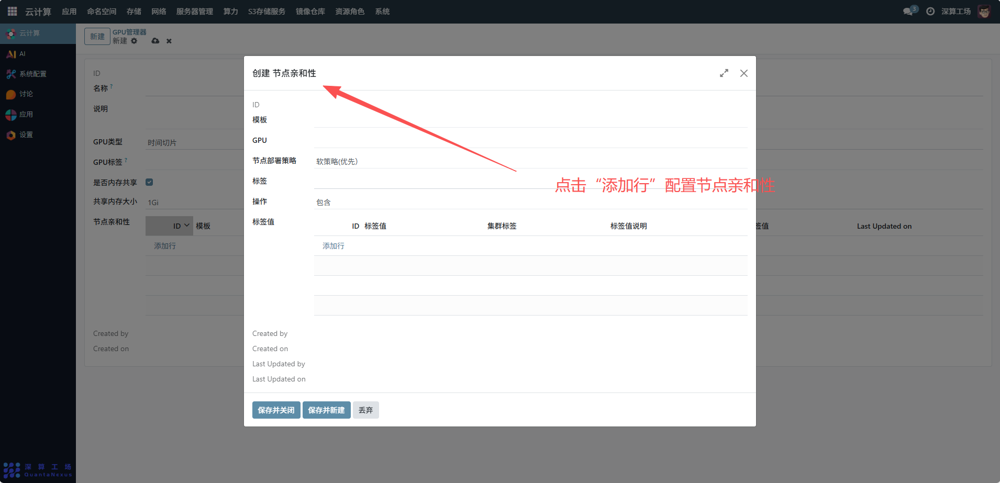
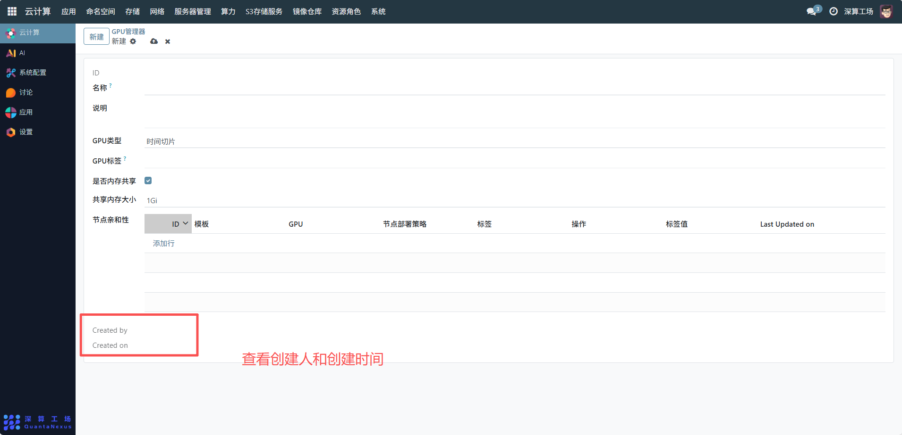

# GPU管理器
GPU 管理器主要用于对云计算环境中的 GPU 资源进行集中管理与调度，包括定义 GPU 的类型、内存共享策略、节点亲和性等，以满足不同应用对 GPU 资源的差异化需求，提升 GPU 资源的利用率和分配合理性。
## 1、基本信息配置
名称：输入 GPU 管理器的标识名称，例如 “AI 训练 GPU 管理器 v1”，用于区分不同的 GPU 管理配置。
说明：填写该 GPU 管理器的用途说明，如 “用于 AI 训练任务的 GPU 资源管理，支持时间切片和内存共享”。

## 2、GPU 核心参数配置
- GPU 类型：选择 GPU 的调度类型，示例中为 “时间切片”，可根据需求选择其他类型（如 “直通” 等）。
- GPU 标签：输入用于标识 GPU 的标签，便于资源调度时识别。
- 是否内存共享：勾选表示启用 GPU 内存共享，示例中已勾选；若无需共享内存，取消勾选即可。
- 共享内存大小：设置共享内存的容量，示例中为 “1Gi”，可根据业务需求调整（如 “2Gi”“4Gi” 等）。

## 3、节点亲和性配置
点击 “添加行” 配置节点亲和性规则，依次填写：
- 模板：选择关联的节点模板。
- GPU：选择对应的 GPU 资源。
- 节点部署策略：设置节点的部署规则（如 “优先部署”“必须部署” 等）。
- 标签 / 标签值：通过标签键值对进一步限定节点范围，标签值 “true”，确保 GPU 资源仅调度到符合标签的节点上。

## 4、查看创建与更新信息
界面下方的 “Created by”（创建人）和 “Created on”（创建时间）为系统自动记录，无需手动配置，用于追溯配置的操作历史。

