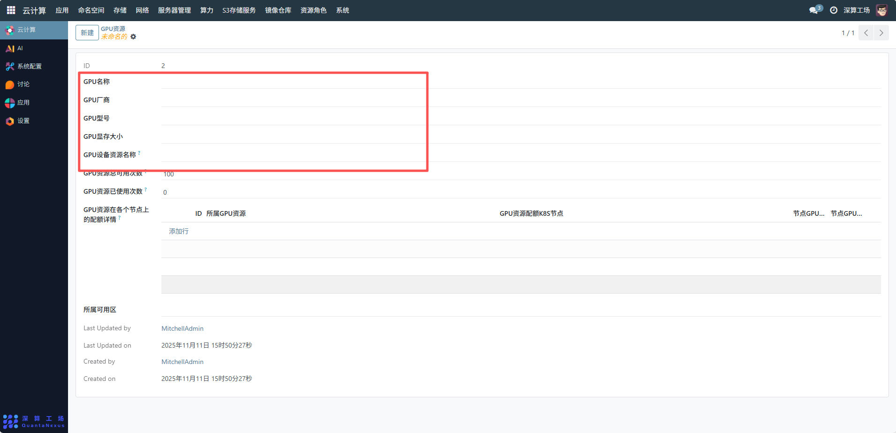
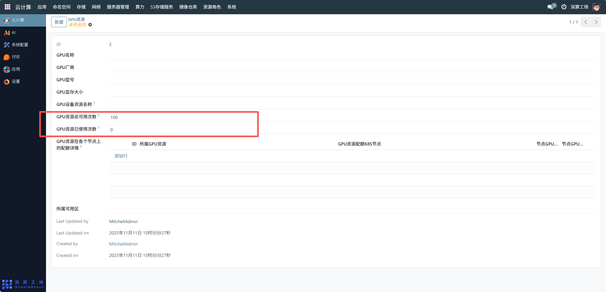
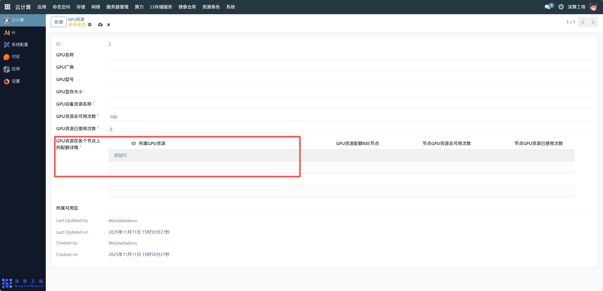

# GPU资源
GPU 资源主要用于对云计算环境中的 GPU 硬件资源进行集中管理，包括定义 GPU 的型号、显存、厂商等属性，规划资源的总可用次数、已使用次数，以及在不同 K8S 节点上的配额分配，从而满足 AI 训练、图形渲染等业务对 GPU 资源的精细化需求，实现 GPU 资源的高效调度与利用
## 1、基础属性配置
- GPU 名称：输入 GPU 资源的标识名称，用于区分不同的 GPU 资源配置。
- GPU 厂商：选择 GPU 的生产厂商。
- GPU 型号：填写具体的 GPU 型号。
- GPU 显存大小：设置 GPU 的显存容量，用于匹配业务对显存的需求。
- GPU 设备资源名称：输入系统内识别该 GPU 设备的资源名称，确保与底层设备管理一致。

## 2、资源次数管理
- GPU 资源总可用次数：设置该 GPU 资源的总可使用次数（如示例中为 “100”），用于资源的使用次数限制，避免过度消耗。
- GPU 资源已使用次数：系统会自动统计该资源的已使用次数（示例中为 “0”），便于掌握资源的消耗进度。

## 3、节点配额配置
点击 “添加行” 配置 GPU 资源在 K8S 节点上的配额，依次填写：
- 所属 GPU 资源：选择当前配置的 GPU 资源（如 “Tesla T4 资源池 A”）。
- GPU 资源配额 K8S 节点：选择对应的 K8S 节点（需提前在集群节点模块配置）。
- GPU 资源总可用次数：设置该节点上该 GPU 资源的具体配额。

## 4、可用区与追溯管理
所属可用区：选择该 GPU 资源所属的可用区（需提前在可用区模块配置），实现资源的区域化管理。

