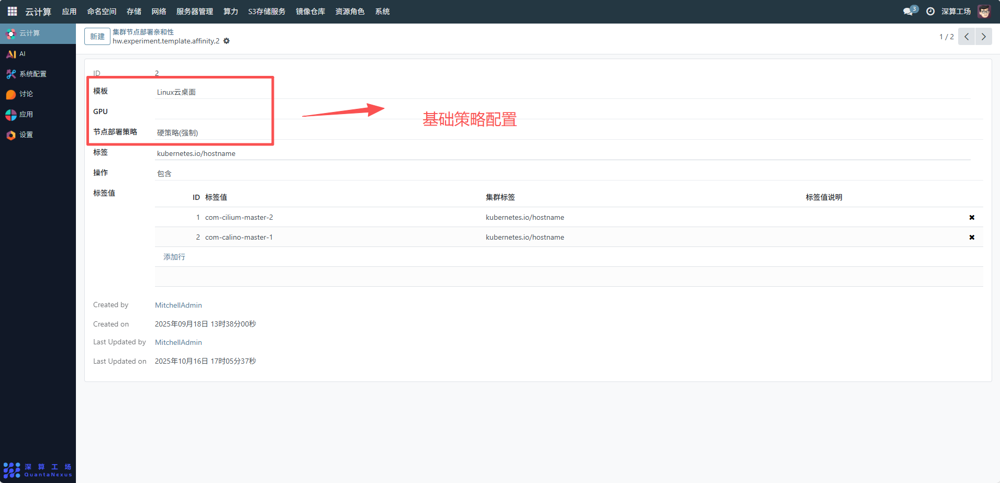
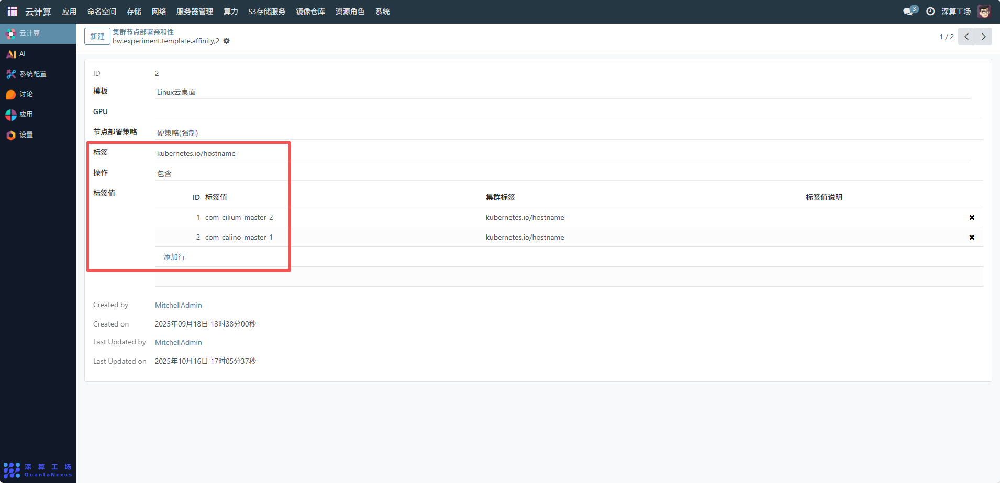
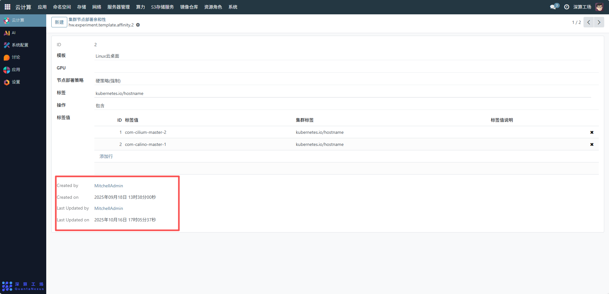

# 集群节点部署亲和性
集群节点部署亲和性主要用于控制 Kubernetes 集群中 Pod 的调度策略，通过定义 Pod 与节点的亲和规则（如基于标签、GPU 资源、部署策略等），确保 Pod 优先或必须调度到符合条件的节点上，从而实现资源的合理分配、业务的高可用性及性能优化。
## 1、基础策略配置
- 模板：选择关联的调度模板（需提前创建），明确该亲和性规则的应用场景。
- GPU：若 Pod 依赖 GPU 资源，选择对应的 GPU 配置（需提前在 GPU 资源模块配置），确保 Pod 调度到含目标 GPU 的节点。
- 节点部署策略：选择部署策略，如 “软策略 (优先)” 表示 Pod 优先调度到符合条件的节点，若没有则可调度到其他节点；若为 “硬策略 (必须)” 则 Pod 仅能调度到符合条件的节点。

## 2、标签匹配规则配置
- 标签：输入用于匹配节点的标签键。
- 操作：选择匹配操作，如 “包含” 表示节点标签需包含指定的标签值。
- 标签值：点击 “添加行”，关联具体的集群标签值（需提前在集群标签值模块配置），例如选择标签值 com-cilium-master-2，表示 Pod 优先调度到含该主机名标签的节点。

## 3、追溯与权限管理
界面下方的 “Created by/on”“Last Updated by/on” 为系统自动记录的操作信息，用于追溯亲和性规则的创建和变更历史，同时支持基于创建人进行权限管控。

