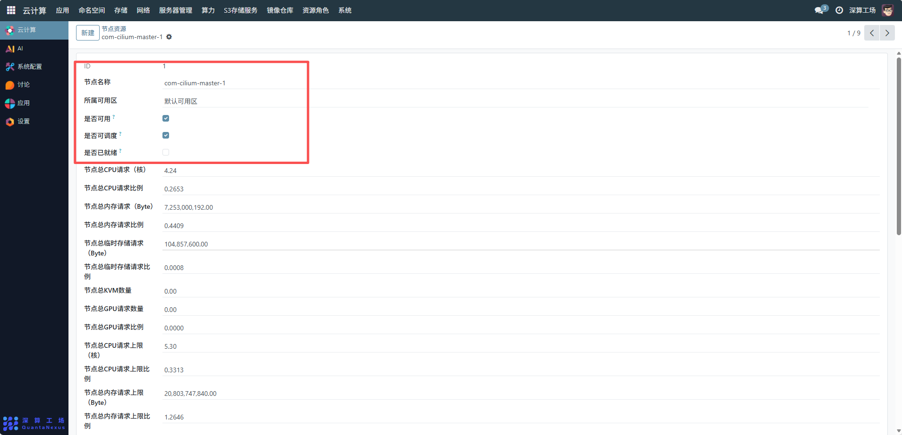
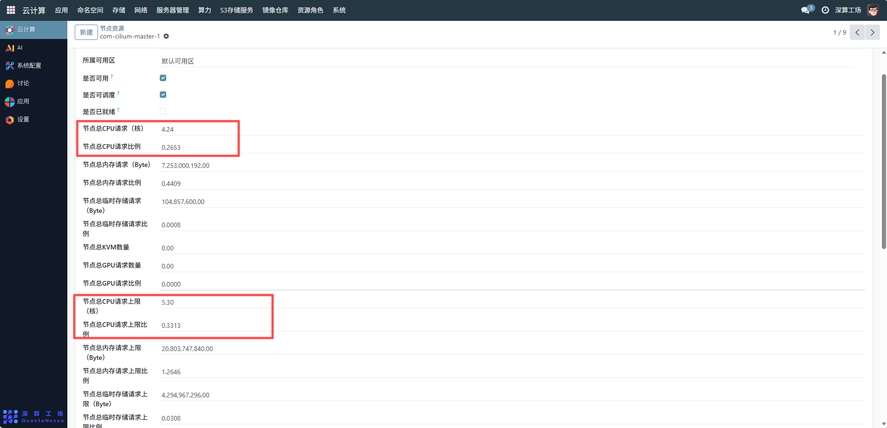
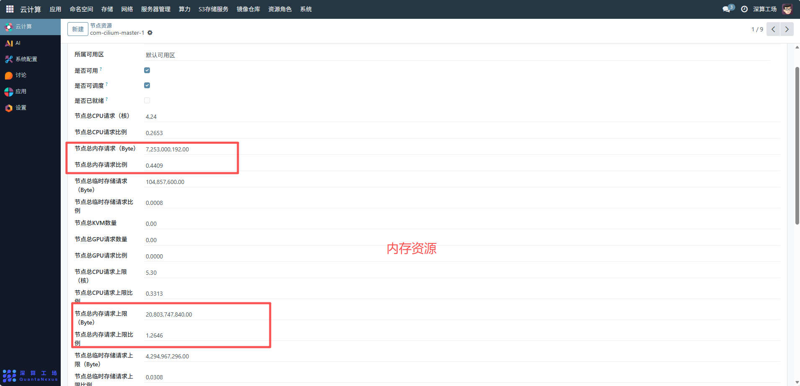
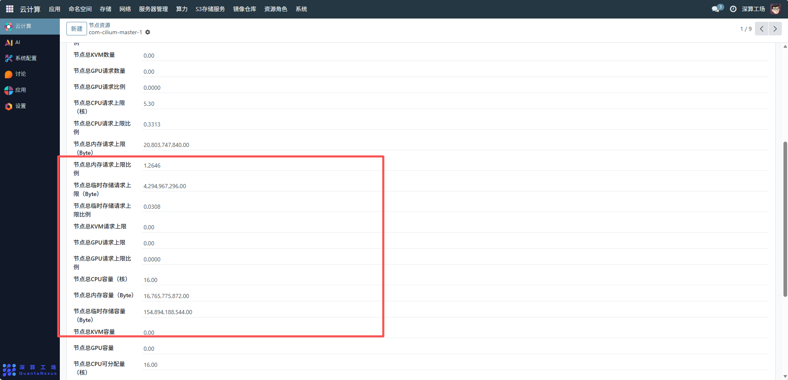
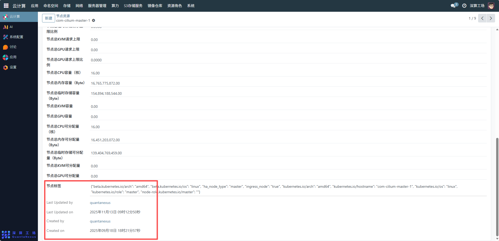

# 节点资源
节点资源主要用于对云计算集群中的节点硬件资源（CPU、内存、存储、GPU 等）进行集中监控与配置管理，通过统计和设置节点的资源请求、容量、可分配量及上限等参数，实现资源的合理调度、容量规划和性能优化，保障业务应用在节点上的稳定运行。
## 1、基础信息与可用性配置
- 节点名称与所属可用区：确认节点的标识名称（如com-cilium-master-1）和所属可用区（如 “默认可用区”），用于资源的区域化管理和识别。
- 可用性与调度性：勾选 “是否可用” 表示节点可承载业务；勾选 “是否可调度” 表示该节点参与 Kubernetes 等编排系统的资源调度。“是否已就绪” 由系统自动检测节点状态，用于判断节点是否能正常提供服务。

## 2、资源请求与容量管理
* CPU 资源：
- 查看 “节点总 CPU 请求（核）” 和 “请求比例”，掌握当前节点 CPU 的已申请资源。
- 确认 “节点总 CPU 容量（核）” 和 “可分配量（核）”，明确节点 CPU 的总能力和剩余可分配资源。
- 设置 “节点总 CPU 请求上限（核）” 和 “上限比例”，限制 CPU 资源的最大申请量，避免资源过载。

* 内存资源：
- 同理，通过 “节点总内存请求（Byte）”“内存容量（Byte）”“内存可分配量（Byte）”“内存请求上限（Byte）” 等字段，管理内存资源的申请、容量和上限。

存储与特殊资源：
- 对 “临时存储请求 / 容量 / 可分配量 / 上限”“KVM 数量”“GPU 数量” 等资源，执行类似的查看和配置操作，满足存储、虚拟化、AI 算力等业务的资源需求。

## 3、节点标签与追溯管理
- 节点标签：展示节点的标签、这些标签用于资源调度的亲和性配置（如将特定 Pod 调度到含master标签的节点）。
- 操作追溯：“Last Updated by/on”“Created by/on” 记录了节点资源配置的创建和更新历史，便于权限管理和问题追溯。

