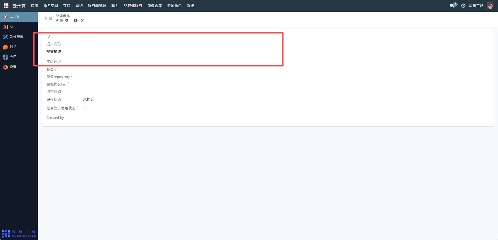
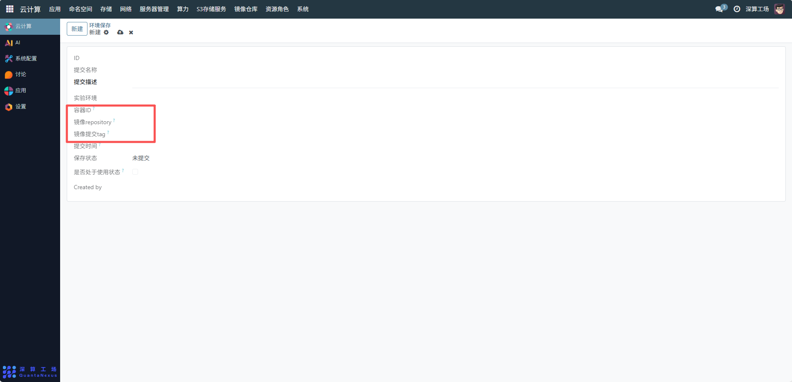
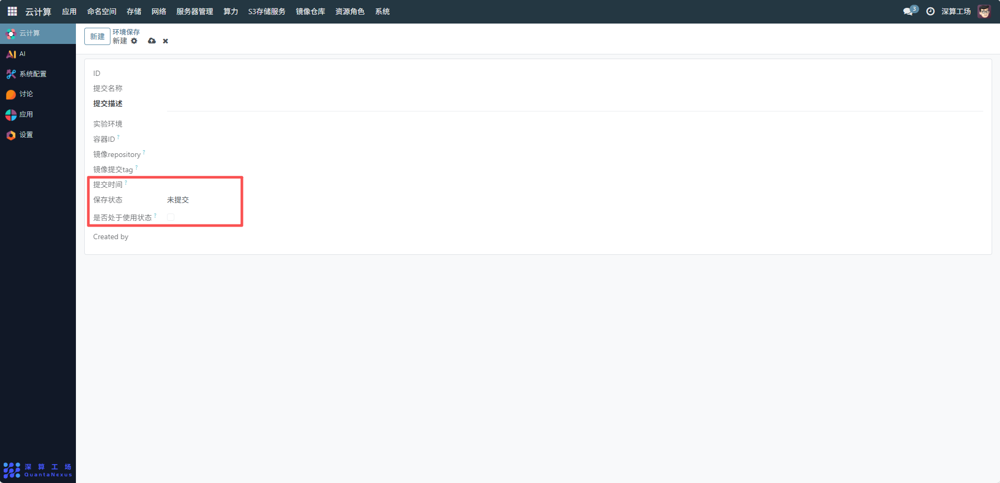

# 环境保存
环境保存主要用于对实验或应用运行的容器环境进行状态快照与存储，便于后续快速恢复相同的运行环境，支持环境复用、版本回溯或故障排查，尤其适用于需要重复执行的实验场景或需保留特定配置的应用环境。
## 1、基础信息配置
- 提交名称：输入环境保存的标识名称，例如 “20251111_AI 训练环境_v1”，用于区分不同的环境快照。
- 提交描述：填写该环境的用途说明，如 “基于 PyTorch 2.0 的图像分类训练环境，包含 CUDA 11.7”，便于后续识别环境内容。
- 实验环境：选择关联的实验环境（需提前创建），明确该环境所属的实验场景。

## 2、容器与镜像信息关联
- 容器 ID：输入需要保存状态的容器 ID（从集群节点或容器管理中获取），确保准确指向目标容器。
- 镜像 repository：填写容器对应的镜像仓库地址，用于环境恢复时拉取基础镜像。
- 镜像提交 tag：填写镜像的具体版本标签，确保恢复时使用相同版本的镜像。

## 3、状态管理
- 提交时间：系统会自动记录环境保存的提交时间，无需手动填写，用于追溯环境创建的时间点。
- 保存状态：初始为 “未提交”，完成配置后点击提交按钮，状态会更新为 “已提交”。
- 是否处于使用状态：若该环境快照当前被激活或复用，勾选此选项；未使用时保持未勾选，便于状态区分。

