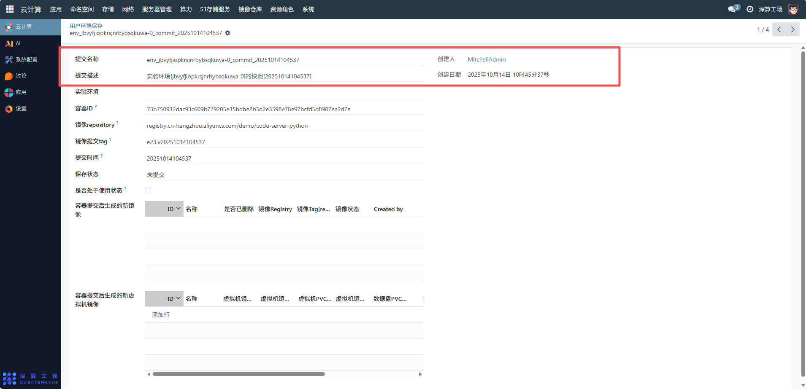
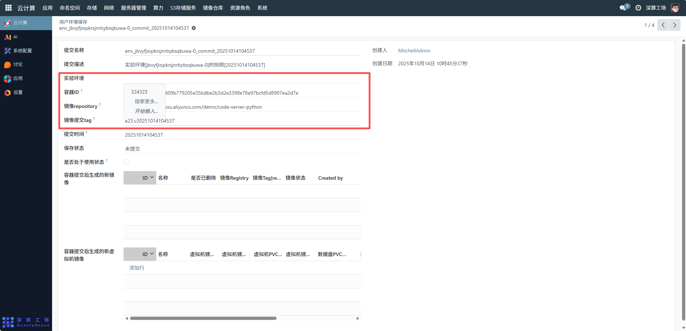
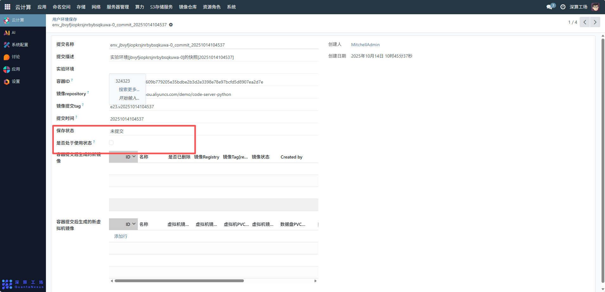
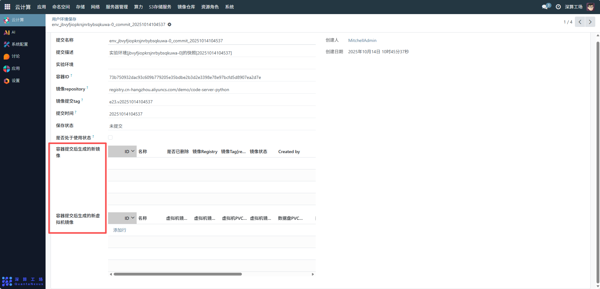

# 用户环境保存
用户环境保存主要用于对用户实验或应用的容器 / 虚拟机环境进行快照式存储，方便用户后续快速恢复相同的运行环境，支持环境复用、版本回溯、故障排查，尤其适用于需要保留特定配置的开发、实验场景，保障环境的一致性和可追溯性。
## 1、基础信息确认与描述
提交名称 / 描述：确认系统生成的提交名称（如env_jbvyfjiopkrsjnrbysqkuwa-0_commit_20251014104537）和提交描述（如 “实验环境快照 [20251014104537]”），这些信息用于识别环境快照的唯一性和用途。
创建人 / 日期：系统自动记录创建人和创建日期，用于权限管理和操作追溯。

## 2、环境核心信息关联
实验环境与容器 ID：关联对应的实验环境，并确认容器 ID，确保快照指向目标运行实例。
镜像 repository 与 tag：填写环境对应的镜像仓库和版本标签（如e23.v20251014104537），保障环境恢复时的镜像一致性。

## 3、状态与使用管理
保存状态：查看当前环境快照的保存状态（如 “未提交”），提交后状态会更新为 “已提交”，用于判断快照是否生效。
是否处于使用状态：若该环境快照当前被激活或复用，勾选 “是否处于使用状态” 选项；未使用时保持未勾选，便于区分环境的活跃性。

## 4、衍生资源管理
容器提交后生成的新镜像：若环境快照生成了新的容器镜像，可在对应区域添加行，填写镜像的 ID、名称、Registry、Tag 及状态等信息，实现镜像的关联管理。
容器提交后生成的新虚拟机镜像：同理，若生成了虚拟机镜像，可在该区域添加行，配置虚拟机镜像的 ID、名称、PVC 等信息，完成虚拟机环境的快照延伸管理

