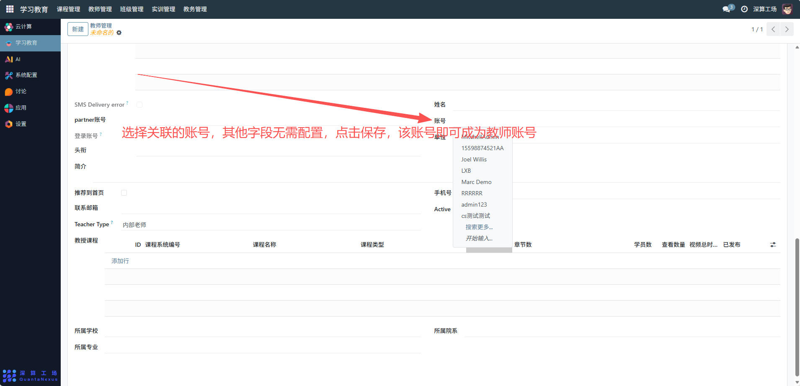

# 教师管理
“教师管理” 是学习教育平台中教师信息与教学权限的综合管理工具，核心作用是集中配置教师的基础信息、授课课程、所属机构等内容，实现教师身份的管理、教学任务的分配与教学资源的关联，是支撑教学活动开展的核心人员管理模块。
# 1、教师基础信息配置
姓名 / 账号 / 登录账号：填写教师的身份标识与系统账号，用于登录与身份识别；
头衔 / 简介：补充教师的职称（如 “讲师”）与个人介绍，展示教师资质；
联系方式：填写手机号、联系邮箱，便于沟通协作；
Teacher Type：选择教师类型（如 “内部老师”“外部教师”），区分教师身份。

