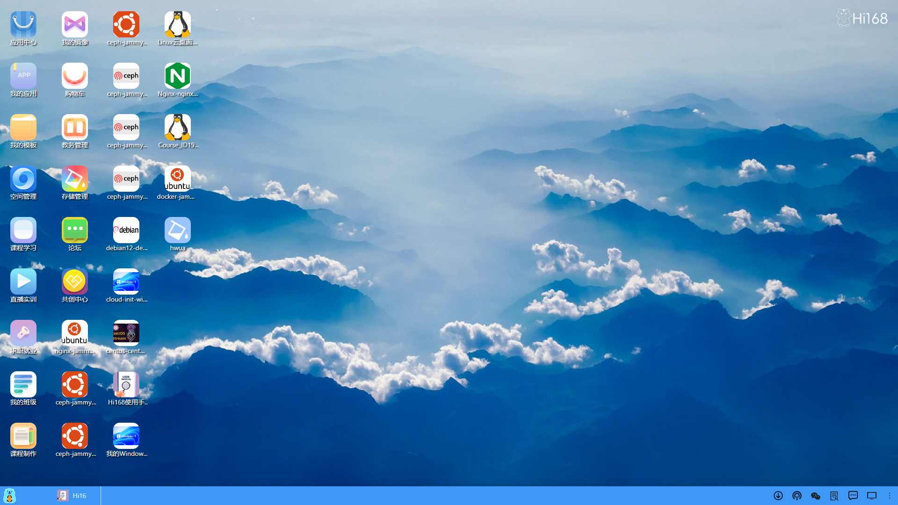

## 前言

<h2 style="text-align: center;">欢迎使用深算工场桌面版</h2>

欢迎使用深算工场桌面版平台  
尊敬的用户：  
欢迎使用深算工场桌面版平台！我们致力于为您提供一个全面、高效、便捷的综合管理平台，涵盖应用中心、我的应用、我的模板、空间管理、认证、直播、我的镜像、存储管理、镜像中心等多个模块。

深算工场桌面版平台以其丰富的功能、高效的管理和便捷的操作，为用户提供了一站式的解决方案。

深算工场是自主研发的云计算平台，基于轻量级容器和虚拟机技术混合架构模式的开放式云平台；支持多种AI和大数据框架，支持以插件的方式加入平台，开箱即用；支持Nvidia全系GPU，支持GPU拆分共享使用；多云无限扩容，可以跟合作企业、高校扩容多个节点；实现基础设施资源的智能化调度；提供桌面版功能，将开发、交付、云应用等板块以APP的形式嵌入桌面版页面。

我们希望通过这个平台，帮助您更好地管理学习和工作，提升生活和工作的质量。感谢您的使用和支持！
