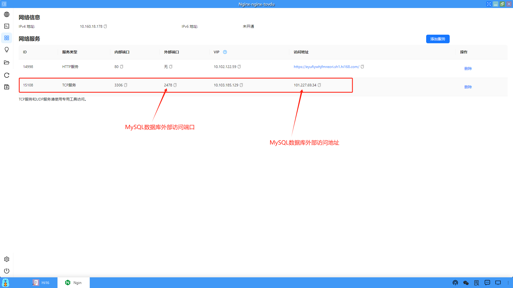

### 应用界面
Hi168的应用分为虚拟机和容器两种类型，应用界面左侧的菜单基本相同，但也有一些差异，下面介绍一下这两种类型应用的菜单。
#### 1、容器应用
这里以Nginx应用为例，如下图。

**（1）HTTP Web服务**：以浏览器方式打开一个指定端口的HTTP Web服务，需要在服务端口中添加需要对外暴露的端口。

**（2）命令行终端**：提供了一个Linux的命令终端，方便用户进行Linux命令的操作。

**（3）服务端口**：服务端口列出了网络信息和网络服务，用户可以将应用环境中不同服务类型的端口暴露出来，供外部连接访问使用。服务类型包括：HTTP、TCP、UDP、TTYD和WEBSHELL。

比如：需要暴露应用环境中安装的MySQL3306端口，供外部连接使用。

**（4）挂载存储桶**：可以将创建的存储桶（桶中所有内容）挂载到应用环境中供用户使用，存储桶可以参考“存储管理”模块的介绍。挂载存储桶请查看下面的虚拟机挂载。

**（5）文件系统**：提供了一个图形化的Linux文件系统，可以供用户进行比较直观的操作，包括文件上传和下载。

**（6）刷新**：可以刷新整个界面。

**（7）应用快照**：可以为应用创建一个或多个快照，具体可以参考“我的应用”的创建快照，功能是相同的。

#### 2、虚拟机应用
这里Linux云桌面应用为为例，如下图。

**（1）图形化终端**：提供了VNC服务连接应用环境中的图形化界面。

**（2）命令行终端**：同上

**（3）服务端口**：同上

**（4）挂载存储桶**：存储桶的创建参考“存储管理”模块的介绍。

**（5）文件上传下载**：提供了trz和tsz命令进行文件的上传和下载。

**（6）刷新**：同上

**（7）控制面板**：noVNC服务自带的控制面板，用户可以打开进行相关的操作，一般默认可以不使用。若需要将外部的文本内容复制到应用环境中去，可以使用控制面板中的剪贴板功能。

**（8）应用快照**：同上

**（9）自动调整图形化界面长宽比**：可以自适应地调整图形化界面的长宽比例。
